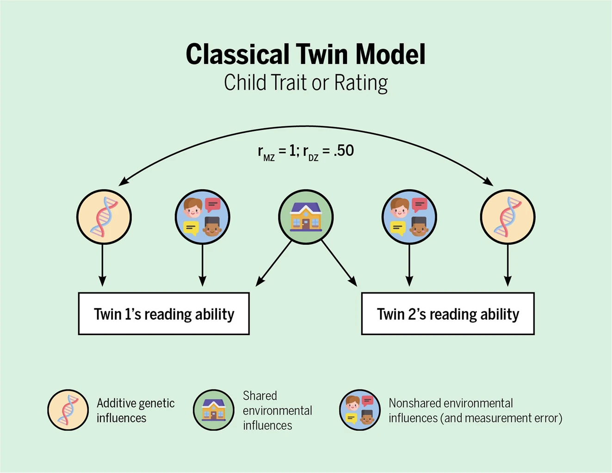

```{r child = "../setup.Rmd"}
```

<!-- The adage 'A picture is worth a thousand words' is just as applicable to Behavior Genetics as it is to journalism. In this talk, I delve into the rich diverse history of data visualization techniques in the field of behavior genetics, tracing advancements from Wright's [@Wright1920] classic path diagram of guinea pigs to the contemporary usage of Manhattan plots. This survey sets the stage for the development of two resources aimed at bolstering the field's visualization toolkit. The first, an atlas employing 'ggplot2' in R, aims to guide researchers in selecting the most appropriate visualization techniques for their data. The second, a proposed R package, seeks to facilitate the integration of 'OpenMx'-compatible visualizations, streamlining the presentation of complex genetic analyses. Emphasizing practical advice, the talk will cover effective uses of path diagrams, family trees, and interaction visualizations, with the goal of improving clarity and interpretability of genetic data. This initiative aspires to democratize advanced data visualization tools, making them more accessible to the behavior genetics community and, in turn, amplifying the impact and reach of its research. -->

```{r packages, echo=FALSE, message=FALSE, warning=FALSE}
# Remember to compile
#xaringan::inf_mr(cast_from = "..")
#       slideNumberFormat: ""  
knitr::opts_chunk$set(knitr.duplicate.label = "allow")
library(tidyverse)
if (!require("emo")) devtools::install_github("hadley/emo")
library(emo)
```

---

class: middle

# Hello world!

<!-- Slide 1: Introduction (1 minute) -->
<!-- Script: Good [morning/afternoon/evening], everyone. My name is S. Mason Garrison, and I'm from Wake Forest University. Today, I'm excited to talk about the importance of data visualization in the field of behavior genetics. As the saying goes, "A picture is worth a thousand words." This is particularly true in our field, where complex data can be better understood through effective visualization techniques. -->

```{r echo=FALSE,out.width="10%",fig.align='center',fig.cap="QR code for these slides",fig.height=3}
library(qrcode)
code <- qr_code("https://datascience4psych.github.io/slides/00_dataatlas/d00_slide#1")
plot(code)
```

.footnote[.center[
[DataScience4Psych.github.io/slides/00_ASU/d00_slide](https://datascience4psych.github.io/slides/00_dataatlas/d00_slide#1) 
]
]

---


# The Power of Visualization


### "A picture is worth a thousand words."

Visualizations in behavior genetics:
- Facilitate understanding of complex data.
- Reveal patterns and relationships not obvious from raw data.
- Enable more effective communication of research findings.


<!-- Slide 2: The Power of Visualization (1 minute) -->
<!-- Script: The adage "A picture is worth a thousand words" is just as applicable to Behavior Genetics as it is to journalism. Visualizing data helps us to see patterns, relationships, and insights that might not be immediately apparent from raw numbers alone. Today, I will take you through the rich and diverse history of data visualization techniques in behavior genetics, from early methods to contemporary applications. -->

---
## Alternative Talk

I could have spent this talk showing you some of the cool visualizations I've made since the last conference...

---

# Like This One


```{r, echo=FALSE, out.width="70%", fig.align='center'}
knitr::include_graphics("img/X chroms.png")
```
```{r, echo=FALSE, out.width="70%", fig.align='center'}
knitr::include_graphics("img/mtdna.png")
```

---

# Or these!

```{r, echo=FALSE, out.width="70%", fig.align='center'}
#knitr::include_graphics("path_diagram_image_url")
```

---

# Or even my latest creation!

That's extremely promising for making much better pedigrees plots...

But... well... It's not what I'm going to do today.

--

But I decided to focus on the history of data visualization in behavior genetics. I'll show you some of the cool visualizations I've made in the workshop.

---

class: middle
# Historical Context

---

## Wright's Path Diagram (1920)

- Sewall Wright's path diagrams were pioneering tools for illustrating genetic relationships.
- Enabled the visualization of complex genetic interactions and pathways.
- Revolutionized genetic research by providing a clear, visual method for understanding heritability and genetic correlations.

---

```{r, echo=FALSE, out.width="70%", fig.align='center'}
#knitr::include_graphics("path_diagram_image_url")
```

<!-- Slide 3: Historical Context (1 minute) -->
<!-- Script: One of the earliest and most significant contributions to data visualization in genetics was Wright's Path Diagram, introduced in 1920. This diagram allowed researchers to visually represent the relationships between genetic traits and their underlying factors, revolutionizing how we interpret genetic data. -->

--- 

## Sewall Wright's 1932 Adaptive Landscape Diagram

.pull-left-narrow[
- Wright's adaptive landscape diagram was a groundbreaking visualization of evolutionary processes.
- Depicted the relationship between genetic variation and fitness.
- Provided a visual representation of natural selection and evolutionary dynamics.
.footnote[CITE HERE]
]

.pull-right-wide[
```{r, echo=FALSE, out.width="95%", fig.align='left'}
knitr::include_graphics("img/wright6panel.png")
```
]

<!-- Script: Wright's adaptive landscape diagram was another groundbreaking visualization, depicting the relationship between genetic variation and fitness. This provided a visual representation of natural selection and evolutionary dynamics. -->

---
# Four adaptive landscape diagrams
.pull-left[
- Various adaptations and critiques of Wright's original diagram.
  - A: Ridley's depiction of a Fisherian landscape (1996).
  - B: Gavrilets’ depiction of the holey landscape (1997).
  - C: Coyne et al.'s simplified Wrightian landscape (1997).
  - D: Kauffman and Levin's rugged adaptive landscape (1987).
]
<br>
.pull-right.center[
```{r, echo=FALSE, out.width="96%", fig.align='center'}
knitr::include_graphics("img/responses towright.png")
```
]
.footnote[Credit: Panel from @Skipper_2004]

<!-- Four adaptive landscape diagrams, resulting from critiques of Wright's Reference Wright1932 diagram. Fig. 2a is Ridley's (Reference Ridley1996, 219) depiction of a Fisherian landscape. Fig. 2b is Gavrilets’ (Reference Gavrilets1997, 309) depiction of the holey landscape. Fig. 2c is Coyne et al.'s (Reference Coyne, Barton and Turelli1997, 647) simplified Wrightian landscape. Fig. 2d is the Kauffman and Levin (Reference Kauffman and Levin1987, 33) rugged adaptive landscape. -->
---

# Modern Techniques


## Modern Path Diagrams

- Modern path diagrams are used in structural equation modeling (SEM).

- Visualize complex relationships between variables in a statistical model.

- Help researchers understand the direct and indirect effects of variables on each other.

---

# Classic path diagrams can start to resemble the wiring of a computer or a military aircraft.

# Bomber

```{r, echo=FALSE, out.width="70%", fig.align='center'}
#knitr::include_graphics("path_diagram_image_url")
```   

# Cute little path diagram

```{r, echo=FALSE, out.width="70%", fig.align='center'}

```
---

```{r, echo=FALSE, out.width="70%", fig.align='center'}
#knitr::include_graphics("manhattan_plot_image_url")
```

--- 

### Manhattan Plots

- Widely used in genome-wide association studies (GWAS).
- Plot p-values for genetic variants across the genome.
- Help identify regions of the genome associated with traits or diseases.
- Visualize large-scale genetic data, making it easier to detect significant associations.

<!-- Slide 4: Modern Techniques (1 minute) -->
<!-- Script: Moving to modern times, the Manhattan Plot has become a staple in genetic research, particularly for genome-wide association studies (GWAS). These plots help researchers identify significant genetic variants by visualizing p-values across the genome, making it easier to spot areas of interest. -->

---

# Importance of Good Graphs for Science Communication

## Case Study: Misinterpretation of Genetic Data
.pull-left[
- A figure in a high-profile Nature paper raised concerns about reinforcing racist beliefs.
- The UMAP generated figure aimed to show genetic diversity but was misinterpreted as supporting genetic essentialism.
- Highlights the need for careful design and interpretation of scientific figures.
]

--
.pull-right[
```{r, nature_figure, echo=FALSE, out.width="70%", fig.align="center"}
knitr::include_graphics("img/Genomic data in the All of Us Research Program.jpg")
```
]


<!-- But a problem with using UMAP, Pritchard wrote, is that it can exaggerate the distinctiveness of populations and fail to represent their intermixing properly. -->
---

## Lessons Learned
.pull-left[
- Good graphs should accurately represent data without misleading the audience.
- Consider the potential for misinterpretation and strive for clarity.
- Use visualizations to enhance understanding and communication of scientific findings.
]
.pull-right[
```{r, ref.label="nature_figure", echo=FALSE, out.width="70%", fig.align="center"}
```
]
<!-- Slide 7: Importance of Good Graphs (2 minutes) -->
<!-- Script: This example underscores the importance of good graphs in science communication. A recent Nature article included a figure that was misinterpreted, leading to concerns about reinforcing racist beliefs. The chart aimed to show genetic diversity but ended up being misinterpreted as supporting genetic essentialism. This highlights the need for careful design and interpretation of scientific figures to ensure accurate and responsible communication of data. Good graphs should accurately represent data without misleading the audience, and researchers must consider the potential for misinterpretation. -->

---
# Developing Resources

### Atlas with `ggplot2` in R

- A comprehensive guide for researchers to create effective visualizations using ggplot2.
- Includes examples of various types of plots and when to use them.
- Aims to standardize and improve the quality of visualizations in behavior genetics.
- Provides practical tips and best practices for creating clear and informative plots.

<!-- Slide 5: Developing Resources - Atlas (1 minute) -->
<!-- Script: To support researchers in choosing the most appropriate visualization techniques, we are developing an atlas using `ggplot2` in R. This resource aims to guide researchers through the process of selecting and implementing visualizations that enhance the clarity and interpretability of their data. -->

---

## Proposed R Package

Integration with `OpenMx`:
- Streamlines the creation of visualizations for structural equation modeling (SEM) and other complex analyses.
- Provides functions for creating path diagrams, correlation matrices, and other visualizations compatible with OpenMx.
- Simplifies the process of generating high-quality visualizations from complex genetic data.
- Aims to make advanced visualization tools more accessible to researchers in behavior genetics.

<!-- Slide 6: Developing Resources - R Package (1 minute) -->
<!-- Script: In addition to the atlas, I am gauging interest in developing an R package that integrates with `OpenMx`. This package will streamline the creation of visualizations for complex genetic analyses, making it easier for researchers to present their findings clearly and effectively. -->

---

# Practical Advice

### Effective Visualizations

- Path Diagrams
- Family Trees
- Interaction Visualizations

<!-- Slide 7: Practical Advice (2 minutes) -->
<!-- Script: Let me share some practical advice on using visualizations effectively in your research. Path diagrams are excellent for illustrating relationships between variables. Family trees can help visualize inheritance patterns across generations. Interaction visualizations can reveal how different genetic and environmental factors interact to influence traits. By using these techniques, we can improve the clarity and interpretability of our genetic data. -->

---

# Democratizing Visualization Tools

### Making Advanced Tools Accessible

- Open-source resources: Free and available to the entire research community.
- User-friendly packages: Simplify the process of creating high-quality visualizations.
- Educational materials: Provide guidance and training for researchers at all levels.

### Benefits:

- Improves the quality of visualizations in behavior genetics.
- Increases the impact and reach of research findings.
- Fosters collaboration and sharing of best practices.

<!-- Slide 8: Democratizing Visualization Tools (1 minute) -->
<!-- Script: One of our key goals is to democratize access to advanced visualization tools. By providing open-source resources and easy-to-use packages, we hope to make these powerful techniques accessible to the entire behavior genetics community, thus amplifying the impact of our research. -->

---

# Goals of the Initiative

- Improve clarity and interpretability of genetic data.
- Amplify the reach and impact of behavior genetics research.
- Support the behavior genetics community with better tools and resources.

## Key objectives:

- Develop and maintain high-quality visualization resources.
- Provide training and support for researchers.
- Foster a collaborative environment for sharing best practices and innovations.

<!-- Slide 9: Goals of the Initiative (1 minute) -->
<!-- Script: Our initiative aims to improve the clarity and interpretability of genetic data through effective visualizations. By making these tools more accessible, we hope to amplify the reach and impact of behavior genetics research, making it easier for researchers to communicate their findings to both scientific and general audiences. -->

---

class: middle

# Conclusion and Q&A

## Advancing the Field through Visualization

- Today, we delved into some of the classic data visualizations in behavior genetics.
- We traced its evolution from Wright's path diagrams to modern Manhattan plots.
- We highlighted the development of new resources to enhance visualization practices in the field.
- Remember, effective visualization can transform complex data into understandable insights. Embrace these tools and improve your research communication.


Thank you for your attention.

<!-- Slide 10: Conclusion (1 minute) -->
<!-- Script: In conclusion, data visualization plays a crucial role in advancing the field of behavior genetics. By enhancing our ability to communicate complex data clearly, we support greater collaboration and understanding within the scientific community. Thank you for your attention. -->

---

## Any Questions?

Feel free to ask any questions now, or reach out to me after the talk via email _garrissm@wfu.edu_ or on github _github.com/smasongarrison_.

```{r qr_ds4p, echo=FALSE, fig.align = "center", out.width = "30%", caption="Scan the QR code to visit the Data Atlas"}
library(qrcode)
code <- qr_code("https://DataScience4Psych.github.io/DataScience4Psych/")
plot(code)
```

.footnote[.center[
[DataScience4Psych.github.io/DataScience4Psych/](https://DataScience4Psych.github.io/DataScience4Psych/) 
]
]
<!-- Slide 11: Questions (1 minute) -->
<!-- Script: I’m happy to answer any questions you may have. Feel free to reach out to me via email or connect with me on GitHub. Thank you. -->


