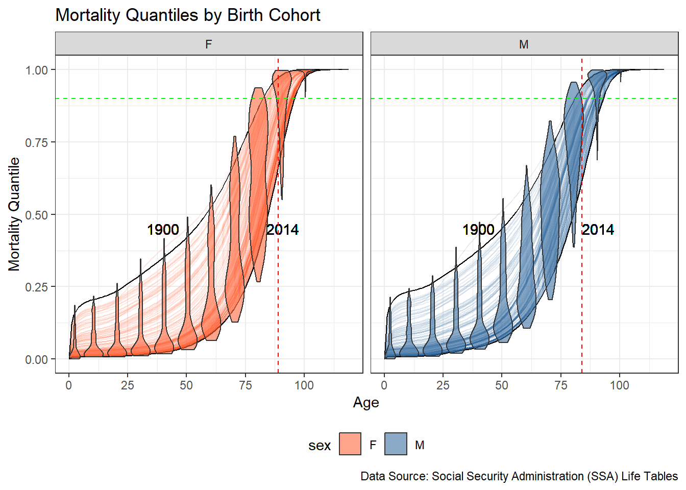
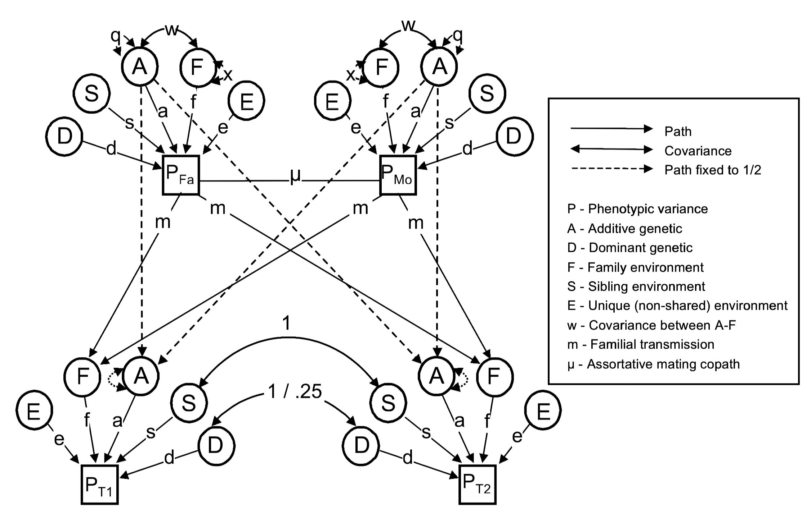
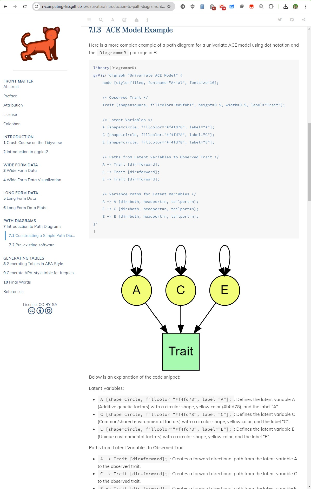

```{r child = "../setup.Rmd"}
```

<!-- The adage 'A picture is worth a thousand words' is just as applicable to Behavior Genetics as it is to journalism. In this talk, I delve into the rich diverse history of data visualization techniques in the field of behavior genetics, tracing advancements from Wright's [@Wright1920] classic path diagram of guinea pigs to the contemporary usage of Manhattan plots. This survey sets the stage for the development of two resources aimed at bolstering the field's visualization toolkit. The first, an atlas employing 'ggplot2' in R, aims to guide researchers in selecting the most appropriate visualization techniques for their data. The second, a proposed R package, seeks to facilitate the integration of 'OpenMx'-compatible visualizations, streamlining the presentation of complex genetic analyses. Emphasizing practical advice, the talk will cover effective uses of path diagrams, family trees, and interaction visualizations, with the goal of improving clarity and interpretability of genetic data. This initiative aspires to democratize advanced data visualization tools, making them more accessible to the behavior genetics community and, in turn, amplifying the impact and reach of its research. -->

```{r packages, echo=FALSE, message=FALSE, warning=FALSE}
# Remember to compile
#xaringan::inf_mr(cast_from = "..")
#       slideNumberFormat: ""  
knitr::opts_chunk$set(knitr.duplicate.label = "allow")
library(tidyverse)
if (!require("emo")) devtools::install_github("hadley/emo")
library(emo)
```

---

class: middle

# Hello world!

<!-- Slide 1: Introduction (1 minute) -->
<!-- Script: Good [morning/afternoon/evening], everyone. My name is S. Mason Garrison, and I'm from Wake Forest University. Today, I'm excited to talk about the importance of data visualization in the field of behavior genetics. As the saying goes, "A picture is worth a thousand words." This is particularly true in our field, where complex data can be better understood through effective visualization techniques. -->

```{r echo=FALSE,out.width="30%",fig.align='center',fig.cap="QR code for these slides",fig.height=3}
library(qrcode)
code <- qr_code("https://r-computing-lab.github.io/slides/00_bga_2024/d00_slide.html#1")
plot(code)
```

.footnote[.center[
[r-computing-lab.github.io/slides/00_bga_2024/d00_slide](https://r-computing-lab.github.io/slides/00_bga_2024/d00_slide.html#1) 
]
]

---


# The Power of Visualization


### "A picture is worth a thousand words."

- Visualizations in behavior genetics:
  - Facilitate understanding of complex data.
  - Reveal patterns and relationships not obvious from raw data.
  - Enable more effective communication of research findings.


<!-- Slide 2: The Power of Visualization (1 minute) -->
<!-- Script: The adage "A picture is worth a thousand words" is just as applicable to Behavior Genetics as it is to journalism. Visualizing data helps us to see patterns, relationships, and insights that might not be immediately apparent from raw numbers alone. Today, I will take you through the rich and diverse history of data visualization techniques in behavior genetics, from early methods to contemporary applications. -->

---

class: middle

# Alternative Talk

- I *could* have spent this talk showing you some of the cool visualizations I've made since the last conference...

---

# Like These Ones!

.pull-left.center[
<br>
<br>
<br>
```{r, echo=FALSE, out.width="100%", fig.align='center'}
knitr::include_graphics("img/X chroms.png")
```
]

.pull-right[
```{r, echo=FALSE, out.width="70%", fig.align='left'}

```
]

---

# Or these!
.pull-left.center[
```{r, echo=FALSE, out.width="99%", fig.align='center', fig.cap="A pedigree plot of the SSA mortality from 1900 to the present."}

```
]
.pull-right[
```{r, echo=FALSE, out.width="99%", fig.align='center', fig.cap="A pedigree plot of the Swedish mortality from 1750 to the present."}

```
]

---

# Or even my latest creation!


```{r, echo=FALSE, out.width="40%", fig.align='center'}

```

.footnote[.center[
[x.com/SMasonGarrison/status/1800222792933310619](https://x.com/SMasonGarrison/status/1800222792933310619) 
]
]
--
.tiny[I swear that's these are extremely promising for making much better pedigrees plots...]


---

# Not today!


```{r, echo=FALSE, out.width="50%", fig.align='center'}

```

<!--  Instead, I decided to focus some historic data visualizations in behavior genetics and gauge interest in a few resources I'm developing.
--> 

---

class: middle
# Historical Context

---

## Wright's Path Diagram (1920)

- Sewall Wright's path diagrams were pioneering tools for illustrating genetic relationships.
- Enabled the visualization of complex genetic interactions and pathways.
- Revolutionized genetic research by providing a clear, visual method for understanding heritability and genetic correlations.

--

```{r, echo=FALSE, out.width="35%", fig.align='center'}

```

<!-- Slide 3: Historical Context (1 minute) -->
<!-- Script: One of the earliest and most significant contributions to data visualization in genetics was Wright's Path Diagram, introduced in 1920. This diagram allowed researchers to visually represent the relationships between genetic traits and their underlying factors, revolutionizing how we interpret genetic data. -->


---

class: middle

# But that's... cliché
-  Let's see some other examples from Sewall Wright's work.

--

```{r, echo=FALSE, out.width="70%", fig.align='center'}

```

---

<!-- Slide 4: Wright's Adaptive Landscape Diagram (2 minutes) 
This chapter traces the origins and conceptual lineages of the adaptive landscape concept and its representations. While Armand Janet's 1895 concept arguably marks the origin of the adaptive landscape concept and even its graphic representation, Janet's concept had very limited impact when compared to Sewall Wright's concept from 1932. As part of his effort to reconcile Mendelian genetics and Darwinian evolution in his shifting balance theory, Wright offered the metaphor of the adaptive landscape and its topographic representation as a way of depicting the effect of variations in population size, migration, and the strength of selection. Wright's genetic version of the adaptive landscape inspired other versions of the adaptive landscape based on phenotypic changes and on molecular changes. As a result, the history of the adaptive landscape is described in terms of three lineages based on the material basis of the adaptive landscape: the genetic landscape, the phenotypic landscape, and the molecular landscape.
-->

## Sewall Wright's 1932 Adaptive Landscape Diagram


.pull-left[
- Wright's adaptive landscape diagram was an attempt to reconcile Mendelian genetics and Darwinian evolution. (Shifting Balance Theory)

```{r, echo=FALSE, out.width="95%", fig.align='left'}
knitr::include_graphics("img/wright6panel.png")
```
]

--

.pull-right.midi[
- Offered a metaphor of the adaptive landscape and its topographic representation
- Represents the relationship between (phe|ge)notypes and their reproductive success (fitness).
- Landscape is visualized in a multi-dimensional space, where each point corresponds to a specific (phe|ge)notype, and the height (z) of the landscape at that point represents the fitness associated with that (phe|ge)notype.
- Some key features are: 
  - Fitness Peaks & Valleys .small[(high points (phe|ge)notypes with high fitness, while low points represent those with low fitness)], Organisms are "trying" to climb towards the peaks; and 
  - Ridges & Valleys .small[(ridges represent (phe|ge)notypes that are similar to each other, while valleys represent dissimilarity).]
  - Evolutionary Pathways .small[(The paths organisms take through the landscape depend on mutation, selection, and genetic drift.) 
  - Evolution tends to move populations up the slopes towards higher fitness, but can be constrained by the landscape's topography.]
]


<!-- An adaptive landscape, also known as a fitness landscape, is a conceptual model used in evolutionary biology to represent the relationship between genotypes (or phenotypes) and their reproductive success (fitness). This landscape is visualized in a multi-dimensional space, where each point corresponds to a specific genotype (or phenotype), and the height of the landscape at that point represents the fitness associated with that genotype (or phenotype).

Here are the key features and concepts of an adaptive landscape:

Dimensions: Each axis in the landscape represents a different genetic or phenotypic trait. In a simple two-dimensional model, the x and y axes could represent two different traits, while the z-axis represents fitness.

Fitness Peaks and Valleys: High points (peaks) on the landscape represent genotypes or phenotypes with high fitness, while low points (valleys) represent those with low fitness. Organisms are "trying" to climb towards the peaks.

Evolutionary Pathways: The paths organisms take through the landscape depend on mutation, selection, and genetic drift. Evolution tends to move populations up the slopes towards higher fitness, but can be constrained by the landscape's topography.

Ruggedness: The complexity of the landscape is referred to as its ruggedness. A rugged landscape has many peaks and valleys, indicating a complex relationship between genotype and fitness, while a smooth landscape has fewer, more distinct peaks.

Adaptive Peaks: These are the optimal points where an organism has maximum fitness given the current environmental conditions.

Shifting Landscapes: The adaptive landscape can change over time due to changes in the environment, leading to new peaks and valleys and thus new evolutionary pressures.

This concept helps to visualize and understand how populations evolve over time, how they can become trapped on local fitness peaks, and how they might traverse valleys to reach higher peaks through mechanisms like genetic drift or significant environmental changes.

-->
<!-- Script: Wright's adaptive landscape diagram was another groundbreaking visualization, depicting the relationship between genetic variation and fitness. This provided a visual representation of natural selection and evolutionary dynamics. -->

---

# Four adaptive landscape diagrams
.pull-left[
- .small[Other versions of the adaptive landscape were inspired by Wright's original diagram. (Technically Armand Janet's conceptualized this in 1895, but Wright's concept had a much larger impact.)]
- Various adaptations and critiques of Wright's original diagram.
  - A: Ridley's depiction of a Fisherian landscape (1996).
  - B: Gavrilets’ depiction of the holey landscape (1997).
  - C: Coyne et al.'s simplified Wrightian landscape (1997).
  - D: Kauffman and Levin's rugged adaptive landscape (1987).
]
<br>
.pull-right.center[
```{r, echo=FALSE, out.width="96%", fig.align='center'}

```
]
.footnote[Credit: Panel from Skipper (2004)]

<!-- Four adaptive landscape diagrams, resulting from critiques of Wright's Reference Wright1932 diagram. Fig. 2a is Ridley's (Reference Ridley1996, 219) depiction of a Fisherian landscape. Fig. 2b is Gavrilets’ (Reference Gavrilets1997, 309) depiction of the holey landscape. Fig. 2c is Coyne et al.'s (Reference Coyne, Barton and Turelli1997, 647) simplified Wrightian landscape. Fig. 2d is the Kauffman and Levin (Reference Kauffman and Levin1987, 33) rugged adaptive landscape. -->

---

class: middle
# Fast Forward to the Present

---


## Modern Path Diagrams

- Modern path diagrams are used in structural equation modeling (SEM).
- Now... they use `r emo::ji('square')`s, `r emo::ji('circle')`s, and `r emo::ji('left arrow')`s to represent variables, relationships, and causal pathways.
- Visualize complex relationships between variables in a statistical model in a way that can be easily interpreted.
- However, they can be challenging to create...

---

# .midi[Classic path diagrams can start to resemble ...]

<!--  nuclear twin family (NTF) design -->
.pull-left[
## Military Aircraft
```{r, echo=FALSE, out.width="90%", fig.align='center'}

```   
.tiny[Keller, M. C., Medland, S. E., Duncan, L. E., Hatemi, P. K., Neale, M. C., Maes, H. H. M., & Eaves, L. J. (2009). Modeling Extended Twin Family Data I: Description of the Cascade Model. Twin Research and Human Genetics, 12(1), 8–18. doi:10.1375/twin.12.1.8]
]

--
.pull-right[
## Storybook Characters
```{r, echo=FALSE, out.width="90%", fig.align='center'}

```
.tiny[Hart, S.A., Little, C. & van Bergen, E. Nurture might be nature: cautionary tales and proposed solutions. npj Sci. Learn. 6, 2 (2021). https://doi.org/10.1038/s41539-020-00079-z]
]

---

### Manhattan Plots

.pull-left-narrow[
- Widely used in genome-wide association studies (GWAS).
- Plot p-values for genetic variants across the genome.
- Help identify regions of the genome associated with traits or diseases.
- Visualize large-scale genetic data, making it easier to detect significant associations.
]
<!-- Slide 4: Modern Techniques (1 minute) -->
<!-- Script: Moving to modern times, the Manhattan Plot has become a staple in genetic research, particularly for genome-wide association studies (GWAS). These plots help researchers identify significant genetic variants by visualizing p-values across the genome, making it easier to spot areas of interest. -->
.footnote[All of Us Research Program Genomics Investigators (2024). Genomic data in the All of Us Research Program. Nature, 627(8003), 340–346. https://doi.org/10.1038/s41586-023-06957-x]

--

.pull-right-wide[
```{r, echo=FALSE, out.width="90%", fig.align='center'}

```
]

---

class: middle
# Importance of Good Graphs for Science Communication

---

## Case Study: Misinterpretation of Genetic Data
.pull-left[
- A figure in a high-profile Nature paper raised concerns about reinforcing racist beliefs.
- The UMAP (Uniform Manifold Approximation and Projection) generated figure aimed to show genetic diversity but was misinterpreted as supporting genetic essentialism.
- Highlights the need for careful design and interpretation of scientific figures.
.footnote.pull-left[- See more on the kerfuffle [here](https://www.nature.com/articles/d41586-024-00568-w)
- All of Us Research Program Genomics Investigators (2024). Genomic data in the All of Us Research Program. Nature, 627(8003), 340–346. https://doi.org/10.1038/s41586-023-06957-x]

]
--

.pull-right[
```{r, nature_figure, echo=FALSE, out.width="70%", fig.align="center"}

```
]


<!-- But a problem with using UMAP, Pritchard wrote, is that it can exaggerate the distinctiveness of populations and fail to represent their intermixing properly. -->
---

## Lessons Learned
.pull-left[
- Good graphs should accurately represent data without misleading the audience.
- Consider the potential for misinterpretation and strive for clarity.
- Use visualizations to enhance understanding and communication of scientific findings.

```{r, echo=FALSE, out.width="60%", fig.align="center"}

knitr::include_graphics("img/All of Us Research Program_A.jpg")

```

]
--
.pull-right[
```{r, ref.label="nature_figure", echo=FALSE, out.width="70%", fig.align="center"}
```
]
<!-- Slide 7: Importance of Good Graphs (2 minutes) -->
<!-- Script: This example underscores the importance of good graphs in science communication. A recent Nature article included a figure that was misinterpreted, leading to concerns about reinforcing racist beliefs. The chart aimed to show genetic diversity but ended up being misinterpreted as supporting genetic essentialism. This highlights the need for careful design and interpretation of scientific figures to ensure accurate and responsible communication of data. Good graphs should accurately represent data without misleading the audience, and researchers must consider the potential for misinterpretation. -->

---

# Developing Resources


## Atlas with `ggplot2` in R

- A comprehensive guide for researchers to create effective visualizations using ggplot2.
- Includes examples of various types of plots and when to use them.
- Aims to standardize and improve the quality of visualizations in behavior genetics.
- Provides practical tips and best practices for creating clear and informative plots.

```{r echo=FALSE,out.width="10%",fig.align='center',fig.cap="QR code for the atlas",fig.height=3}
library(qrcode)
code <- qr_code("https://r-computing-lab.github.io/data-atlas/")
plot(code)
```

.footnote[.center[
[r-computing-lab.github.io/data-atlas/](https://r-computing-lab.github.io/data-atlas/) 
]
]
<!-- Slide 5: Developing Resources - Atlas (1 minute) -->
<!-- Script: To support researchers in choosing the most appropriate visualization techniques, we are developing an atlas using `ggplot2` in R. This resource aims to guide researchers through the process of selecting and implementing visualizations that enhance the clarity and interpretability of their data. -->

---

## Atlas Path Diagrams

.pull-left[
```{r, echo=FALSE, out.width="60%", fig.align='center', caption="Sample path diagrams from the atlas"}

```
]
.pull-right[
- Dot Notation for specifying path diagrams.
- Provides a consistent and intuitive way to create path diagrams.
- Easy to copy and paste, and modify for different models.
- And easy to generate and tweak path diagrams for publication via `DiagrammeR`.
- .small[Note: The atlas is still in very much in development and I'm happy to take requests for additional models.]
- .small[Note Note: Kudos to openmx and umx for their working examples of dot notation for some models]
]

---

## Zoom In

```{r, echo=FALSE, out.width="70%", fig.align='center', caption="Sample path diagrams from the atlas"}

```

---

## Atlas Correlations

```{r, echo=FALSE, out.width="90%", fig.align='center', caption="Sample correlations from the atlas"}

```

---

## Zoom out

.pull-left[
```{r, echo=FALSE, out.width="60%", fig.align='center', caption="Sample path diagrams from the atlas"}

```
]


---

## Zoom less out

.pull-left[
```{r, echo=FALSE, out.width="70%", fig.align='center', caption="Sample Correlations"}

```
]
.pull-right[
```{r, echo=FALSE, out.width="100%", fig.align='center', caption="Kinship Correlations by Zygosity"}


```
]
---

## Proposed R Package ?

Integration with `OpenMx`:
- Streamlines the creation of visualizations for structural equation modeling (SEM) and other complex analyses. (Probably attempting to generalize `DiagrammeR` to works beyond RAM models)
- Provides functions for creating path diagrams, correlation matrices, and other visualizations compatible with the data structures used in `OpenMx`.
- Aims to make advanced visualization tools more accessible to researchers in behavior genetics.

<!-- Slide 6: Developing Resources - R Package (1 minute) -->
<!-- Script: In addition to the atlas, I am gauging interest in developing an R package that integrates with `OpenMx`. This package will streamline the creation of visualizations for complex genetic analyses, making it easier for researchers to present their findings clearly and effectively. -->

---

# Democratizing Visualization Tools

.pull-left[
### Making Advanced Scripts Accessible

- Open-source resources: Free and available to the entire research community.
- User-friendly packages: Simplify the process of creating high-quality visualizations.
- Educational materials: Provide guidance and training for researchers at all levels. Designed to complement what is already available from IBG and openMx and my own Data Science Materials.
]
--

```{r echo=FALSE,out.width="10%",fig.align='center',fig.cap="QR code for the atlas",fig.height=3}
library(qrcode)
code <- qr_code("https://r-computing-lab.github.io/data-atlas/")
plot(code)
```

--

.pull-right[


### Benefits:

- Improves the quality of visualizations in behavior genetics.
- Increases the impact and reach of research findings.
<!--  - Fosters collaboration and sharing of best practices.-->
- Amplify the reach and impact of behavior genetics research.
- Support the behavior genetics community with more tools and resources.
<!-- Slide 8: Democratizing Visualization Tools (1 minute) -->
<!-- Script: One of our key goals is to democratize access to advanced visualization tools. By providing open-source resources and easy-to-use packages, we hope to make these powerful techniques accessible to the entire behavior genetics community, thus amplifying the impact of our research. -->
]

---

class: middle

# Conclusion and Q&A

## Advancing the Field through Visualization

- Today, we delved into some of the classic data visualizations in behavior genetics.
- We traced its evolution from Wright's path diagrams to modern Manhattan plots.
- We highlighted the development of new resources to enhance visualization practices in the field.
- Remember, effective visualization can transform complex data into understandable insights. Embrace these tools and improve your research communication.


Thank you for your attention.

<!-- Slide 10: Conclusion (1 minute) -->
<!-- Script: In conclusion, data visualization plays a crucial role in advancing the field of behavior genetics. By enhancing our ability to communicate complex data clearly, we support greater collaboration and understanding within the scientific community. Thank you for your attention. -->

---

## Any Questions?

Feel free to ask any questions now, or reach out to me after the talk via email _garrissm@wfu.edu_ or on github _github.com/smasongarrison_.

```{r qr_ds4p, echo=FALSE, fig.align = "center", out.width = "30%", caption="Scan the QR code to visit the Data Atlas"}
library(qrcode)
code <- qr_code("https://r-computing-lab.github.io/data-atlas/")
plot(code)
```

.footnote[.center[
[r-computing-lab.github.io/data-atlas/](https://r-computing-lab.github.io/data-atlas/) 
]
]
<!-- Slide 11: Questions (1 minute) -->
<!-- Script: I’m happy to answer any questions you may have. Feel free to reach out to me via email or connect with me on GitHub. Thank you. -->


