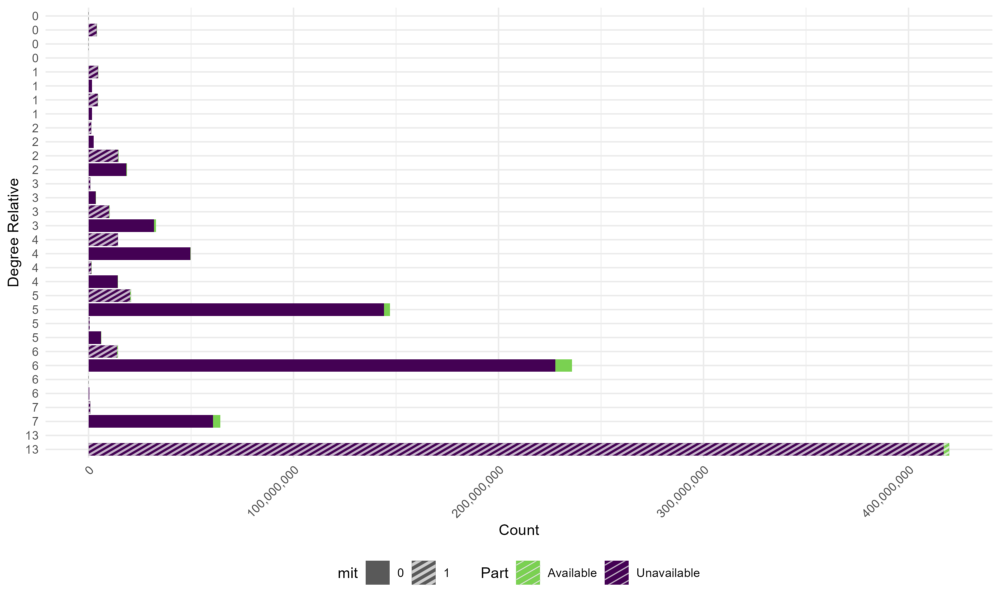

```{r child = "../setup.Rmd"}
```

<!-- Current genetic models of Alzheimer's disease (AD) overlook mitochondrial DNA (mtDNA), despite its biological links to neurodegeneration. mtDNA with its strictly maternal inheritance without recombination, may modulate neurodegenerative processes through altered energy metabolism and reactive oxygen species production. To assess mtDNA's influence on AD, we analyzed the Utah Population Database—a comprehensive resource of 11 million individuals across 200,000 extended families, from which we identified case-control pairs and their families, totaling 4.8 million people spanning 4-to-17 generations. AD diagnoses were ascertained using linked death certificates (ICD revisions 6–10) and electronic medical records from Intermountain Healthcare and the University of Utah Health Sciences Center (ICD-9 and ICD-10).  Using BGmisc (Garrison, Hunter et al. 2024) to algorithmically reconstruct pedigrees, we identified multiple genealogical clusters, including one that contained approximately 4.3 million relatives. From all clusters, we systematically extracted distant cousin dyads to evaluate extended cousin similarity in AD outcomes, jointly accounting for degrees of nuclear relatedness (6.25%, 3.125%, 1.5625%, etc.) and maternal versus paternal lineage. This design allowed us to estimate nuclear (h²) and mitochondrial (mt²) heritability simultaneously, testing whether matrilineal cousins display heightened similarity in AD relative to their paternal-line counterparts. Verifying this pattern would clarify mtDNA's role in the development of AD, guiding investigations into how maternal inheritance shapes neurodegeneration.
 -->

```{r packages, echo=FALSE, message=FALSE, warning=FALSE}
# Remember to compile
#xaringan::inf_mr(cast_from = "..")
#       slideNumberFormat: ""  
knitr::opts_chunk$set(knitr.duplicate.label = "allow")
library(tidyverse)
if (!require("emo")) devtools::install_github("hadley/emo")
library(emo)
knitr::write_bib(c(.packages(), "bookdown"), "packages.bib")
library(rcites)
library(RefManageR)
# Load the bibliography file
#toBibtex(citation("xaringan"))

bib <- ReadBib("packages.bib", check = FALSE) # Load your BibTeX file
BibOptions(check.entries = FALSE, style = "markdown") 
```


# Hello world!

<!-- Slide 1: Introduction (1 minute) -->
<!-- Script: Good [morning/afternoon/evening], everyone. My name is S. Mason Garrison, and I'm from Wake Forest University. I'm excited to continue the saga that Mike has begun. We have had big math problems, so who am I change the vibes. So behond a tale of my big data problems. Today, I’ll be presenting our attempt to trace mitochondrial inheritance patterns in Alzheimer’s Disease using a family-based case-control design. This talk is fundamentally about inference under constraint. Because while our dataset is enormous—4.8 million people embedded in extended pedigrees—our question hinges on what the data don’t tell us just as much as what they do. -->

<!-- This is work with Nithya Mylakumar, Xuanyu Lyu, Michael Hunter, Margie Gatz, Ken Smith, and Alex Burt, and it was supported by the National Institute on Aging [RF1-AG073189].-->

```{r echo=FALSE,out.width="30%",fig.align='center',fig.cap="QR code for these slides",fig.height=3}
library(qrcode)
code <- qr_code("https://r-computing-lab.github.io/slides/00_bga_2025/d00_slide.html#1")
plot(code)
```

.footnote[.center[
[r-computing-lab.github.io/slides/00_bga_2025/d00_slide](https://r-computing-lab.github.io/slides/00_bga_2025/d00_slide.html#1) 
]
]

---

# Mitochondrial Heritability of Alzheimer’s Disease
### Evidence from the Utah Population Database  
Mason Garrison,
Nithya Mylakumar M.
Xuanyu Lyu,
Michael Hunter,
Margie Gatz,
Ken Robert Smith,
Alex Burt

**NIA RF1-AG073189**
---

# The Power of Mitochondria (mtDNA)

### "It's the powerhouse of the cell" ``r emo::ji("zap")``  .small[Every Middle School Biology Teacher]

<!-- Slide 2:  Why Look at Mitochondrial DNA in AD? -->
<!-- Script: Alzheimer’s disease is widely recognized as heritable, but nearly all existing models focus on nuclear DNA. And yet mitochondrial DNA—or mtDNA—has multiple biological pathways connecting it to neurodegeneration.

MtDNA is maternally inherited, non-recombining, and central to energy production and oxidative stress regulation. All of these are plausible mechanistic pathways for Alzheimer’s risk. Mutations in mtDNA accumulate with age, and dysfunctional mitochondria are repeatedly observed in AD-affected brain tissue.

But critically, even though these pathways are biologically plausible, they’ve been underexamined at the population level. So we asked: is there evidence of mtDNA-linked familial resemblance for AD in large-scale genealogical data? -->

.pull-left-wide[
- Alzheimer’s disease is widely recognized as heritable, but 
  - nearly all existing models focus on nuclear DNA.
- And yet, `r emo::ji("dna")` mtDNA has multiple biological pathways connecting it to neurodegeneration.
- MtDNA is 
  - maternally inherited, 
  - non-recombining, and 
  - central to energy production and 
  - oxidative stress regulation.
- All of these are plausible mechanistic pathways for Alzheimer’s risk. (Swerdlow, 2018; Coskun et al., 2012; Wallace, 2005)
]
.pull-right-narrow[
- Mutations in mtDNA accumulate with age, and 
  - dysfunctional mitochondria are repeatedly observed in AD-affected brain tissue (e.g., Coskun, et al 2004).
]

<!-- Swerdlow, R. H. (2018). Mitochondria and mitochondrial cascades in Alzheimer’s disease. Journal of Alzheimer’s Disease, 62(3), 1403-1416. -->
<!-- Wallace, D. C. (2005). A mitochondrial paradigm of metabolic and degenerative diseases, aging, and cancer: a dawn for evolutionary medicine. Annu. Rev. Genet., 39(1), 359-407. -->
<!-- Coskun, P. E., & Busciglio, J. (2012). Oxidative stress and mitochondrial dysfunction in Down’s syndrome: relevance to aging and dementia. Current gerontology and geriatrics research, 2012(1), 383170. -->
<!-- Coskun, P. E., Beal, M. F., & Wallace, D. C. (2004). Alzheimer's brains harbor somatic mtDNA control-region mutations that suppress mitochondrial transcription and replication. Proceedings of the National Academy of Sciences, 101(29), 10726-10731. -->

---
# The Power of Mitochondria (mtDNA)

### "It's the powerhouse of the cell" ``r emo::ji("zap")``  .small[Every Middle School Biology Teacher]

- And yet, despite this biological plausibility...
--

- .midi[they've been almost entirely ignored at the population level.]

--

### So we asked:

.center[Is there evidence of mtDNA-linked familial resemblance for AD in large-scale genealogical data?]


---

background-image: url(img/Slide9_cropped.PNG)
background-size: 98%
background-position: center
background-repeat: no-repeat
class: middle

# The 
  
```{r fig.align='center', include=FALSE, out.width="95%"}
#knitr::include_graphics("img/Slide9.PNG")
#knitr::include_graphics(image_write(crop_bottom_percent("img/Slide9.PNG", pct = 10), tempfile(fileext = ".png")))
crop_bottom_percent("img/Slide9.PNG", pct = 6, 
                    output_path = "img/Slide9_cropped.PNG")
#
```

---

background-image: url(img/Slide10_cropped.PNG)
background-size: 94%
background-position: center
background-repeat: no-repeat

# The Data: What We Have

```{r, echo=FALSE, out.width="95%", fig.align='center'}
crop_bottom_percent("img/Slide10.PNG", pct = 6)
#
```

---

background-image: url(img/Slide11_cropped.PNG)
background-size: 93%
background-position: center
background-repeat: no-repeat


# The Data: Who We Have
  
```{r fig.align='center', include=FALSE, out.width="93%"}
crop_bottom_percent("img/Slide11.PNG", pct = 6)
#
```

---


background-image: url(img/Slide12_cropped.PNG)
background-size: 93%
background-position: center
background-repeat: no-repeat


# The Data: Who We Have
  
```{r fig.align='center', include=FALSE, out.width="93%"}
crop_bottom_percent("img/Slide12.PNG", pct = 6)
```

---

# The Data: What We Used

<!-- Script: We used the Utah Population Database—one of the world’s largest and deepest genealogical datasets, with over 11 million individuals linked across multigenerational pedigrees. For this project, we extracted a subset of 4.8 million individuals embedded in multigenerational family trees, anchored around AD cases and matched controls. These pedigrees span up to 17 generations, seeded with founders from 19th-century Utah (Skolnick et al., 1979; O’Brien et al., 1994). -->
<!-- -->
<!-- Linked data included birth and death certificates, family history records, and ICD-coded diagnoses from EMRs and death records, covering ICD-6 through ICD-10. Critically, these AD indicators come from two sources: (1) death records and (2) electronic medical records from Intermountain Healthcare and University of Utah Health Sciences. Which brings us to the first constraint: diagnostic coverage. -->


.pull-left[
- For this project, we extracted a subset of 4.8 million individuals:
  - anchored around 100,000 AD cases and their matched controls,
  - organized into extended family trees,  
  - spanning up to 17 generations.
]

.pull-right[
- Linked records central to our phenotype:
  - ICD-coded diagnoses from EMRs and death records (ICD-6 to ICD-10).
- Critically, AD indicators came from two sources:
  - death certificates and  
  - electronic medical records from Intermountain Healthcare and the University of Utah Health Sciences Center.
]

---

# The Data: What We Made
 
.pull-left[
- We algorithmically reconstructed extended pedigrees:
  - using **BGmisc**, our custom R package for extended behavior genetic analysis (Garrison, Hunter, Lyu, Trattner, & Burt, 2024),  
  - in combination with graph theory algorithms to identify cousin pairs,  
  - and computed path-based relatedness estimates (Hunter, Garrison et al., RnR).
- For each dyad, we traced:
  - nuclear relatedness,
  - maternal vs. paternal lineage,
  - mtDNA sharing, and
  - potential shared environment.
]

.pull-right[
- To illustrate this on a human scale, we simulated a family:
  - spanning 6 generations,  
  - using `simulatePedigree()` and plotted with `ggpedigree` (Garrison, 2025),  
  - visualizing two relatedness types:
    - **additive** (left) and  
    - **mitochondrial** (right).
- The full dataset contains 4.8 million people—
  - but this mini-pedigree captures the logic of the design.
]

---

.pull-left[
```{r echo=FALSE, out.height = "500px", fig.align = "center"}
library(BGmisc)
library(ggpedigree)
set.seed(8)

# Simulate a family with 4 generations
df_ped_6 <- simulatePedigree(Ngen = 6)

df_ped_all <- recodeSex(df_ped_6,
  code_male = "M",
  recode_male = 1,
  recode_female = 0
) %>% rename(personID = ID, famID=fam)

ggpedigree::ggpedigree(df_ped_all,
  interactive = TRUE,
  personID = "personID",
  famID = "famID",
  config = list(
    label_method = "geom_text",
    label_text_size = 1,
    point_size = 1,
    sex_color_include = FALSE,
    focal_fill_personID = 10011,
    focal_fill_include = TRUE,
    focal_fill_force_zero = TRUE,
    focal_fill_component = "additive",
    focal_fill_mid_color = "orange",
    focal_fill_low_color = "#9F2A63FF",
 #   focal_fill_high_color = "#2A9F63FF",
    focal_fill_method = "gradient",
    focal_fill_legend_title = "",
 sex_legend_title = "Relatedness to Founder\n\nSex",
    focal_fill_na_value = "black",
    value_rounding_digits = 4,
      code_male = "1",
    focal_fill_scale_midpoint = 0.5,
        tooltip_columns = c("personID","focal_fill")
  )

)
```
]
--
.pull-right[
```{r echo=FALSE, out.height = "500px", fig.align = "center"}

ggpedigree::ggpedigree(df_ped_all,
  interactive = TRUE,
  personID = "personID",
  famID = "famID",
  config = list(
    label_method = "geom_text",
    label_text_size = 1,
    point_size = 1,
    sex_color_include = FALSE,
    focal_fill_personID = 10011,
    focal_fill_include = TRUE,
    focal_fill_force_zero = TRUE,
    focal_fill_component = "mitochondrial",
    focal_fill_high_color = "#d55e00",
    focal_fill_mid_color = "#d55e00",
    focal_fill_low_color = "grey10",
    focal_fill_scale_midpoint = 0.85,
    focal_fill_legend_title = "",
     sex_legend_title = "MTDNA Relatedness to Founder\n\nSex",
    focal_fill_na_value = "black",
    value_rounding_digits = 4,
    
   code_male = "1",
   tooltip_columns = c("personID","focal_fill")
  )) 

```
]


<!-- Script: Our approach was to algorithmically reconstruct extended pedigrees and extract cousin dyads at various degrees of relatedness. We used BGmisc, our custom R package for extended behavior genetic analysis (Garrison, Hunter, Lyu, Trattner, & Burt, 2024), in combination with graph theory algorithms to identify cousin pairs and compute path-based relatedness estimates.

For each dyad, we traced whether the relation passed through the maternal or paternal line, whether they shared mtDNA, and whether they had any shared environment. We then calculated polychoric correlations for AD outcomes across these bins, stratified by degree of relatedness and lineage. -->


---

class: middle
# Foreshadowing...

In theory this is where that talk would shift to showing the results of our analysis, but...  

--

## But in practice?

- We hit constraints. And not subtle ones...
    - family size and
    - diagnostic coverage

---

# Constraint 1: Family Size

- In a previous iteration of this project, we examined 'longevists'
  - individuals who lived to be in the top 10% of the population for age at death.
  - If you attended that talk, you may remember that we found strong cousin resemblance for longevity, but that the heart of that talk was centered around how to handle our big family...
  
--
.pull-left.center[
```{r, echo=FALSE, out.width="99%", fig.align='center', fig.cap="A pedigree plot of the SSA mortality from 1900 to the present."}
knitr::include_graphics("img/longevity.png")
```
]
.pull-right[
```{r, echo=FALSE, out.width="59%", fig.align='center', fig.cap=""}
knitr::include_graphics("img/mtdna.png")
```
]
---

background-image: url(img/Slide15.PNG)
background-size: 94%
background-position: 50% 105%
background-repeat: no-repeat

# Constraint 1: Family Size 

<!-- Script: In this project, we’re not looking at longevists, but at Alzheimer’s cases. And while the Utah Population Database is large, it’s not infinite. So we had to make some hard choices about how to define our cases and controls. -->


--

```{r echo=FALSE, fig.align='center', out.width="80%"}
knitr::include_graphics("img/sweetsummer.gif")
```

---

background-image: url(img/Slide15.PNG)
background-size: 94%
background-position: 50% 105%
background-repeat: no-repeat

# Constraint 1: Family Size 

<!-- Script: In this project, we’re not looking at longevists, but at Alzheimer’s cases. And while the Utah Population Database is large, it’s not infinite. So we had to make some hard choices about how to define our cases and controls. -->

---

# Constraint 1: Family Size 

- I wish our family was that ... .tiny[small].

--
- I wish it was that ... .tiny[manageable].
- But it’s not.

--

- To give you a sense of the scale of what we’re working with... 

---

# Constraint 1: Family Size

.pull-left[
```{r, echo=FALSE, out.width="99%", fig.align='center'}
knitr::include_graphics("img/stacked_bar_log.png")
```
]

.pull-right[
- Yes, that scale is logarithmic.  
  - And yes, that really is a lot of cousins.

- For context:
  - the human body contains approximately `2 × 10^13` blood cells,
  - and our dataset has a comparable order of magnitude in cousin pairs.

- In theory, we have:  
  - `4,160,931^2` possible cousin pairs in our big family.

- That’s approximately:  
  - 17 trillion 313 billion 346 million 786 thousand 761.
]

---

# Without log scaling...

.pull-left[
```{r, echo=FALSE, out.width="50%", fig.align='center'}
knitr::include_graphics("img/stacked_bar_pattern_all.png")
```

]
--
.pull-right[
- Same plot.  
- Just without the log scale.
- This is what happens when you try to visualize 4,160,931 cousins
  - on a linear scale.  
- The y-axis is so large that it’s hard to see the smaller relationships.
]

---

# Constraint 2: Diagnostic Coverage

## Who the Data Don’t Show
  
<!-- Script: Even with a population this large, the usable signal is fragile. Many individuals have no diagnostic data at all. Others have only a single diagnostic entry, or an AD-related cause of death recorded via ICD-9. There’s also no uniform ascertainment: some participants have decades of EMR data, others none.

That means our classification of AD status is necessarily a dichotomy—and not a very precise one. And that binary outcome—AD case or not—masks variability in severity, age of onset, and diagnostic certainty. -->

.pull-left[
- Even with a population this large, the usable signal is fragile. 
- Diagnostic coverage is incomplete:
  - some individuals have clear AD diagnoses,
  - some have indicators of **no** AD, and
  - many have no diagnostic data at all.
- This is not just a matter of missing values at random—  
  —it introduces ambiguity in the outcome label itself.
]

.pull-right[
- Our classification is necessarily binary:  
  - AD case vs. non-case.
- But this dichotomy obscures a third group:  
  - those with unknown diagnostic status.
- And even for known cases, we lose nuance in:  
  - severity,  
  - age of onset, and  
  - diagnostic certainty.
]

---


# What We Hoped to Find
  
<!-- Script: If mtDNA contributes to AD, we would expect cousin pairs who share maternal lineage—thus mtDNA—to resemble each other more than those of equal nuclear relatedness but through a paternal line. So, for example, maternal 3rd cousins might show higher concordance for AD than paternal 3rd cousins, despite both having 1.5625% expected nuclear overlap. -->

.pull-left[
- If mtDNA contributes to AD,  
  - then cousin pairs who share **maternal lineage**—thus mtDNA—  
  - should resemble each other more than cousin pairs with equal nuclear relatedness through the **paternal line**.
]

.pull-right[
- For example:  
  - Maternal 3rd cousins (1.5625% nuclear relatedness)  
  - should show **higher concordance** for AD  
  - than paternal 3rd cousins,  
  - if mtDNA contributes to risk.
]


---

# What We Found
  
<!-- Script: We observed impressively negatively phi coefficients for AD status across all degrees of relatedness, indicating that cousins were less likely to share AD diagnoses than expected by chance. This is inconsistent with the known heritability of AD; it also suggests that our diagnostic coverage is incomplete.

It did not matter whether the dyad was maternal or paternal, or how closely related they were. It didn't matter how nicely we modeled the quality of our diagnostic data, or how we controlled for nuclear relatedness. The cousin similarity design did not detect any signal of mtDNA-linked familial resemblance for AD. And frankly, in hindsight, this is not surprising. 

We received 100,000 people with clear AD diagnoses, and 100,000 matched controls. We also received all the demographic data for their relatives. 

What we didn't receive was clear diagnoses for those relatives. For many of them, that's not reasonable to get. 

We have 4.8 million people, but we only have 100,000 AD cases, and 100,000 non-AD controls. That doesn't mean that we have 4.6 million people who don't have AD. It means that we have 4.6 million people who we don't know whether they have AD or not.

-->
 
.pull-left[
- We observed **strongly negative phi coefficients**  
  - for AD status across all degrees of relatedness.

- Cousins were **less likely** to share an AD diagnosis than expected by chance.

- This contradicts the **known heritability of AD**—  
  - and immediately suggests problems with the data.
]

--

.pull-right[
- The pattern held regardless of:
  - whether the dyad was maternal or paternal,
  - how close they were,
  - how well we modeled diagnostic quality.

- The cousin similarity design detects a signal
  - but it's in the wrong direction.
- In hindsight, this is not surprising:
  - We had 100,000 well-classified AD cases and 100,000 matched controls—
  - but the remaining 4.6 million people?
]
- We had 100,000 well-classified AD cases and 100,000 matched controls—
—but the remaining 4.6 million people?

---

# Why the Signal is Weak?
  
```{r, echo=FALSE, out.width="99%", fig.align='center'}

``` 

---

# What We Learned Instead
  
<!-- Script: So what did we learn? We learned that the cousin similarity design is a powerful tool for evaluating mtDNA using pedigree structure—not through genotyping, but through patterns of resemblance. But we also learned that the data we have are not sufficient to answer our original question. -->
<!-- Script: What actually failed here? Because it’s not the sample size. It’s not the analysis. It’s the design. -->
..pull-left[
- Constraint 1: Family size
  - Turns out, this design is plenty powerful.
  - Even a small slice of the family was enough to detect effects.
  - Just not the effects we were hoping for.
]
--
.pull-right[
- Constraint 2: Diagnostic coverage
  - The data we have are not sufficient to answer our original question.
  - We need more complete diagnostic coverage for relatives.
  - We need to be able to distinguish between AD and non-AD relatives.
  - We need to be able to distinguish between AD and unknown relatives.
  If anything, the case-control design induced selection bias.
  
- Which means:
  - We didn’t test resemblance across families—
  - we tested it within a preselected outcome set.
  - We can’t yet resolve whether mtDNA meaningfully contributes to AD via familial resemblance.
  - But we’ve constructed the architecture to test that question—one that can be deployed as richer phenotype linkages emerge.
]

---

# Implications and Next Steps
  
<!-- Script: So what are the implications?
  
Substantively, we can’t yet resolve whether mtDNA meaningfully contributes to AD via familial resemblance. But we’ve constructed the architecture to test that question—one that can be deployed as richer phenotype linkages emerge.

Methodologically, this demonstrates a scalable framework for evaluating mtDNA using pedigree structure—not through genotyping, but through patterns of resemblance.
 -->
  
- Substantively, we can’t yet resolve whether mtDNA meaningfully contributes to AD via familial resemblance. 
- But we’ve constructed the architecture to test that question—one that can be deployed as richer phenotype linkages emerge.
- Methodologically, this demonstrates a scalable framework for evaluating mtDNA using pedigree structure—not through genotyping, but through patterns of resemblance.
- The most fruitful next step is reducing missingness in our phenotype data 


---

# Acknowledgements
  
<!-- Script: This work was funded by the National Institute on Aging [RF1-AG073189] and supported by the Utah Population Database. The analytic infrastructure was developed in the open-source R package BGmisc (Garrison et al., 2024). Thanks to my co-authors and to the data stewards at UPDB. -->
  
- This work was funded by the National Institute on Aging [RF1-AG073189] and supported by the Utah Population Database.

---

## Any Questions?

Feel free to ask any questions now, or reach out to me after the talk via email _garrissm@wfu.edu_ or on github _github.com/smasongarrison_.

```{r qr_ds4p, echo=FALSE, fig.align = "center", out.width = "30%", caption="Scan the QR code to visit the Data Atlas"}
library(qrcode)
code <- qr_code("https://r-computing-lab.github.io/data-atlas/")
plot(code)
```

.footnote[.center[
[r-computing-lab.github.io/data-atlas/](https://r-computing-lab.github.io/data-atlas/) 
]
]


