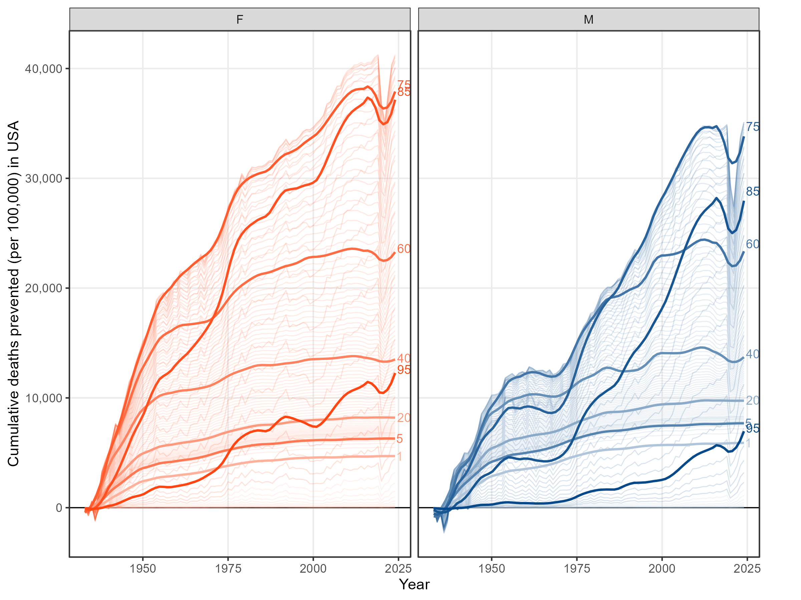
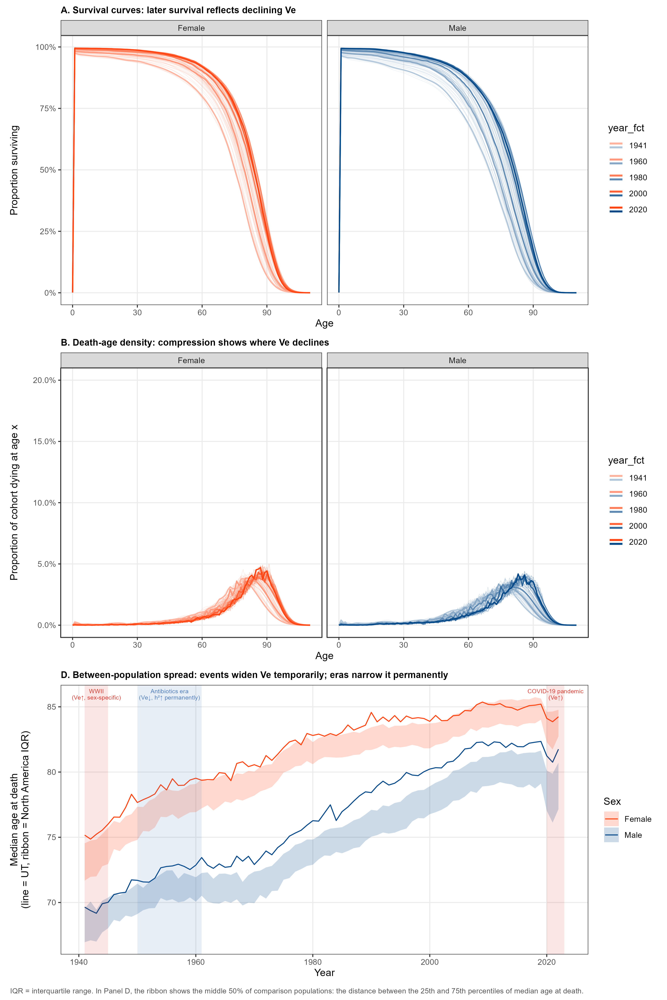
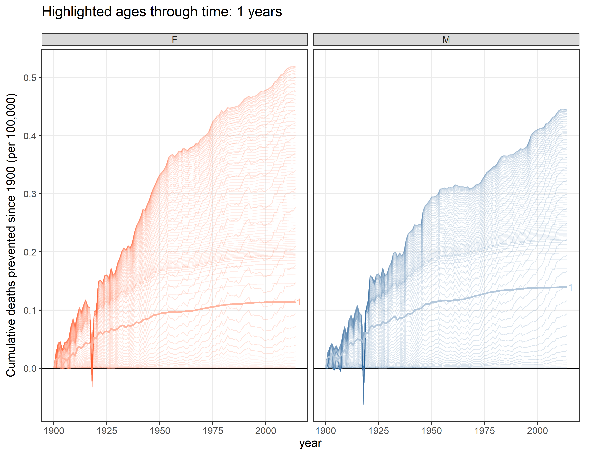
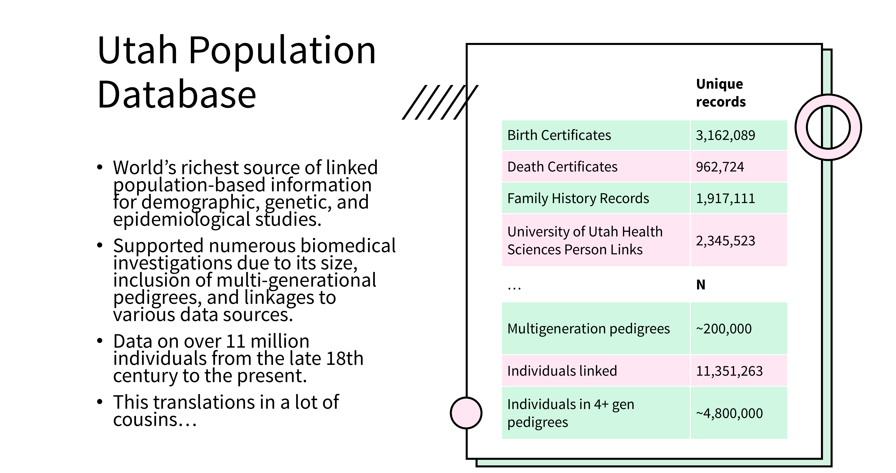
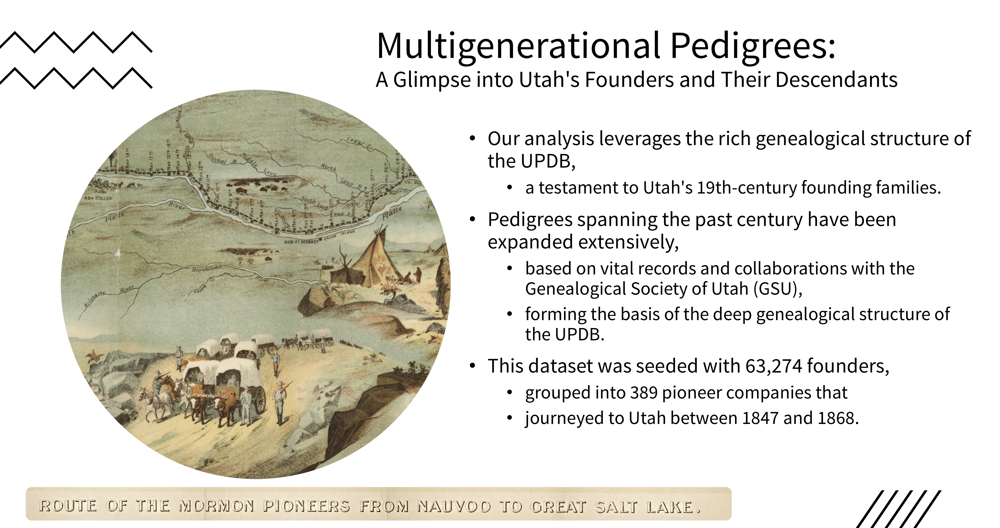
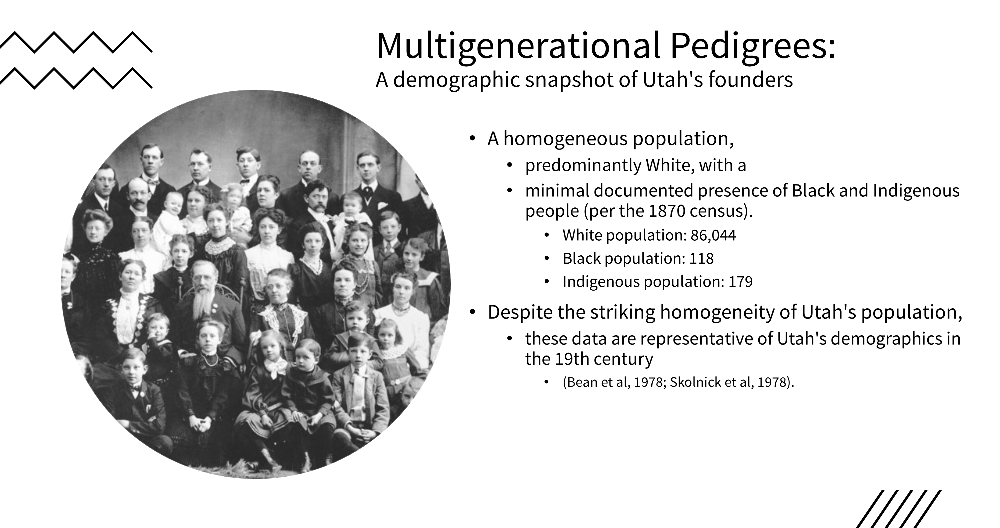
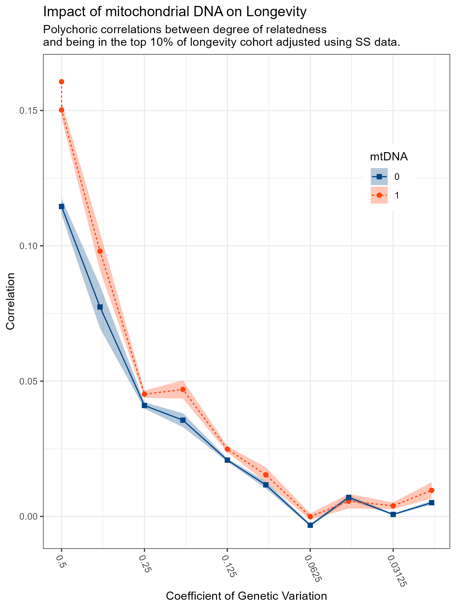
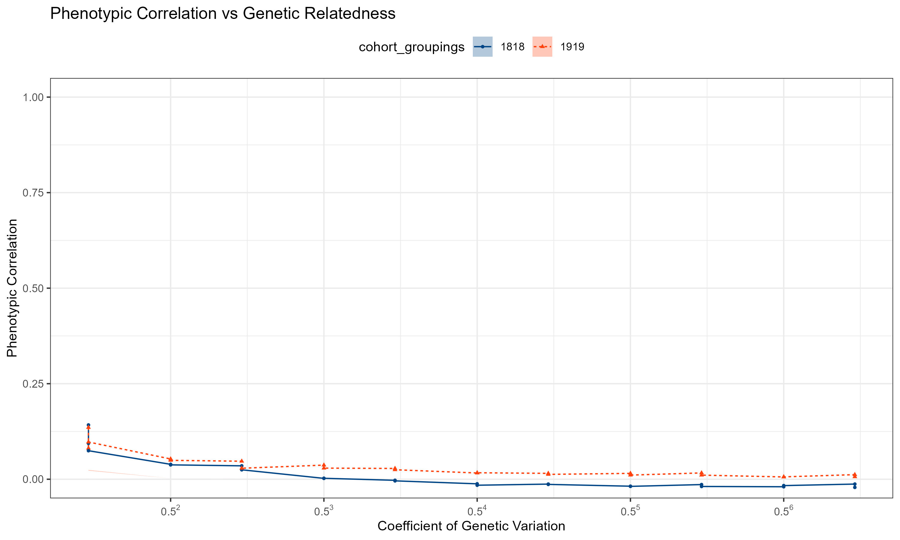

```{r child = "../setup.Rmd"}
```

<!-- Studies 1 and 2 evaluated temporal influences on heritability estimates from meta-analytic and raw twin data. Despite employing different methods in non-overlapping samples with different types of twin data, both studies identified temporal changes in genetic estimates of at least .03 per decade. Although our confidence is buoyed by this constructive replication, the decline in heritability estimates could be specific to twin designs or to the most recent historical epoch. For Study 3, we thus sought to clarify whether the pattern of changing heritability estimates might extend to an extended pedigree sample with 5 generations of kinship pairs dating back three centuries: the Utah Population Database (UPDB). The UPDB includes 1,018,929 deceased individuals born between 1700 and 1925, with 176,348,110 unique kinship links amongst them. Because formal models for temporal moderation of heritability in pedigree data do not yet exist, we conducted an indirect test by evaluating whether kinship similarity varied by century of birth. The similarity of first-degree relatives varied minimally (but significantly, a consequence of the very large N) depending on their century of birth. In contrast, second- through fifth-degree relatives were substantially more similar when both were born in the 20th century, with correlations approximately double those of pairs born prior to the 20th century. Preliminary Falconer-inspired analyses showed the same pattern, estimating heritability at 22% in the 20th century but 27% prior to the 20th century. Such results offer strong additional support for temporal changes in heritability.
 -->

```{r packages, echo=FALSE, message=FALSE, warning=FALSE}
# Remember to compile
#xaringan::inf_mr(cast_from = "..")
knitr::opts_chunk$set(knitr.duplicate.label = "allow")
library(tidyverse)
if (!require("emo")) devtools::install_github("hadley/emo")
library(emo)
knitr::write_bib(c(.packages(), "bookdown"), "packages.bib")
library(rcites)
library(RefManageR)

bib <- ReadBib("packages.bib", check = FALSE)
BibOptions(check.entries = FALSE, style = "markdown")
```


# Hello world!

<!-- Slide 1: Title (30 sec) -->
<!-- Script: Good [morning/afternoon/evening]. I'm Mason Garrison from Wake Forest University. Today I'm asking whether the heritability of longevity has been stable across historical time — or whether the genetics of how long you live looks different depending on when you were born. I've got 300 years of pedigree data and 176 million kinship pairs, so let's find out. -->

```{r echo=FALSE,out.width="30%",fig.align='center',fig.cap="QR code for these slides",fig.height=3}
library(qrcode)
code <- qr_code("https://r-computing-lab.github.io/slides/00_bga_2026/d00_slide.html#1")
plot(code)
```

.footnote[.center[
[r-computing-lab.github.io/slides/00_bga_2026/d00_slide](https://r-computing-lab.github.io/slides/00_bga_2026/d00_slide.html#1)
]
]

---

# Temporal Changes in the Heritability of Longevity
### Evidence from the Utah Population Database

- Mason Garrison (Wake Forest University)
- Michael D. Hunter (Penn State University)
- Ken R. Smith (University of Utah)
- *S. Alexandra Burt (Michigan State University)*

**NIA R01-AG073189**

<!-- This is work with Michael Hunter,Ken Smith, and Alex Burt, and it was supported by the National Institute on Aging [RF1-AG073189].-->
---

# Road map

- 
- Data
- Method
- Result

---


# Is the Heritability of Longevity Stable Over Time?

<!-- Slide 3: Background and question (1 min) -->
<!-- Script: We've known for decades that longevity has a genetic component. Classic twin studies put h² around 20–25%. More recent work correcting for extrinsic causes of death puts it closer to 50% (Shenhar et al., 2026). But these estimates treat heritability as a fixed property of the trait — a constant. What if it isn't? The environment of 1750 was radically different from 1950. Life expectancy has climbed from around 32 to over 73 years. The dominant causes of death have shifted from infectious disease to chronic, degenerative conditions. If genetic and environmental contributions to longevity are sensitive to those historical shifts — as theory predicts — then heritability should not be constant across time. That's the question. -->

.pull-left[
- Longevity is heritable
  - Twin studies: h² ≈ 20–25% .small[(e.g., Herskind et al., 1996; McGue et al., 1993)]
  - Pedigree Studies: h² ≈ 25% + mt² ≈ 5% .small[(Burt, Garrison, et al 2025)]
  - Correcting for extrinsic mortality: h² ≈ 50% .small[(Shenhar et al., 2026)]
- But these treat h² as **fixed**
]
--
.pull-right[
- The environment has changed dramatically:
  - Life expectancy: ~32 → ~73 years
  - Dominant cause of death: infectious → chronic/degenerative
  - Antibiotic era, sanitation, nutrition — all compress extrinsic mortality
- **If environment shapes how genetic differences express, h² should shift too**
]

---

# Longevity Has Been Going Up

<!-- Slide 4: Motivation figure (1 min) -->
<!-- Script: Here are several over-engineered figures that I made to illustrate what the longevity landscape has looked like across the last three centuries. 
On the left, I'm showing data about the state of utah from the Social Security Administration, which has detailed records of all deaths in the state from 1941 to 2023. On the right, I'm showing data about Sweden from the Human Mortality Database, which has detailed records of all deaths in Sweden from 1750 to 2025. 

In both cases, panel A  shows survival curves shifting right and compressing over time. Panel B shows the death-age density narrowing.  Panel D shows between-population spread in median age at death, with historical events marked. WWI, the 1918 flu pandemic, and WWII all spike the between-population variance — catastrophic environmental shocks that overwhelmed genetic differences, temporarily suppressing h². Then the antibiotic era permanently compressed that variability. 


 Panel A shows survival curves shifting right and compressing over time. Panel B shows the death-age density narrowing. Panel C tracks age-by-time shifts in mortality — gains have accumulated unevenly across the lifespan. Panel D is the key one: between-population spread in median age at death, with historical events marked. WWI, the 1918 flu pandemic, and WWII all spike the between-population variance — catastrophic environmental shocks that overwhelmed genetic differences, temporarily suppressing h². -->
 
.pull-left[

.medi[Utah demographics from the Social Security Administration (1941 - 2023)]

```{r, echo=FALSE, out.height="88%", fig.align='center'}
#

```
]
.pull-right[
.medi[Swedish Demographics from Human Mortality Database (1750 - 2025)]
  
```{r, echo=FALSE, out.height="88%", fig.align='center'}
#
knitr::include_graphics("img/panel_SWE_CI_continent_min_1750_croped.png")
```
]

---

# So Why Would Heritability Change?

<!-- Slide 5: Theoretical motivation (1.5 min) -->
<!-- Script: Let's zoom in on panel C, which I actually cut out of the previous figure... This shows the age-by-time shifts in mortality. Gains have accumulated unevenly across the lifespan. The most dramatic improvements have been in infancy and old age, with more modest gains in midlife. This is important because it means that the environmental context for genetic expression has changed differently at different ages.  -->

## SSA data for the entire USA: (1900-2019)

.pull-left-wide[
```{r, echo=FALSE, out.width="54%", fig.align='center'}

```
]
--
- Interpretation: Relative to a person born in 1900, what proportion of deaths were postponed. 


---


background-image: url(img/Slide9_cropped.PNG)
background-size: 98%
background-position: center
background-repeat: no-repeat
class: middle

<!-- Slide 7: UPDB (1 min) -->
<!-- Script: The Utah Population Database is one of the world's deepest genealogical resources, containing over a million deceased individuals born between 1700 and 1925, linked into multigenerational pedigrees via birth records, death records, and historical census data (Skolnick et al., 1979). That gives us 176 million unique kinship pairs spanning multiple birth centuries. And critically — unlike our AD work last year — everyone has a death record. Phenotype coverage is complete. -->


# The 
  
```{r fig.align='center', include=FALSE, out.width="95%"}
#knitr::include_graphics("img/Slide9.PNG")
#knitr::include_graphics(image_write(crop_bottom_percent("img/Slide9.PNG", pct = 10), tempfile(fileext = ".png")))
crop_bottom_percent("img/Slide9.PNG", pct = 6, 
                    output_path = "img/Slide9_cropped.PNG")
#
```


---

background-image: url(img/Slide10_cropped.PNG)
background-size: 94%
background-position: center
background-repeat: no-repeat

# The Data: What We Have

```{r, echo=FALSE, out.width="95%", fig.align='center'}
crop_bottom_percent("img/Slide10.PNG", pct = 6)
#
```

---

background-image: url(img/Slide11_cropped.PNG)
background-size: 93%
background-position: center
background-repeat: no-repeat


# The Data: Who We Have
  
```{r fig.align='center', include=FALSE, out.width="93%"}
crop_bottom_percent("img/Slide11.PNG", pct = 6)
#
```

---


background-image: url(img/Slide12_cropped.PNG)
background-size: 93%
background-position: center
background-repeat: no-repeat


# The Data: Who We Have
  
```{r fig.align='center', include=FALSE, out.width="93%"}
crop_bottom_percent("img/Slide12.PNG", pct = 6)
#
```


---

# The Data: What We Used

<!-- Script: We used the Utah Population Database—one of the world’s largest and deepest genealogical datasets, with over 11 million individuals linked across multigenerational pedigrees. For this project, we extracted a subset of 4.8 million individuals embedded in multigenerational family trees, anchored around AD cases and matched controls. These pedigrees span up to 17 generations, seeded with founders from 19th-century Utah (Skolnick et al., 1979; O’Brien et al., 1994). -->

.pull-left[
- For this project, we were able to use a more manageable subset 
  - **1,018,929** deceased individuals
  - Born 1700–1925
  - Pedigrees up to 17 generations deep
  - Linked via genealogical and vital records .small[(Skolnick et al., 1979)]
- **176,348,110** unique kinship pairs
  - 1st through 5th-degree and beyond
  - Multiple birth centuries represented
  - Same dataset as Burt, Garrison et al. (2025)
]
.pull-right[

- Phenotype: **Age at death** (longevity)
  - Recorded for every individual — no missingness `r emo::ji("check")`
- Pedigrees reconstructed using **`BGmisc`** .small[(Garrison, Hunter, Lyu, Trattner, & Burt, 2024)]
  - Graph-theoretic path-based relatedness estimation .small[(Hunter, Garrison et al., 2026)]
]

---

# The Data: What We Made
 
.pull-left[
- We reconstructed extended pedigrees:
  - using **BGmisc**, our custom R package for extended behavior genetic analysis .small[(Garrison, Hunter, Lyu, Trattner, & Burt, 2024)],  
  - in combination with graph theory,  
  - and computed path-based relatedness estimates .small[(Hunter, Garrison et al., 2026)].
- For each dyad, we traced:
  - nuclear relatedness,
  - maternal vs. paternal lineage,
  - mtDNA, and potential shared environment.
]
--
.pull-right[
- Go read the 35 page appendix of Burt, Garrison et al if you want more specifics

```{r, echo=FALSE, out.width="55%", fig.align='center', fig.cap=""}

```
]


---

# The Analytic Strategy

<!-- Slide 8: Methods (1.5 min) -->
<!-- Script: Because formal models for temporal moderation of heritability in pedigree data don't yet exist, what we have is an indirect test. We split kinship pairs by whether both members were born in the 20th century (1900 or later) versus both born prior, then ask: does within-pair similarity differ by birth century, and does that pattern vary by degree of relatedness in the way we'd expect if heritability itself were changing? -->

.pull-left[
- **The question**: does within-pair similarity in longevity differ by birth century?
  - Split: both members born in 20th century vs. both born prior .small[(Burt, Garrison et al., 2025)]
- **The logic**:
  - 1st-degree relatives share A **and** C — changes can cancel
  - 2nd–5th degree relatives share A, not shared household
  - If h² changes over time, distant kin should show it most clearly
]
--
.pull-right[
- **The test**:
  - Tetrachoric correlations for top-10% longevity .small[(Olsson, 1979; Fox, 2015)]
  - Stratified by: degree of relatedness × century of birth
  - 20th-century pairs vs. pre-20th-century pairs
- No formal temporal moderation model for pedigrees exists yet — this is indirect
]

---

# Results: First-Degree Relatives

<!-- Slide 9: 1st degree results (1 min) -->
<!-- Script: For first-degree relatives, we found minimal variation by birth century. The difference was statistically significant — but this is a consequence of the enormous sample size, not of substantive effect size. The practical pattern is flat. This is exactly what our theoretical model predicts: if A rises as C falls, the two changes partially offset each other in first-degree pairs. The signal is not here. -->


.pull-left-narrow[
- Within-pair similarity for 1st-degree relatives (Burt, Garrison et al., 2025, Table S7):
  - **Minimal** variation across birth centuries
  - Statistically significant — but N = all the people `r emo::ji("sweat_smile")`
  - Practically trivial
- This is the **expected** pattern, not a null result:
  - If A↑ as C↓ over time, net change in 1st-degree similarity ≈ 0
  - 1st-degree pairs conflate A and C — not where we expect the signal
]
--
.pull-right-wide[

```{r echo=FALSE, fig.align='center', fig.cap="", message=FALSE, warning=FALSE, out.width="95%"}
library(tidyverse)
library(DT)
# read table"E:\Dropbox\Lab\Research\Presentations\slides\slides\00_bga_2026\results.csv"
results <- read.csv("cor_cohort19flat.csv") %>%
  select(cohort_groupings,n_pairs, addRel_max, 
         mtdna, 
         cnu, 
         age_k1_meanFunction, 
         USA_flag_10_k1_meanFunction,
         USA_flag_10_polychorFunction_rho, 
         USA_flag_10_polychorFunction_se) %>%
  filter(cohort_groupings %in% c(1919,1818)) %>%
  rename(cohort = cohort_groupings,
         n_pairs = n_pairs,
         mtdna = mtdna, 
         cnu = cnu, 
         age = age_k1_meanFunction, 
         top10 = USA_flag_10_k1_meanFunction,
         rho = USA_flag_10_polychorFunction_rho, 
         se = USA_flag_10_polychorFunction_se) %>%
# reverse order of dataset
  arrange(desc(addRel_max))

DT::datatable(
  results,
  rownames = FALSE,
  options = list(pageLength = 10, scrollX = TRUE)
) %>%
  formatRound(columns = c("rho", "se","top10","addRel_max"), digits = 3) %>%
   formatRound(columns = c("age"), digits = 1)
```


]
---

# Results: Distant Relatives (2nd–5th Degree)

<!-- Slide 10: KEY RESULT (2 min) -->
<!-- Script: Here's where the story is. For 2nd through 5th-degree relatives — cousins and beyond — pairs born in the 20th century were substantially more similar in longevity than pairs born before the 20th century. The correlations were approximately double. These pairs share genetics but not shared household. So this pattern specifically implicates increased genetic influence on longevity in the modern era. The effect is consistent across all distant kin classes — it's not driven by any one degree. And it is consistent with the theoretical prediction: as extrinsic environmental mortality compressed in the antibiotic era, genetic differences between families account for a progressively larger share of longevity variation. -->

<!-- [FIGURE: Add results figure for 2nd-5th degree correlations by birth century] -->

.pull-left[
- **2nd–5th degree relative pairs** (Burt, Garrison et al., 2025, Table S7):
  - Born in the **20th century**: correlations **~2× higher** than
  - pairs born **prior to the 20th century**
- Distant relatives share `r emo::ji("dna")` genetics, not shared household
  - This pattern implicates genetic influence specifically
  - Consistent with antibiotic era prediction: Ve↓, h²↑ permanently
  - Holds across all distant kin classes
- Not sample-size noise — the difference is substantively large
]
--
.pull-right[

```{r, echo=FALSE, out.width="55%", fig.align='center', fig.cap=""}

```
]
---

# Results: Preliminary Heritability Estimates

<!-- Slide 11: Falconer estimates (1 min) -->
<!-- Script: We also ran preliminary Falconer-inspired analyses. These gave h² of 22% for 20th-century pairs and 27% for pre-20th-century pairs — which seems to contradict the distant-relative result. But this is an artifact of the aggregate estimate being dominated by 1st-degree pairs, which are the most numerous and show minimal change. The flat first-degree pattern drowns out the distant-kin signal in the pooled estimate. Formal models that can decompose these effects by degree and birth period are the obvious next step — and they don't exist yet. -->

.pull-left[
- Preliminary Falconer-inspired h²:
  - **20th century**: h² ≈ **22%**
  - **Pre-20th century**: h² ≈ **27%**
- Seems to contradict the distant-relative result...
]
--
.pull-right[
- It doesn't — the aggregate estimate is dominated by 1st-degree pairs
  - Most numerous, minimal change → swamps the distant-kin signal
- Formal temporal moderation models for pedigrees **don't yet exist**
  - These estimates are preliminary and indirect
  - Decomposing properly is the next methodological step
]

---

# What We Learned

<!-- Slide 12: Discussion (1 min) -->
<!-- Script: So what do we take away? First, temporal change in kinship similarity extends beyond twins and beyond the last century — we see it in 300 years of pedigree data. Second, the clearest signal is in distant kin, specifically implicating genetic rather than environmental change. Third, the Falconer estimates are preliminary and require better models. And fourth — methodologically — the field currently lacks formal tools to do this analysis rigorously. That gap is the core of the work ahead. -->

.pull-left[
- Temporal change in kinship similarity seen in **extended pedigree data** going back **300 years**
- Signal is in **distant kin** — specifically implicates genetic influence
  - Consistent with the theoretical predictions from the antibiotic era
]
--
.pull-right[
- **Caveats**:
  - No formal temporal moderation model for pedigrees yet
  - Falconer estimates are preliminary and aggregate
  - Mechanism still requires decomposition
- The field needs new models — and building them is next
]

---

# Next Steps

- **Formal modeling**: multigenerational pedigree model for temporal moderation of A, D, C, and E
  - Linear, quadratic, and cubic forms; discrete shifts for pre-registered historical events
- **Validate by simulation**: confirm sensitivity and specificity across effect sizes
- **Apply in the full UPDB**: formal test of the 300-year heritability trajectory for longevity
- **Extend to related aging outcomes**: Type II diabetes, Alzheimer's Disease, Parkinson's Disease

---

# Acknowledgements

- **Utah Population Database** (University of Utah / Huntsman Cancer Institute)
- **Co-authors**: Michael D. Hunter, Ken R. Smith, S. Alexandra Burt
- **R packages**: `BGmisc` (Garrison, Hunter, Lyu, Trattner, & Burt, 2024), `ggpedigree` (Garrison, 2025)
- **Human Mortality Database** for theoretical illustration figures

---

## Any Questions?

Feel free to ask now, or reach out: _garrissm@wfu.edu_ | _github.com/smasongarrison_

```{r qr_bga2026, echo=FALSE, fig.align = "center", out.width = "30%"}
library(qrcode)
code <- qr_code("https://r-computing-lab.github.io/slides/00_bga_2026/d00_slide.html")
plot(code)
```

.footnote[.center[
[r-computing-lab.github.io/slides/00_bga_2026/d00_slide.html](https://r-computing-lab.github.io/slides/00_bga_2026/d00_slide.html)
]
]
