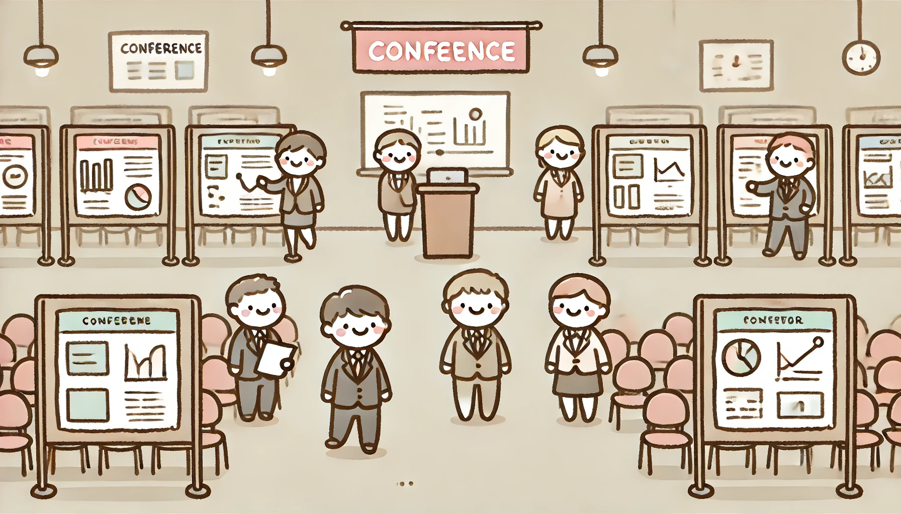
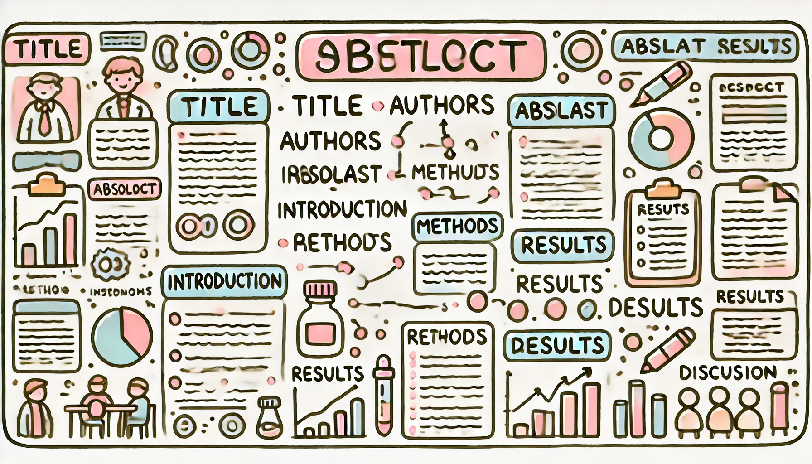
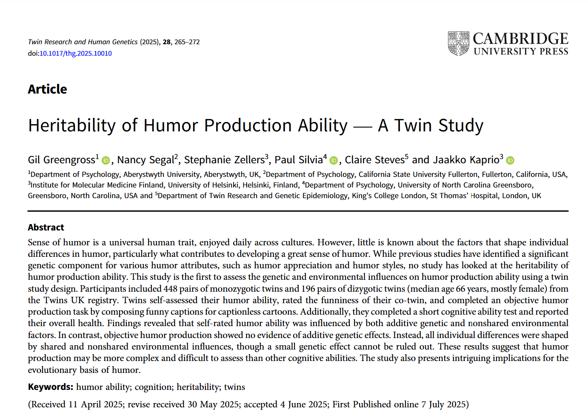
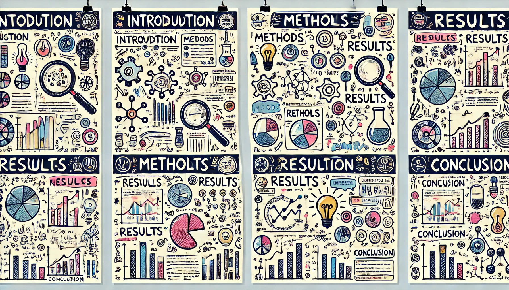

```{r child = "../setup.Rmd"}
```


```{r packages, echo=FALSE, message=FALSE, warning=FALSE}
# Remember to compile
#xaringan::inf_mr(cast_from = "..")
#       slideNumberFormat: ""  
knitr::opts_chunk$set(knitr.duplicate.label = "allow")
library(tidyverse)
if (!require("emo")) devtools::install_github("hadley/emo")
library(emo)
```


class: middle, center

# Let's Talk About Posters

### (No, really - let's *talk* about them!)

---

# Hello world!

.pull-left[
- **Who am I?**
  - Dr. S. Mason Garrison
  - Assistant Professor in Quantitative Psychology
  - Love turning data into stories
- **What will we cover today?**
  - How to create and deliver an effective conference poster
]
--
.pull-right[
- **Today's Roadmap:**
  1. Quick intro
  2. (Re)think what posters are for
  3. Learn the basics
  4. Practice your pitch!
  
```{r echo=FALSE,out.width="50%",fig.align='center',fig.cap="QR code for these slides",fig.height=3}
library(qrcode)
code <- qr_code("https://r-computing-lab.github.io/slides/01_poster/d00_slide.html")
plot(code)
```
.footnote[.center[
[r-computing-lab.github.io/slides/01_poster/d00_slide.html](https://r-computing-lab.github.io/slides/01_poster/d00_slide.html)
]
]
]


---

class: middle

# What is a Poster Presentation?

---

.pull-left[
### Core Elements & Functions
- Visual research presentation
- Typically 36" x 48" or similar (or 48" x 36"!)
- Combines text, graphics, and data to communicate research findings
- Primary functions: research communication, networking, and feedback generation

]
--
.pull-right[
```{r echo=FALSE, out.width="90%"}

```


### Common Contexts
- Academic conferences
- Department events
- Industry meetings
]


---

class: middle

# What a Poster Presentation isn't

---

class: middle

# Posters Aren't Novels!

.pull-left[
### Common Mistake
- Cramming everything in
- Letting it speak for itself
- Standing back silently
]

.pull-right[
### Better Approach
- Highlight key points
- Start conversations
- Guide the story
]

---

class: middle

# The Basics Still Matter


.center[

### But they're just the beginning
]

.pull-left[
- Clear title
- Organized sections
- Clean design
- Key figures
]

.pull-right[
- Think of these as your
  - Conversation starters
  - Visual aids
  - Memory hooks
]

---

class: middle, center

# Poster Components & Design


---

# Essential? Components

.pull-left[
### Essential? Components
1. Title & Authors
2. Abstract
3. Introduction
4. Methods
5. Results
6. Discussion
7. References
]

--
.pull-right[
```{r echo=FALSE, out.width="90%"}


```

]

---

# Poster Components & Design
.pull-left[
1. **Title & Authors**
   - Clear, compelling title
   - Contact information
   - Author affiliations
2. **Introduction**
   - Research context
   - Clear objectives
   - Research questions
]

--

.pull-right.medi[
### Design Principles
1. **Visual Hierarchy**
   - Clear reading path
   - Important info stands out
   - Logical flow

2. **Space Usage**
   - 40% white space
   - Balanced layout
   - Clean margins

3. **Typography**
   - Readable fonts (24pt+ text)
   - Consistent styling
   - Clear headings (36pt+)
]


----

# Methods & Results Presentation

.pull-left[
### Methods Section
- Clear research design
- Key procedures
- Important variables
- Analysis approach

]

--

.pull-right[
- Consider including:
  - Flow diagrams
  - Timeline graphics
  - Sample characteristics
  - Equipment/materials
]

---

# Methods & Results Presentation

.pull-left[
### Results Display
- Clear figures/tables
- Statistical findings
- Visual hierarchy of results
]

--

.pull-right[
- Key elements:
  - Main findings first
  - Supporting evidence
  - Error bars/uncertainty (some way for your reader to visualaly evalue your conclusion)
  - Effect sizes
]

---

class: middle

# The Art of the Poster Pitch

---

# The Pitch

.pull-left[
### Presentation Levels
1. **Lightning (30 sec)**
   - Main finding
   - Key implication
   - Next steps

2. **Standard (2 min)**
   - Research context
   - Methods overview
   - Key findings
   - Main implications
]
--

.pull-right[
3. **Deep Dive (5+ min)**
   - Full background
   - Detailed methods
   - Complete findings
   - Future directions


- Use the poster as a guide to facilitate conversation

]
---

class: middle, center

# Story Time:
## The Posterless Poster Presentation

---


# What Really Happened

.pull-left[
### Disaster?
- Poster thrown out by conference staff
- Presentation next day
- No time to reprint
]
--
.pull-right[
### Actually...
- Mini printouts worked great
- Focus shifted to conversation
- More engaging interactions
- Great feedback received
]


---

# Coda

```{r echo=FALSE, out.height="80%"}

```

---

class: middle, center, inverse

# Your Turn!

.center[
### Let's practice the art of the poster
]

---

# Practice Exercise
1. Partner up
2. Devise a plan:
   - To craft a poster in 5 minutes
   - Using only whiteboard and markers
3. Pick a topic:
   - Halloween
   - Research on cats
4. Draft your poster!


---

# Next: The Pitch

---

class: middle, center, inverse

# Your Turn!

.center[
### Let's practice the art of the pitch
]

---


# Find a new poster!


.center[
```{r echo=FALSE, out.width="70%"}

```
]


---


# Practice Exercise
1. Partner up
2. Take turns:
   - 30-second version
   - 2-minute version
   - Q&A practice?
3. Feedback focus:
   - Clarity
   - Engagement
   - Time management


---

class: middle

# Real Talk


### Most people will remember:

.pull-left[
- ONE main idea
- How you made them feel
- Whether they'd like to collaborate
]

--

.pull-right[
*Not: (even though you spent hours on it)*
- Whether your references are properly formatted
- Your font choices
- Every statistical detail
]


---

# Recap

--

- Audience participation?


---

## Any Questions?

Feel free to ask any questions now, or reach out to me after the talk via email _garrissm@wfu.edu_ or on github _github.com/smasongarrison_ or well, Greene 438

```{r qr_ds4p, echo=FALSE, fig.align = "center", out.width = "30%", caption="Scan the QR code to visit the Data Science for Psych website"}
library(qrcode)
code <- qr_code("https://r-computing-lab.github.io/slides/01_poster/d00_slide.html")
plot(code)
```

.footnote[.center[
[r-computing-lab.github.io/slides/](https://r-computing-lab.github.io/slides/01_poster/d00_slide.html) 
]
]
