```{r child = "../setup.Rmd"}
```

<!--  -->

```{r packages, echo=FALSE, message=FALSE, warning=FALSE}
# Remember to compile
#xaringan::inf_mr(cast_from = "..")
#       slideNumberFormat: ""  
knitr::opts_chunk$set(knitr.duplicate.label = "allow")
library(tidyverse)
if (!require("emo")) devtools::install_github("hadley/emo")
library(emo)
```

---

class: middle

# Hello world!

- **Who am I?**
  - Assistant Professor at Wake Forest University
  - Specializing in Quantitative Psychology
- **What will we cover today?**
  - How to create and deliver an effective conference posters
  - Practical tips and strategies for success
  
-- 

```{r echo=FALSE,out.width="10%",fig.align='center',fig.cap="QR code for these slides",fig.height=3}
library(qrcode)
code <- qr_code("https://r-computing-lab.github.io/slides/00_poster/d00_slide#1")
plot(code)
```
.footnote[.center[
[r-computing-lab.github.io/slides/01_poster/d00_slide](https://r-computing-lab.github.io/slides/00_poster/d00_slide#1) 
]
]


---

# Understanding the Audience

.pull-left[
- **Why it matters:**
  - Tailoring your content to your audience ensures engagement and comprehension
- **Types of audiences:**
  - Academic experts vs. general attendees
- **Strategies:**
  - Know their level of knowledge
  - Anticipate questions and interests
]

.pull-right[
```{r echo=FALSE, out.width="50%"}
# This image should depict an audience to visually support the content.
knitr::include_graphics("img/audience.jpg")
```
]


---


# What is a Poster Presentation?

.pull-left[
- Definition: A visual presentation of research typically displayed on a large board.
- Purpose:
  - To communicate research findings succinctly.
  - To engage in discussions with attendees.
  - To gain feedback and ideas from peers and experts.
] 
--
.pull-right[ 
```{r echo=FALSE, out.width="90%"}
knitr::include_graphics("img/git-logo.png")
# knitr::include_graphics("img/poster_presentation.jpg")

```
]

---

# What Makes a Good Poster?


---
# Components of a Poster

.pull-left[
- Title: Clear and concise, capturing the essence of your research.
- Authors and Affiliations: List of researchers and their institutions.
- Abstract: Brief summary of the research, including key objectives, methods, results, and conclusions.
- Introduction/Background: Context and significance of the research.
]

--
.pull-right[ 
```{r echo=FALSE, out.width="50%"}
knitr::include_graphics("img/github_logo.png")
knitr::include_graphics("img/github-mark.png")
```
]


<!-- "Now, let's break down the components of a poster.

First, the title should be clear and concise, capturing the essence of your research.

Next, you should list the authors and their affiliations, so viewers know who conducted the research and where it was done.

The abstract is a brief summary of your research, including the key objectives, methods, results, and conclusions.

The introduction or background section provides the context and significance of your research."
-->

---

# Components of a Poster (Cont.)

.pull-left[

- Methods: Description of the research design and methodology.
- Results: Key findings presented clearly, using tables, graphs, and charts.
- Discussion/Conclusion: Interpretation of the results, implications for the field, and future research directions.
- References: List of cited works.
- Acknowledgments: Recognition of funding sources, collaborators, and contributors.
]


<!-- "The methods section describes your research design and methodology, providing enough detail for someone else to replicate your study.

The results section presents your key findings clearly, often using tables, graphs, and charts to make the data easy to understand.

In the discussion or conclusion section, you interpret the results, discuss their implications for the field, and suggest directions for future research.

Don't forget to include a references section to list the works you cited and an acknowledgments section to recognize funding sources, collaborators, and other contributors."

-->

.pull-right[ 
```{r echo=FALSE, out.width="50%"}
knitr::include_graphics("img/github_logo.png")
# knitr::include_graphics("img/poster_methods.jpg")

```
]

---

class: middle

# Exploring GitHub's Potential for the Psychology Community

---

# GitHub for Project Management

- **Centralized Workspace:** Manage your research projects in a single space, accessible to the whole team.
- **Issue Tracking:** Log tasks, bugs, and feature requests as issues to keep track of project progress.
- **Milestones:** Set important project milestones to track progress towards major goals.
- **Project Boards:** Use Kanban-style boards to visualize workflow, from idea to implementation.

--
- Disclosure: I do not use most of these features consistently...

.footnote[Learn more about GitHub for project management: [GitHub Project Management](https://docs.github.com/en/issues/trying-out-the-new-projects-experience)]

---

## Managing Research Projects and Labs

- **Collaboration at Scale:** GitHub enables team members to work together seamlessly, regardless of their location.
- **Transparency and Reproducibility:** By hosting your lab's projects on GitHub, you ensure that your research processes are transparent and your results are reproducible.
- **Example:** My [R Computing Lab](https://github.com/R-Computing-Lab) demonstrates how labs can manage datasets, code, and collaborate on analysis in real(ish)-time.

.pull-left[
```{r echo=FALSE, out.width="45%"}
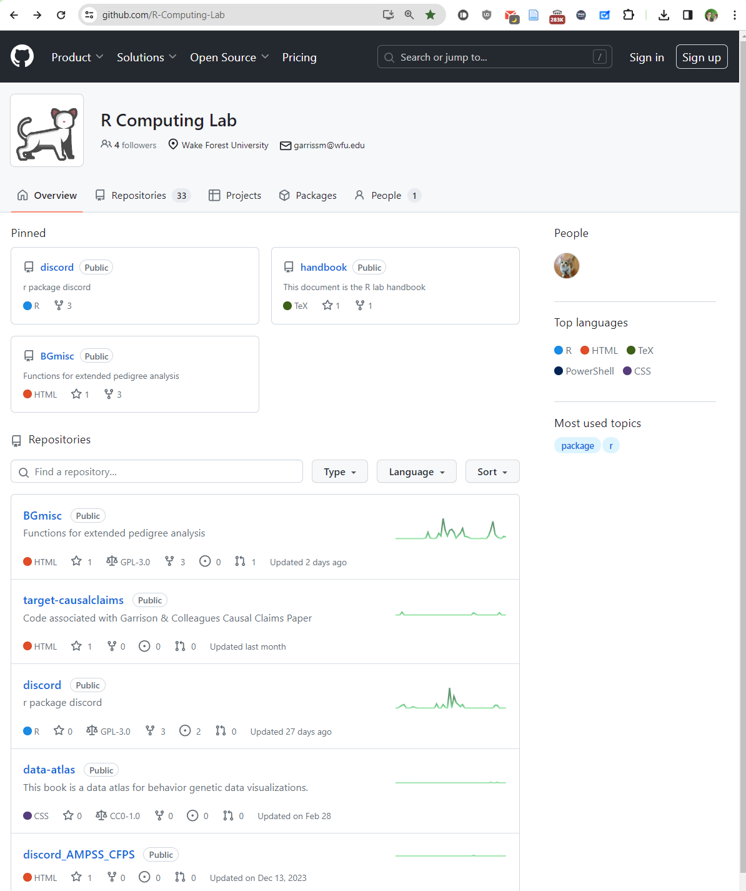
```
]
.pull-right[
```{r echo=FALSE, out.width="45%"}
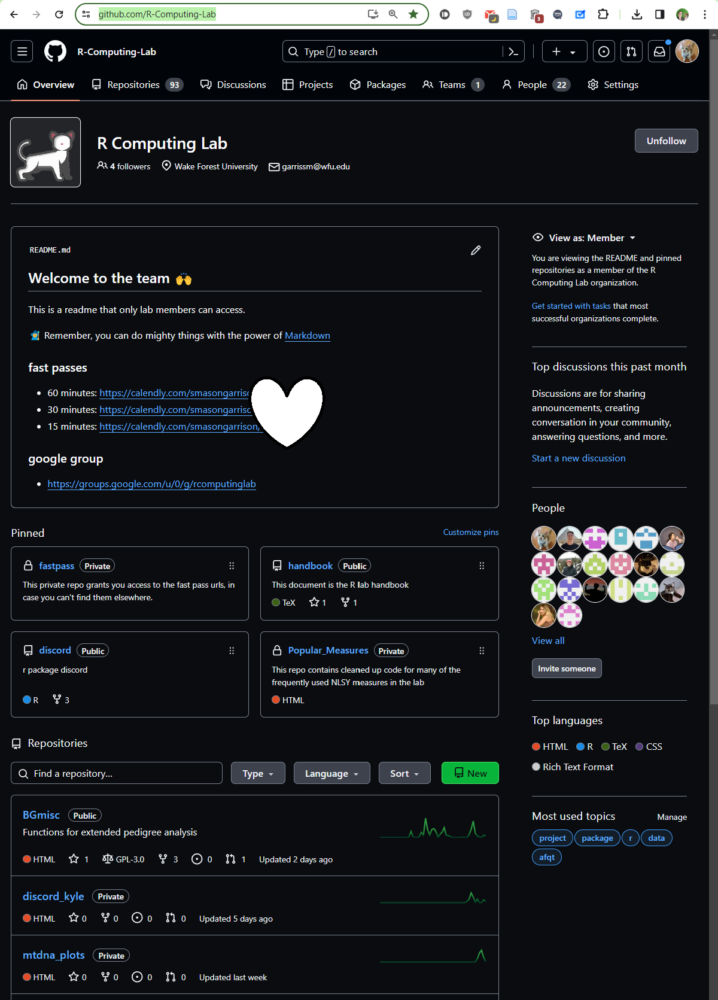
```
]

---

.pull-left[
```{r echo=FALSE, out.width="90%"}

```
]
.pull-right[
```{r echo=FALSE, out.width="90%"}

```
]


---

## Teaching Courses

.pull-left[
- **Interactive Learning:** GitHub provides a platform for sharing up-to-date course materials and notes, making learning more interactive and engaging.
- **Version Control for Syllabi:** Easily update and revise syllabi policies, dates etc. [smasongarrison.github.io/syllabi/](https://smasongarrison.github.io/syllabi/)
- **Examples:** The [Data Science for Psychologists course repository](https://github.com/DataScience4Psych) repository showcases how GitHub can be used to enhance the teaching and learning experience.
]

--
.pull-right[
```{r echo=FALSE, out.width="80%"}
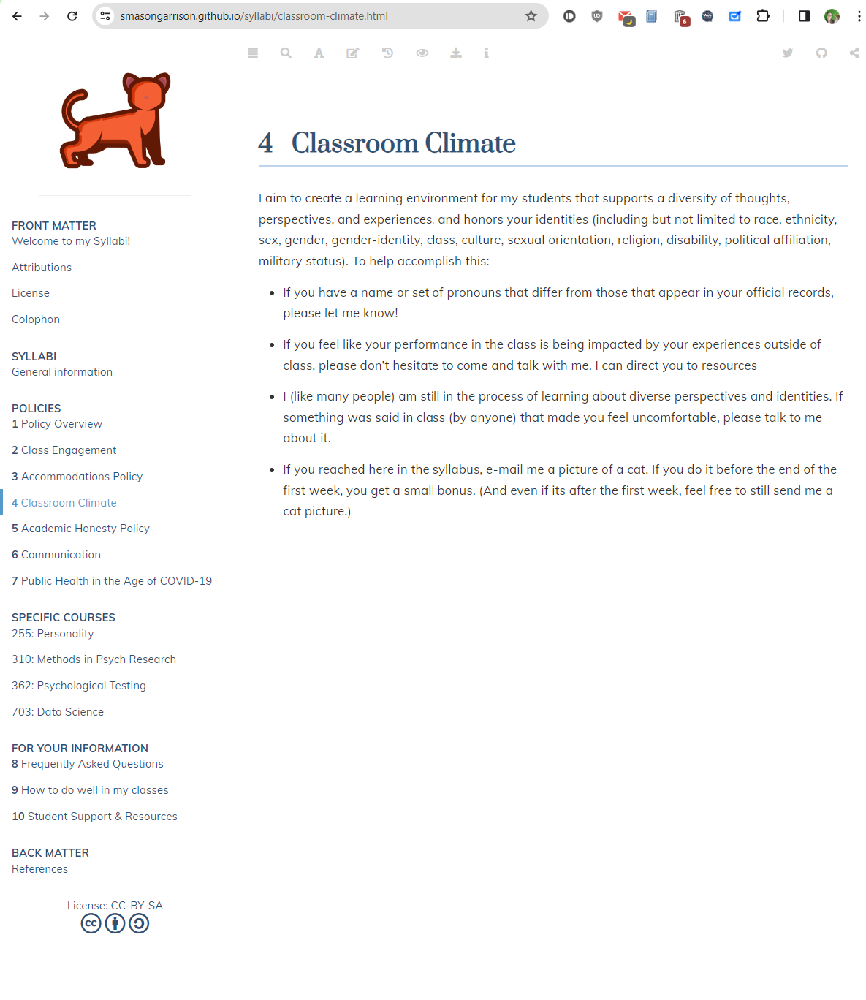
```
```{r echo=FALSE,out.width="10%",fig.align='center',fig.height=3}
library(qrcode)
code <- qr_code("https://smasongarrison.github.io/syllabi/")
plot(code)
```
]
---

### Data Science for Psychologists

.pull-left[
```{r echo=FALSE, out.width="85%"}
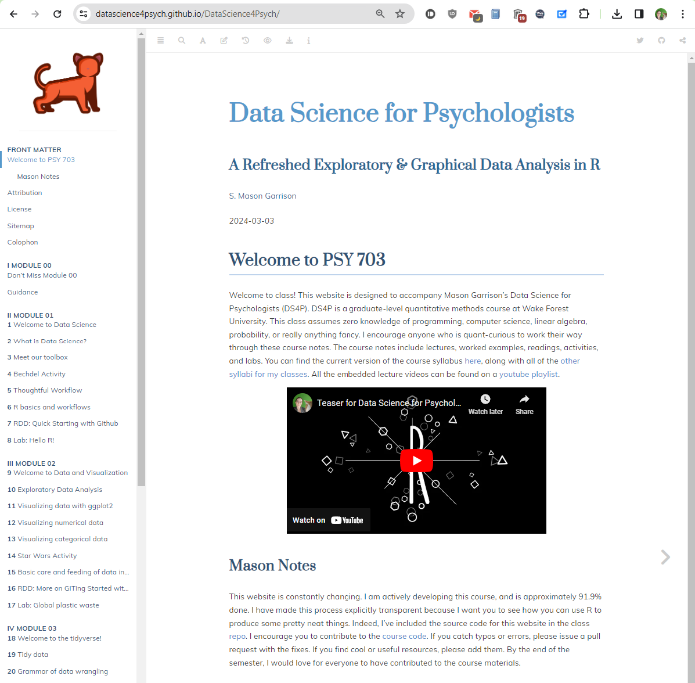
```
```{r ref.label="qr_ds4p",echo=FALSE,out.width="10%"}
```
.footnote[.center[
[DataScience4Psych.github.io/DataScience4Psych/](https://DataScience4Psych.github.io/DataScience4Psych/) 
]
]]
.pull-right[
```{r echo=FALSE, out.width="85%"}
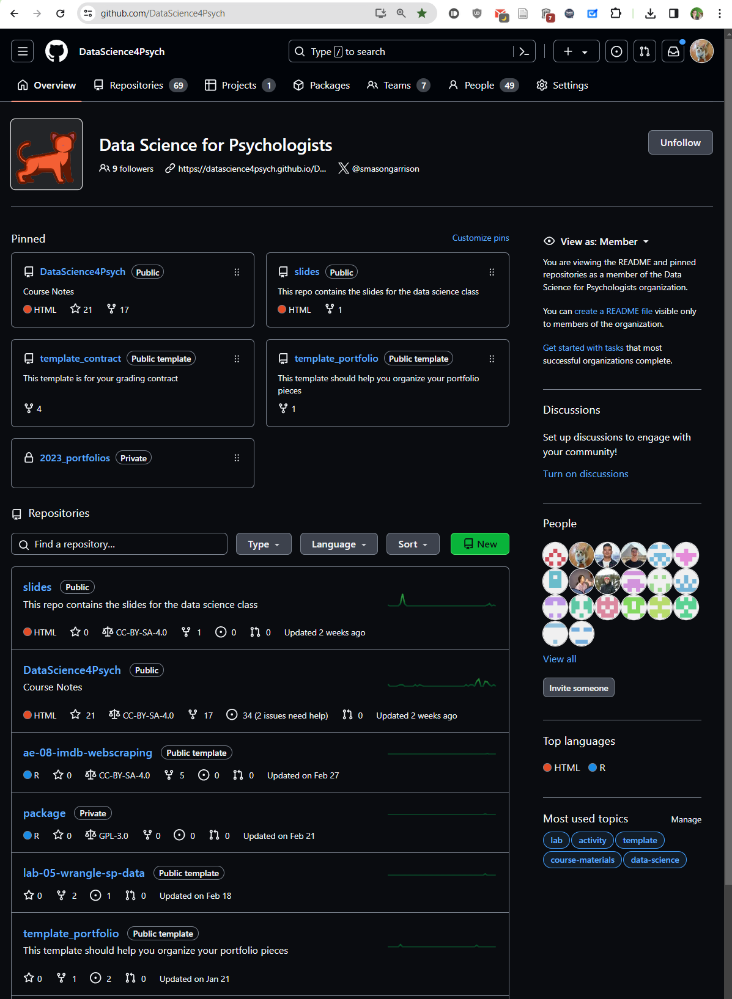
```
]

---

## Publishing Academic Papers

- **Streamlined Publication Process:** GitHub supports the publishing process with version control and collaboration, making the development and review of manuscripts more efficient.
- **Open Collaboration:** Encourages open and collaborative peer review and feedback from the global community.
- **Example:** The Journal of Open Source Software (JOSS) uses GitHub to manage submissions, reviews, and publication processes.  https://joss.theoj.org/papers/10.21105/joss.06203

--
.pull-left[
```{r echo=FALSE, out.width="50%"}
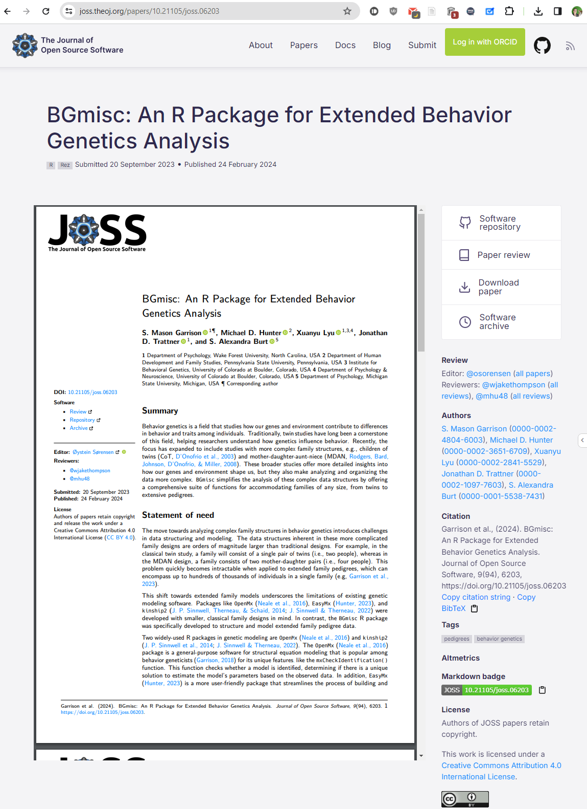
```
]
.pull-right[
```{r echo=FALSE, out.width="50%"}
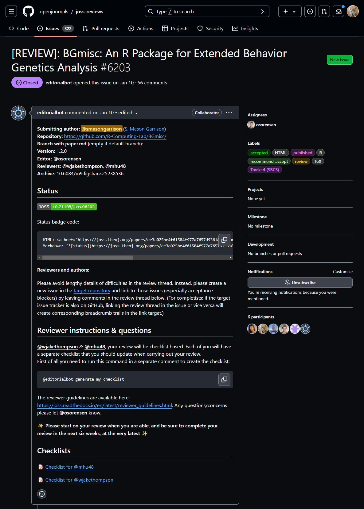
```
]

---
.pull-left[
```{r echo=FALSE, out.width="90%"}

```
]
.pull-right[
```{r echo=FALSE, out.width="90%"}

```
]

---

## Website Hosting with GitHub

<!-- Beyond code and collaboration, GitHub serves as an efficient host for personal academic websites, CVs, and even presentations like this one. -->

- **Showcase Your Work:** GitHub Pages allows researchers and academics to host their professional portfolios, CVs, and even project pages for free.
- **Example:** Visit [S. Mason Garrison's CV](https://smasongarrison.github.io/CV-Tex/SMasonGarrisonCV.pdf) hosted on GitHub for an example of how you can use GitHub Pages to host your academic CV.

--

.pull-left[
```{r echo=FALSE, out.width="100%"}
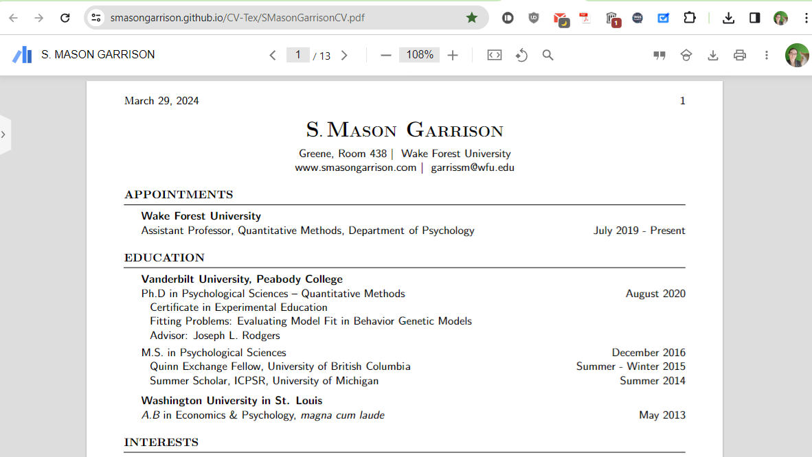
```
]
.pull-right[
```{r echo=FALSE, out.width="100%"}
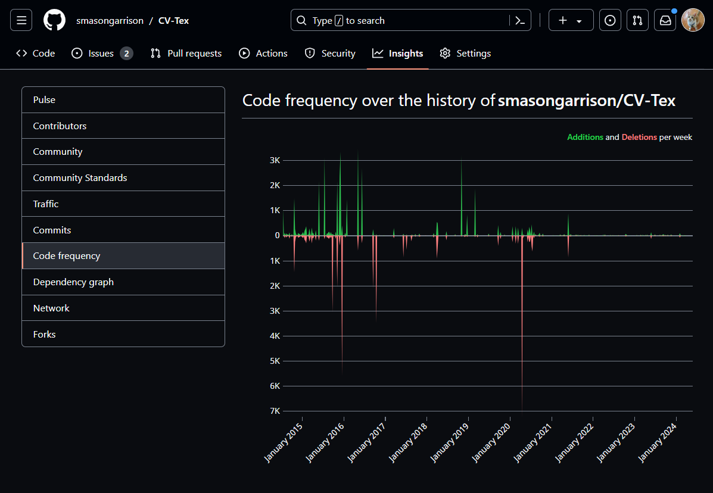
```
]


---

class: middle

# Intriguing, right?


---

class: middle
# GitHub toolkit overview

---

```{r echo=FALSE, out.width="100%"}
knitr::include_graphics("img/whole-game-01.png")
```

---

```{r echo=FALSE, out.width="100%"}
knitr::include_graphics("img/whole-game-02.png")
```

---

```{r echo=FALSE, out.width="100%"}
knitr::include_graphics("img/whole-game-03.png")
```

---

```{r echo=FALSE, out.width="100%"}
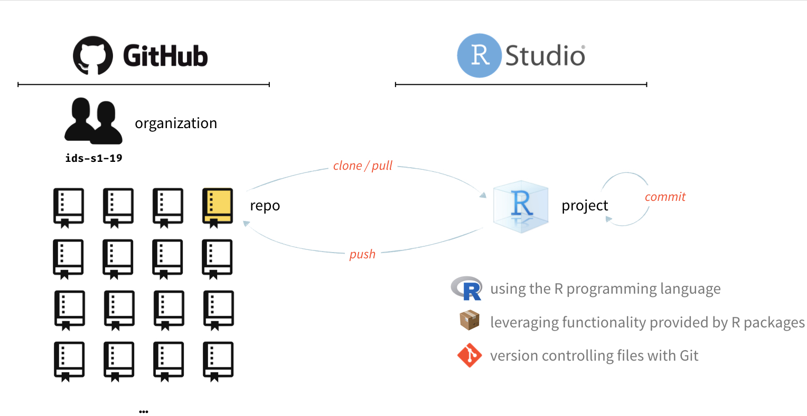
```

---

## Terminology Cheat Sheet

- **Repositories (Repo)**: Store your projects in repositories, including all files, revisions, and documentation.
- **Commits**: Save changes to your project, creating a transparent history of your work and decisions.
- **Push**: Send your committed changes to a remote repository on GitHub.com.
- **Pull**: Fetch changes from a remote repository and merge them into your local repository.
--

- **Pull Requests**: Propose changes to a project and discuss those changes with project collaborators before merging them.
- **Branches**: Work on different versions of a repository at the same time, allowing for parallel development.
- **Issues**: Track ideas, enhancements, tasks, or bugs for your projects. Organize with labels, assignees, and milestones.

---

class: middle

# Git and GitHub

---

## Version control

- We introduced GitHub as a platform for collaboration
- But it's much more than that...
- It's actually designed for version control

---

## Versioning

```{r echo=FALSE, fig.align = "center", out.width = "70%"}
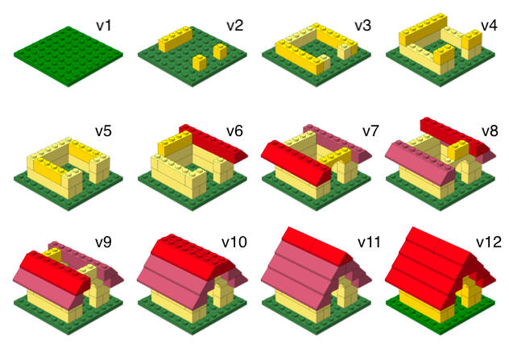
```

---

## Versioning (with human readable messages)

```{r echo=FALSE, fig.align = "center", out.width = "70%"}

```

---

## Why do we need version control?

```{r echo=FALSE, fig.align = "center", out.width="40%"}

```

---

# Git and GitHub tips

- Git is a version control system -- like “Track Changes” features from Microsoft Word on steroids. GitHub is the home for your Git-based projects on the internet -- like DropBox but much, much better).

--
- There are millions of git commands -- ok, that's an exaggeration, but there are a lot of them -- and very few people know them all. 99% of the time you will use git to add, commit, push, and pull.

--
- We will be doing Git things and interfacing with GitHub through RStudio/GitHub Desktop, but if you google for help you might come across methods for doing these things in the command line -- skip that and move on to the next resource unless you feel comfortable trying it out.

--
- There is a great resource for working with git and R: [happygitwithr.com](http://happygitwithr.com/). Some of the content in there is beyond the scope of this talk, but it's a good place to look for help.

---

## Let's take a tour - Git and GitHub

.center[

]

- Connect an R project to Github repository
- Working with a local and remote repository
- Making a change locally, committing, and pushing
- Making a change on GitHub and pulling


---

## Create a GitHub account

.small[
.instructions[
Go to [github.com](https://github.com/), and create an account (unless you already have one)... This is going to be the first step of the activity, so you can get ahead and do it now.
]
]

--

Tips for selecting a username:<sup>✦</sup>

.small[
- Incorporate your actual name.
- Reuse username from other contexts, e.g., Twitter or Slack.
- Pick a username you'll be comfortable revealing to your future boss.
- Shorter is better than longer.
- Be as unique as possible in as few characters as possible.
- Make it timeless. Don't highlight your current university, employer, etc.
- Avoid words laden with special meaning in programming, like `NA`.
]


--
.small[ 
<sup>✦</sup> Source: [Happy git with R](http://happygitwithr.com/github-acct.html#username-advice) by Jenny Bryan
]

---

class: middle

## Practical Demonstration

---


## Part 1: Setting Up Your GitHub Repository

1. **Sign Up on GitHub**
   - Visit [GitHub.com](https://github.com/) and create a new account.
   
2. **Create Your First Repository**
   - Click the "+" icon in the top right corner and select "New repository".
   - Name your repository and optionally add a description.

---

## Part 2: Local Setup and Version Control

- Option A: Using RStudio (for R users)
- Option B: Using GitHub Desktop (for a GUI approach)

---

## Option A: Using RStudio
- 3 **Install Git**
   - Download and install Git from [git-scm.com](https://git-scm.com/).
- 4 **Configure Git with RStudio**
   - In RStudio, go to Tools > Global Options > Git/SVN and make sure Git is recognized.
- 5 **Clone a Repository**
   - Use the "New Project" wizard in RStudio to clone your repository for local work.

.footnote[**Resources to Learn More**
   - [GitHub Guides](https://guides.github.com/)
   - [Happy Git and GitHub for the useR](http://happygitwithr.com/)
]

---

## Option B: Using RStudio

- 3 **Install and Set Up GitHub Desktop**
   - Download and install GitHub Desktop from [desktop.github.com](https://desktop.github.com/).
   - Open GitHub Desktop and sign in with your GitHub account.
- 4 **Configure GitHub**  
   - Configure your GitHub and email account under GitHub Desktop’s Preferences to ensure your commits are properly attributed to you.
--

- 5  **Clone the Repository Using GitHub Desktop**
   - In GitHub Desktop, go to `File` > `Clone Repository`.
   - Select the repository you created on GitHub from the list and choose a local path where you want to store the project files.
   - Click `Clone` to create a local copy of your repository.
  
---

# Part 3: Make Changes and Committing with GitHub
  
- 6 **Make Changes Locally**: 
   - Add or modify files in your local project folder.
- 7 **Commit Your Changes**: 
   - Summarize your changes in a commit message and commit them. 
   - In RStudio, use the Git tab. 
   - In GitHub Desktop, use the Changes tab.
  
---
- 7A **RStudio (Git tab)**
   - Open RStudio and click on the Git tab in the top right panel.
   - Check the box next to the files you want to commit, add a commit message in the top left panel, and click `Commit`.
- 7B **GitHub Desktop (Changes tab)**
   - Open GitHub Desktop; you should see the changes listed.
   - Select the files you want to commit, add a commit message in the bottom left panel describing your changes, and click `Commit to main` (assuming you are working on the main branch).

---

# Part 4: Keeping in Sync

- 8 **Push to GitHub**: Upload your changes to GitHub. Use the "Push" button in RStudio or GitHub Desktop.
--

- 8A **RStudio (Git tab)**
   - With your changes committed, click the `Push` button in RStudio to upload your changes to the remote repository on GitHub.
- 8B **GitHub Desktop (Changes tab)**
   - With your changes committed, click the `Push origin` button in GitHub Desktop to upload your changes to the remote repository on GitHub.
--

- 9 **View your changes** 
   - Your changes are now reflected on GitHub, and you can view them by navigating to your repository on the GitHub website.  
- 10 **Pull from GitHub**: If changes are made on GitHub directly (by you or collaborators), you can update your local repository by clicking the `Pull` button in RStudio or GitHub Desktop.
   - Start experimenting with small projects to get comfortable with the workflow. Happy coding!

---


## Additional Resources

- [GitHub Guides](https://guides.github.com/)
- [Happy Git and GitHub for the useR](http://happygitwithr.com/)
- GitHub Desktop Documentation: For detailed guides and troubleshooting, visit [docs.github.com/en/desktop](https://docs.github.com/en/desktop).
- Interactive Tutorials: GitHub offers interactive tutorials to understand the workflow better; find them at [lab.github.com](https://lab.github.com/).

---


class: middle

# Conclusion and Q&A

- Today, we explored how GitHub can revolutionize research and collaboration in psychology.
- We've seen its potential from managing labs to hosting websites.
- Remember, the journey of a thousand miles begins with a single step. Start small and explore!

---

## Any Questions?

Feel free to ask any questions now, or reach out to me after the talk via email _garrissm@wfu.edu_ or on github _github.com/smasongarrison_.

```{r qr_ds4p, echo=FALSE, fig.align = "center", out.width = "30%", caption="Scan the QR code to visit the Data Science for Psych website"}
library(qrcode)
code <- qr_code("https://DataScience4Psych.github.io/DataScience4Psych/")
plot(code)
```

.footnote[.center[
[DataScience4Psych.github.io/DataScience4Psych/](https://DataScience4Psych.github.io/DataScience4Psych/) 
]
]
