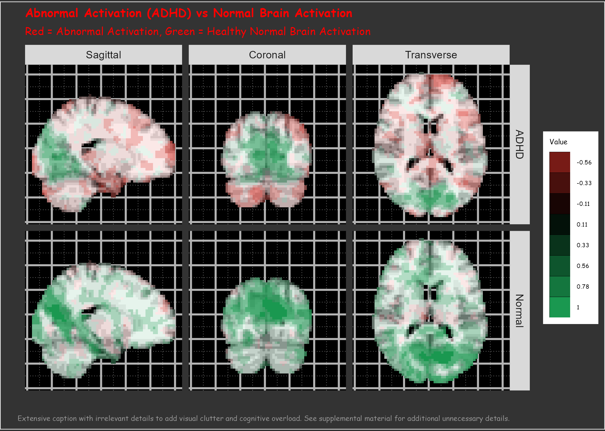

```{r child = "../setup.Rmd"}
```

<!-- Neuroscience and psychology courses often present neurodevelopmental disorders through a deficit-based lens, reinforcing stigma and framing conditions such as ADHD and autism as disorders of dysfunction rather than as variations in neurocognitive processing. This framing, which centers pathology and dysfunction, fails to account for neurodivergent perspectives and intersectional barriers that shape lived experiences (Sinclair, 1993; Kapp, 2020). Moreover, it alienates students with neurodivergent identities by implicitly framing their cognitive and emotional experiences as deviations from a neurotypical norm rather than as variations within human diversity (Singer, 1999).
Building on prior work that critiques how psychology curricula reinforce stigma in the teaching of psychiatric conditions (Navarre, Uliaszek, & Garrison, under revision),  this presentation proposes a disability-informed, anti-ableist framework for teaching neurodevelopmental disorders. This framework is rooted in critical disability studies (CDS; Minich, 2016; Schalk, 2017 ) and the neurodiversity paradigm (Singer, 1999; Walker, 2021), emphasizing that the challenges faced by neurodivergent individuals are not inherent deficits but arise from systemic barriers, social invalidation, and lack of accessibility in educational and clinical settings.
We will explore how similar approaches can transform how neurodevelopmental conditions are taught in neuroscience and psychology classrooms. This talk will: (1) illustrate how conventional pedagogical tools can perpetuate harmful stereotypes, (2) examine the impact of language and representation in shaping student perceptions, and (3) propose concrete strategies for integrating inclusive, disability-affirming frameworks into teaching.
By implementing these strategies, neuroscience educators can disrupt structural ableism and create a curriculum that is more inclusive, representative, and accessible to all students, particularly those who are neurodivergent. This approach reshapes the understanding of neurodevelopmental variation from a stigmatizing disorder model to a complex interaction of neurological, social, and cultural factors, ensuring that students are equipped with a nuanced and ethically responsible framework for engaging with neurodivergence.
 -->

```{r packages, echo=FALSE, message=FALSE, warning=FALSE}
# Remember to compile
#xaringan::inf_mr(cast_from = "..")
#       slideNumberFormat: ""  
knitr::opts_chunk$set(knitr.duplicate.label = "allow")
library(tidyverse)
if (!require("emo")) devtools::install_github("hadley/emo")
library(emo)
knitr::write_bib(c(.packages(), "bookdown"), "packages.bib")
library(rcites)
library(RefManageR)
# Load the bibliography file
#toBibtex(citation("xaringan"))

bib <- ReadBib("packages.bib", check = FALSE) # Load your BibTeX file
BibOptions(check.entries = FALSE, style = "markdown") 


```


# Hello world!

<!-- Slide 1: Introduction (1 minute) -->

```{r echo=FALSE,out.width="50%",fig.align='center',fig.cap="QR code for these slides",fig.height=3}
library(qrcode)
code <- qr_code("https://r-computing-lab.github.io/slides/02_neurodiversity/d00_slide.html#1")
plot(code)
```

.footnote[.center[
[r-computing-lab.github.io/slides/02_neurodiversity/d00_slide](https://r-computing-lab.github.io/slides/02_neurodiversity/d00_slide.html#1) 
]
]

???

Script: Good morning,  everyone! My name is S. Mason Garrison, and I'm from Wake Forest University.  I'm here today to talk about how we teach neurodevelopmental disabilities—and I'm bringing three perspectives to this conversation. First, as someone who teaches data visualization, I spend a lot of time thinking about how our visual and linguistic choices shape understanding. Second, although I'm trained as a quantitative psychologist, I dabble in disability studies, which has taught me to question assumptions about whose minds and bodies we design for. And third, I'm neurodivergent myself, which means I have lived experience navigating educational systems that weren't built for brains like mine.
 
I want to talk with you about how we might teach neurodevelopmental conditions in ways that are more inclusive, more accurate, and less stigmatizing. The core of this talk focuses on ADHD, autism, and related conditions, but I want to suggest that the neurodiversity paradigm invites us to think more broadly—about sensory differences like blindness and Deafness, about alternative communication methods, about the full spectrum of human neurological variation. As educators, the language we use, the examples we give, the way we visualize brain differences—all of this profoundly shapes what our students take away, not just about neuroscience, but about the value and belonging of neurodivergent people.
---

# The Problem with Deficit Framing


.pull-left[
- Psychology and neuroscience courses often present neurodevelopmental disorders as deficits.
- This framing implies dysfunction, brokenness, and deviation from a supposed norm.
- Conditions like ADHD and autism are portrayed as problems to be fixed.
- Sensory disabilities like blindness are portrayed as loss rather than variation.
- This reinforces stigma and ignores the lived experience of disabled people.
]

???
<!-- Slide 2: Deficit framing -->
Script: As a quantitative psychologist who teaches data visualization, I spend a lot of time thinking about how we present information—and what messages our visual choices send. But I also bring lived experience as a neurodivergent person to this conversation, which gives me a different lens on how deficit framing actually impacts students. When I look at neuroscience teaching materials, I see the same patterns I've studied in my own field: data visualizations that embed value judgments. Those fMRI slides with "reduced activation" highlighted in red? From a data viz perspective, that's a design choice that implies "less = bad." 

In most neuroscience and psychology classrooms, neurodevelopmental conditions are taught using what’s often called a “deficit model.” That is: we treat ADHD and autism as disorders — breakdowns in executive function, or in social reciprocity, or in attention. We show fMRI slides with red areas indicating "reduced activation." We diagram neural pathways as "impaired" or "dysfunctional." We present connectivity matrices highlighting "disrupted networks."

--
.pull-right[

- How this shows up in neuroscience teaching:
  - fMRI slides showing "reduced activation" in ADHD brains (red = bad)
  - Diagrams of "impaired" dopaminergic pathways
  - Autism described as "mirror neuron dysfunction"
  - Neural plasticity framed as "compensation for damage"
  - Default mode network differences labeled as "abnormal connectivity"
  
]

???
<!-- Slide 2: Deficit framing -->
This seems scientifically neutral—we're just showing the data, right? 

We may think that these are just helpful illustrations of whatever phenomenon we're teaching about. But this framing encodes an implicit comparison against a supposed neurotypical norm.  Every time we label different brain activation as "abnormal," we're telling students that neurodivergent brains are broken versions of typical brains. We rarely ask: what if these are simply different patterns of neural organization? what if these are differences, not deficits? This same deficit thinking extends beyond neurodevelopmental conditions—when we frame blindness as "loss of visual processing" rather than enhanced neural plasticity in other sensory regions, when deafness is treated as silence instead of culture, we reinforce narrow models of  ability and optimal brain function.


---
# The Problem with Deficit Framing
- Specific examples of deficit language we use:
  - "ADHD students struggle with attention" (implies they're failing at something normal)
  - "Autism involves social communication deficits" (centers what's missing)
  - "Blindness causes learning difficulties" (assumes visual learning is standard)
  

---

# What Counts as Difference?


.pull-left[
- Neurodiversity includes cognitive, sensory, and communicative variation.
- Not limited to psychiatric or learning diagnoses.
- Includes blindness, Deafness, alternative speech, sensory processing differences.
- The problem isn’t diversity — it’s curricular narrowness.
]
<!-- Slide 3: Starting with difference -->

???

Script: When we talk about diversity in cognition or behavior, we often start with diagnostic categories: ADHD, autism, dyslexia. But those aren’t the only kinds of differences that matter. Visual processing, sensory balance, tactile interpretation, alternative communication methods — these are all part of human variation. A neurodiversity lens asks us to treat all of these not as exceptions or impairments, but as ways of being. And it asks us to notice when curricula center just one way of perceiving, thinking, or moving through the world.

--
.pull-right[
- Instead of saying: "Students with ADHD struggle with attention"
    - We could say: "Students with ADHD may have different attention patterns—hyperfocusing intensely on preferred topics while finding it challenging to sustain attention on less engaging material"
- Instead of: "Autism involves social communication deficits"
    - We could say: "Autistic students may communicate directly and prefer clear expectations, which can be misinterpreted in neurotypical social contexts"
]


---

# Who Is the Curriculum Built For?

<!-- Slide 3: Default assumptions in teaching -->


- Most materials presume sighted, hearing, and neurotypical processing.
- These defaults are rarely acknowledged.
- Students who navigate the world differently are framed as edge cases — or not seen at all.
- Inaccessibility isn’t a flaw in the system — it is the system.

--
- Now before you think this is just a problem for neurodivergent students, consider this:  
  - If you’ve ever struggled to keep up with a fast-paced lecture, or felt lost in a sea of text-heavy slides, you’ve felt the impact of these defaults.
  
???

Script: Inaccessible teaching is often framed as an accident — an oversight. But it reflects deeper defaults. When every slide assumes visual access, when every example assumes verbal speech, when every assignment presumes a normative cognitive pace — that’s not neutrality. That’s a curriculum designed for only one kind of learner. A neurodiversity-informed approach asks: Who gets left out? And why? 

---

# What We're Proposing Instead

<!-- Slide 4: A unified neurodiversity paradigm -->


.pull-left[
- Neurodiversity is not just about cognition — it's about interaction, access, and belonging.
- Recognizes variation in sensory input, speech, movement, learning.
- Includes students who use Braille, AAC, or alternative pacing.
- Moves from treating students as deviations to *redesigning* the system.
]
--
.pull-right[

- Now, *redesigning* is a big word. 
- It’s not just about 
  - adding captions or alt text, or 
  - adding more uncompensated labor to your to-do list.
- It’s about rethinking the assumptions we make about who our students are and how they learn.
- It's reconsidering our defaults, and asking who gets left out.
- And, if you do it right, these changes benefit **everyone**, not just those with disabilities.
- They also benefit *you* as an instructor!

```{r, echo=FALSE, out.width="100%", fig.align='center'}

if(file.exists("img/neurodiversity_roots.png")) {
  knitr::include_graphics("img/neurodiversity_roots.png")
} else {
  knitr::include_graphics("../img/logo.png")
}

```
]

<!-- Script:  -->

???

So what’s the alternative? A framework that doesn’t start with pathology. A pedagogy that treats variation as expected. This doesn’t just mean rethinking how we teach ADHD or autism. It means applying that same lens across sensory, cognitive, and communicative dimensions. So that whether a student is blind, nonspeaking, or has an atypical learning profile — they’re not a problem to be accommodated. They’re already in the model.

---


# What This Talk Will Cover

<!-- Slide 5: Roadmap -->


1. How conventional pedagogical tools reinforce narrow models of ability  
2. How language and representation shape perception  
3. Concrete strategies for inclusive, disability-affirming pedagogy


???

Here’s where we’re headed. First, I’ll show how conventional tools — even ones meant to be helpful — often reinforce narrow norms. Then I’ll turn to the role of language and representation. And finally, I’ll propose a framework for disability-affirming teaching that begins in neurodevelopmental difference but makes room for the broader ecology of human variation.

---

# The Trouble with Teaching Tools

<!-- Slide 6: Conventional tools -->

.pull-left[
# Common neuroscience teaching tools that reinforce deficits:
- fMRI activation maps with "decreased activation" highlighted in red
- Neural pathway diagrams showing "broken" or "impaired" connections
- Neurotransmitter system slides emphasizing "dysfunction"
- Brain anatomy comparisons showing "abnormal" vs "normal" structures
- Connectivity matrices highlighting "disrupted" networks
- Color schemes that aren't accessible to colorblind students
]

???

Script: Let me share what I see when I look at neuroscience teaching tools through a data visualization lens. As someone who teaches students how to create ethical, unbiased visualizations, I notice that many neuroscience teaching materials make design choices that embed judgments about the data. -->

We love our brain imaging data—fMRI activation maps, DTI tractography, connectivity matrices. These seem objective, scientific. But notice how we present them: "decreased activation" highlighted in alarming red colors, "disrupted" white matter tracts, "abnormal" connectivity patterns. When students see these visuals repeatedly, they learn that different brain patterns equal broken brains. We rarely show the same data and say "here's an alternative pattern of neural organization" or "this shows a different regulatory strategy." The very design of our teaching tools—the color schemes, the language, the comparisons we make—teaches students that neurodiversity is pathology. And this extends beyond neuroimaging. When we diagram dopaminergic pathways in ADHD as "impaired reward processing" instead of "different sensitivity patterns," we're shaping how future clinicians and researchers will think about neurodivergent people.

--

.pull-right[
# What students learn from these visuals:

- Different brain activity = broken brain
- Neurotypical patterns = correct patterns
- Intervention goal = normalize brain function
]

---

# The Trouble with Teaching Tools 

.pull-left[

## Alternative approaches from data visualization principles:

- Use neutral colors for different patterns (blues/greens instead of red)
- Label differences descriptively, not evaluatively ("Pattern A" vs "impaired")
  - Present activation patterns as "alternative" not "reduced"
- Show multiple patterns as variations within normal range
- Use accessible color palettes that work for all students
- Let the data speak without embedded implicit messaging
]
.pull-right[
- Instead of showing ADHD brains with red "deficit" areas, show them as "Pattern B" in blue alongside "Pattern A" neurotypical brains in green—different colors, equal visual weight
- Example reframe: Instead of "ADHD shows prefrontal cortex dysfunction," try 
- "ADHD brains show different prefrontal activation patterns that may reflect alternative attention regulation strategies"
]


---

# What Gets Centered?

- Emphasis on normalization trains students to expect convergence.
- Visuals like heatmaps or "reduced activation" imply that divergence = deficiency.
- “Support plans” focus on mitigation, not affirmation.
- These messages are rarely explicit — but they’re learned.

<!-- Slide 7: Hidden curriculum -->

???

Script: The structure of our materials tells students what matters. If every example is a deficit, students learn that neurodivergence is a problem. If every brain image highlights a deviation, students learn to pathologize the visible. If every intervention is designed to normalize, students assume that normalization is the goal. This is what disability scholars call the “hidden curriculum”: the values we teach without saying them aloud.

---

# The Power of Representation

<!-- Slide 8: Language and visuals -->
<!-- -->

.pull-left[
- “Impairment” vs. “difference”
- “Deficit” vs. “divergent profile”
- “Normal” vs. “statistically common”
- Language encodes assumptions about causality and deviance.
]

.pull-right[
```{r, echo=FALSE, out.width="80%", fig.align='center'}

if(file.exists("img/language_frame_shift.png")) {
  knitr::include_graphics("img/language_frame_shift.png")
} else {
  knitr::include_graphics("../img/logo.png")
}
```
]

???

Script: Representation isn’t just about who’s in the slides — it’s also about how they’re framed. Saying “students with autism struggle with communication” is different from saying “students with autism may communicate in ways not recognized by neurotypical norms.” One locates difficulty in the person; the other, in the interaction. The same is true for visual representation. Images of isolated brains or redacted faces convey something about belonging — or its absence. 

---

# A Note on Expansion

<!-- Slide 9: Broadening the frame -->
<!--  -->

- Strategies that affirm neurodevelopmental variation also apply to:
  - Blind students using tactile navigation
  - Deaf students engaging in signed academic discourse
  - Nonspeaking students using AAC
- These aren’t separate cases — they reveal the same design failures
- Inclusion starts with what gets named, visualized, and expected

???
Script: So far we’ve focused on neurodevelopmental diagnoses like ADHD and autism — and that’s still the core of the talk. But I want to loop back to something I mentioned earlier: that the neurodiversity paradigm doesn’t need to stop there. The same framing strategies — pathologizing language, deficit-based visuals, hidden assumptions — also apply to how we talk about blindness, about echolalia, about alternative communication. A more expansive understanding of neurodiversity helps us see these parallels — and do better by all our students.

---

# What Inclusion Actually Looks Like

<!-- Slide 10: Universal design and planning -->
<!-- Script:  -->

.pull-left[
- Inclusion is a planning problem, not a reaction problem.
- UDL = anticipating variation, not retrofitting for exception.
- Ask: what kinds of learners are implicitly excluded?
- Build access into materials, structure, and expectations.
]

.pull-right[
[pdf available here]("https://r-computing-lab.github.io/slides/02_neurodiversity/img/udlg3-graphicorganizer-digital-nonumbers-a11y.pdf")
```{r, echo=FALSE, out.width="90%", fig.align='center'}


knitr::include_graphics("img/udlg3-graphicorganizer-digital-nonumbers-a11y.png")

```
]

???
So what does inclusive teaching look like — not in theory, but in practice? It starts before students enter the room. Inclusion isn’t just offering an accommodation letter and hoping for the best. It means designing courses from the outset to anticipate variation. That’s the principle behind Universal Design for Learning. But UDL isn’t just checklists or formatting tweaks — it’s a philosophical shift: assuming diversity is the default. Designing for variation. And doing so upfront.

- UDL principles include:
  - Multiple means of representation (visual, auditory, tactile)
  - Multiple means of action and expression (written, verbal, visual)
  - Multiple means of engagement (flexible pacing, varied activities)

---

# Examples of Generally Inclusive Practice

<!-- Slide 11: What this can look like -->
<!--  -->


.pull-left-narrow[
## Broadly and Briefly
- Visual: Alt text, audio descriptions, tactile models.
- Temporal: Flexible timing, asynchronous engagement.
- Communicative: Support AAC, typed response options, pause time.
- Structural: Consistent layout, upfront expectations.
]

???

Script: Here are some concrete examples. If you teach with dense visual slides, consider how blind students or screen reader users might access the material. If your quizzes rely on fast recall, think about how executive function diversity reshapes time. If your class rewards verbal spontaneity, what’s the role of alternative communication modes? Inclusive pedagogy means not assuming your own defaults are universal.

Now let me share some specific strategies I've developed in my own teaching that I think could translate to neuroscience education. In my data visualization courses, I've learned that accessibility isn't just about accommodating individual students—it makes the content clearer for everyone. When I describe every graph aloud, it helps not just students who can't see the visual, but also students who are better auditory processors. When I provide data in multiple formats—tables, charts, and narrative summaries—students can choose the representation that works best for their learning style. From my disability studies work, I've learned that the goal isn't to retrofit accessibility onto existing materials, but to design with diversity in mind from the start. For neuroscience educators, this might mean thinking about how students with different sensory and cognitive profiles will access your brain imaging data, your anatomical diagrams, your complex pathway illustrations.
--
.pull-right-wide[
## From my data visualization teaching:
- Describe all graphs and charts aloud during lectures
- Provide data in multiple formats (visual, tabular, narrative)
- Use colorblind-accessible palettes in all materials
- Never rely solely on color to convey important information

# From psychology lab experience:

- Offer flexible lab partnerships (some students work better alone)
- Provide both written and verbal instructions for procedures
- Allow multiple ways to record and report observations
- Build in processing time between instruction and execution
]
---

# Seed Correlation Maps

```{r, echo=FALSE, out.height="100%", fig.align='center'}



```

---

# Examples of Neurosciencey Inclusive Practice

<!-- Slide 11: What this can look like -->
<!--  -->

.pull-left[ 
## For Neuroanatomy/Brain Imaging
- Describe all brain images aloud: "This sagittal section shows the corpus callosum connecting the hemispheres"
  - When showing brain scans, describe what you see: "increased activity in the prefrontal cortex appears as brighter regions"
- Consider 3D printed brain models for low-vision students
- Present complex neural pathways as both flowcharts and narrative descriptions
]

.pull-right[ 
## Universal design principles I use:

- Clear, consistent slide layouts reduce cognitive load for all students
- Multiple examples help students recognize patterns across contexts
- Explicit learning objectives help students focus attention
- Built-in flexibility reduces anxiety and improves performance
]

???

Script: So what does inclusive neuroscience teaching actually look like in practice? Let's get concrete. In neuroanatomy, don't just show the brain image—describe it aloud for students who use screen readers or have visual processing differences: "This sagittal section shows the corpus callosum as a thick white band connecting the left and right hemispheres." Provide 3D printed models so students can learn brain structures through touch, not just vision. In your labs, remember that some students can't use traditional microscopes due to visual differences—offer virtual microscopy options. When teaching complex neural pathways, present them both as step-by-step sequences AND as integrated systems, because students with different cognitive styles need different organizational frameworks. And here's a big one: when discussing brain function, include examples of both neurotypical AND neurodivergent patterns as valid variations, not as normal versus abnormal. This isn't about lowering standards—it's about designing your teaching so more brains can access the rigorous content you're presenting.

---

# What Students Learn Instead

<!-- Slide 12: Consequences of inclusion -->

- Inclusive frameworks teach:
  - Difference ≠ deficit
  - Accessibility is foundational, not supplemental
  - Inclusion can be designed, not improvised
  - All students benefit when none are treated as exceptions

???

Script: When you change what and how you teach, you change what students learn — not just about content, but about people. They learn that variation is real, expected, and respected. They learn that difference isn’t deficiency. They learn that their classroom — maybe for the first time — was built for them. And that changes what they believe is possible, for themselves and for others.
---

# But What About the Pushback?

<!-- Slide 13: Instructor resistance -->
<!-- Script: Any time you talk about redesigning curriculum, there’s pushback. People ask: How am I supposed to accommodate everyone? What if students game the system? What if I lose rigor? These questions reflect a deeper anxiety — not about access, but about authority. When we say “plan for variation,” we challenge the idea that there is one correct, measurable, teachable pace or format. That’s not a threat to learning — that’s a redefinition of who education is for. -->

- Common fears:
  - “What if it’s too much work?”
  - “What if they take advantage?”
  - “What if I can’t measure them fairly?”
- But these are design challenges — not reasons to exclude
- Rigor isn’t standardization — it’s clarity plus support


---

# What We Hoped Students Would Learn

<!-- Slide 14: Student outcomes (ideal) -->
<!-- Script: Let’s rewind. When we teach ADHD, autism, dyslexia, we often hope students will walk away with empathy, with understanding, with scientific nuance. We hope they’ll remember the complexity — that no two people present the same way. We hope they’ll learn that difference doesn’t mean broken. That disability isn’t inherently tragic. That neurodivergence can be identity. That access matters. That science can be humanizing. -->

- Variation is real and expected
- Labels don’t explain people
- Barriers are often environmental
- Neurodivergence includes strength, not just risk
- Accessibility is part of rigor

---

# What They Actually Learn (If We’re Not Careful)

<!-- Slide 15: Hidden learning -->
<!-- Script: But what do they learn instead? If we’re not careful — if we don’t name our assumptions, reframe our slides, audit our assignments — they learn something else. That disabled people are hard to deal with. That disability is always a problem. That the goal is to fix. That students who need different things don’t belong here. That access is optional. That disability is incompatible with excellence. That’s not in your lecture. But it’s in your design. -->

- Neurodivergent = broken
- Support = pity or burden
- “Real” students don’t need flexibility
- Disability = exception, not norm
- Teaching = standardization, not communication

---

# Reframing the Learning Environment

<!-- Slide 16: Model shifts -->
<!-- Script: What if we took those assumptions and flipped them? What if we said: disability isn’t the problem — inflexibility is. What if we made it impossible to build a class that didn’t work for blind students, or AAC users, or students with timeblindness? What if our learning targets included access and dignity? What if inclusion was the default design constraint — not the patch? -->

.pull-left[
- Redesign around outliers, not averages
- Start with disability, not after it
- Teach with difference in mind from day one
- Inclusion as infrastructure, not afterthought
]

.pull-right[
```{r, echo=FALSE, out.width="80%", fig.align='center'}

if(file.exists("img/redesign_startpoint.png")) {
  knitr::include_graphics("img/redesign_startpoint.png")
} else {
  knitr::include_graphics("../img/logo.png")
}
```
]

---

# Case Study: Rewriting a Lecture

<!-- Slide 17: Before and after -->
<!-- Script: Here’s an example. Left: an older version of a lecture slide on executive dysfunction. Right: a revised version using a neurodiversity-informed frame. Same science. But in the first version, the student is the problem. In the second, the system shares responsibility. In the first: deficit and disorder. In the second: variation and strategy. These shifts may seem small — but to students, they change everything. -->

```{r, echo=FALSE, out.width="90%", fig.align='center'}


if(file.exists("img/executive_dysfunction_reframe.png")) {
  knitr::include_graphics("img/executive_dysfunction_reframe.png")
} else {
  knitr::include_graphics("../img/logo.png")
}
```

---


# Implications for Training

<!-- Slide 19: Beyond one course -->
<!-- Script: These choices ripple outward. When we train students in psychology or neuroscience, we’re shaping the frameworks they’ll bring into clinics, labs, and classrooms. If our teaching reinforces stigma, they’ll carry that forward. If it models respect and design equity, they’ll build on it. Neurodiversity-informed pedagogy doesn’t stop with one lecture — it rewrites what kinds of minds and bodies education is designed to support. -->

- Curriculum = cultural transmission
- Today’s undergrad = tomorrow’s provider, evaluator, policymaker
- Pedagogy shapes clinical language, research framing, hiring norms
- Inclusion in training leads to access in systems

---

# Where to Start

<!-- Slide 20: Practical entry points -->
<!-- Script: So where do you begin? You don’t need to rebuild your entire syllabus overnight. Start by auditing slides. Rewrite one case study. Add image descriptions. Use multimodal materials. Make your policies access-explicit. Ask students what they need — and believe them. Don’t wait for a letter. Build with them in mind. From the beginning. -->

- Audit: Who’s represented? Who’s missing?
- Language: Neutralize, humanize, decenter pathology
- Materials: Alt text, captions, structure, pacing
- Policies: Expect variation; build it in

---

# Where to Start

<!-- Script: As someone who's made these changes in my own psychology courses—and as someone who wished these approaches had existed when I was a student navigating higher education as an undiagnosed neurodivergent person—let me give you a practical roadmap. Start with what I call a "language audit." I mean this literally: open three of your most-used slides and count deficit language like "abnormal," "impaired," "dysfunction." When I first did this with my own materials, I was shocked at how casually I was describing brains like mine as broken. Simple substitutions—"different," "alternative," "variant"—sound small but change everything. Next, look at your visualizations. Are you using red to signal difference? As someone who's seen my own brain patterns highlighted in alarming colors, I can tell you that design choice isn't neutral. The goal isn't to avoid scientific rigor—it's to present rigorous science without telling students that their brains are problems to be solved.  -->

### Week 1-2: Language Audit (Start Small, Think Big)
- **Specific task**: Count deficit language in your 5 most-used slides
- **Personal insight**: Ask yourself: "How would I feel if this was describing my brain?"
- **Tool**: Find/replace "abnormal"→"different," "dysfunction"→"alternative pattern"

---

### Week 3-4: Data Visualization Review
- **Choose**: One set of brain imaging slides you use regularly
- **Change**: Replace red/alarm colors with neutral blues/greens
- **Consider**: Would colorblind students (like many neurodivergent people) miss important information?
- **Try printing the image in greyscale to learn how much information you convey with *just* color

---

### Week 5-6: Assessment Flexibility
- **Specific task**: Add one alternative format to your next exam
- **Experience**: Some students can demonstrate knowledge better through writing than diagrams, or vice versa
- **Test**: Ask students which format helped them show what they actually know

### Month 2: Universal Design Experiment
- **Approach**: Design for the margins, and you improve access for everyone
- **Provide**: Multiple ways to access the same information (visual, auditory, kinesthetic)
- **Measure**: Notice which students gravitate toward which formats—you might be surprised

### Ongoing: Student Feedback Integration
- **Ask**: What worked? What didn’t?
- **Listen**: Students are experts on their own learning needs
- **Respond**: Small changes often have big impacts on student experience
---

# Summary

<!-- Slide 21: Recap -->
<!-- Script: -->

.pull-left[
- Deficit framing pathologizes variation
- Neurodiversity affirms complexity and legitimacy
- Inclusive pedagogy is design, not exception
- Students notice — and respond
]

.pull-right[
```{r, echo=FALSE, out.width="80%", fig.align='center'}

if(file.exists("img/summary_graphic.png")) {
  knitr::include_graphics("img/summary_graphic.png")
} else {
  knitr::include_graphics("../img/logo.png")
}
```
]
???

So to summarize — we’ve talked about the deficit model and what it fails to capture. We’ve looked at how conventional tools frame difference. We’ve introduced the neurodiversity paradigm as both critique and design principle. And we’ve argued that these lessons extend beyond diagnosis — toward a broader ethic of variation. Not everyone learns the same way. Not everyone experiences the world the same way. And that’s not a challenge to teaching. That’s the reason we teach. 
---

# Acknowledgments

<!-- Slide 22: Credits -->
<!--  -->

- CDS & neurodiversity scholarship: Sinclair (1993), Singer (1999), Minich (2016), Schalk (2017), Walker (2021)
- Neurodiversity in Mentorship: Garrison, Webster, & Good (2024) Behavior Genetics
- Curricular critique: Navarre, Uliaszek, & Garrison (under revision)
- Students in PSY classrooms, Wake Forest University


???

Script: Thank you to my collaborators, especially Navarre, Uliaszek, & Garrison (under review); to the scholars whose work shaped this framing — including Sinclair, Singer, Walker, Schalk, and Minich — and to the students whose presence and feedback helped build this talk.
---

## Any Questions?

<!-- Slide 23: Close -->
<!-- Script:  -->

Feel free to reach out via email _garrissm@wfu.edu_ or on github _github.com/smasongarrison_ or wikipedia _user:smasongarrison_

```{r qr, echo=FALSE, fig.align = "center", out.width = "30%"}
code <- qr_code("https://r-computing-lab.github.io/slides/02_neurodiversity/d00_slide.html")
plot(code)
```

.footnote[.center[
[r-computing-lab.github.io/slides/02_neurodiversity/d00_slide.html](https://r-computing-lab.github.io/slides/02_neurodiversity/d00_slide.html)
]]

???

Thank you for your time. I’m happy to take questions now or connect later by email or GitHub. You can also scan this QR code to revisit the slides.
