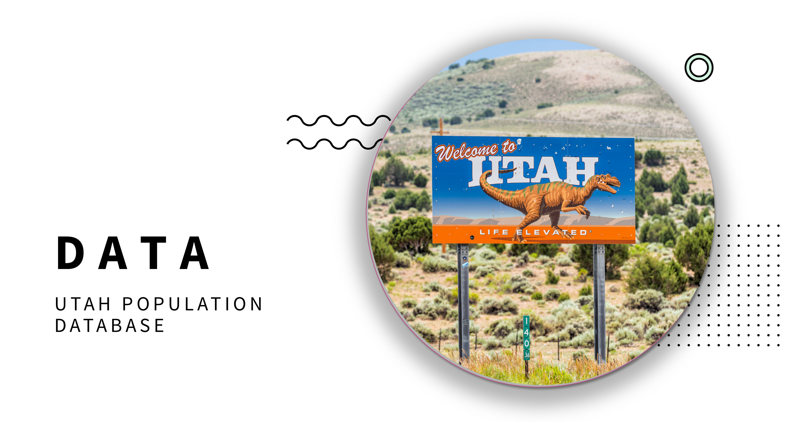
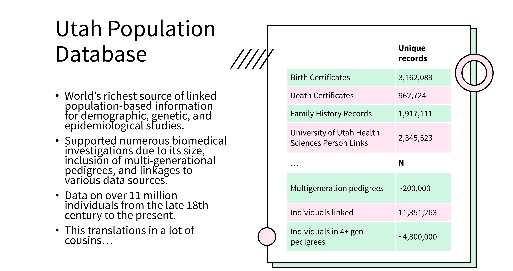
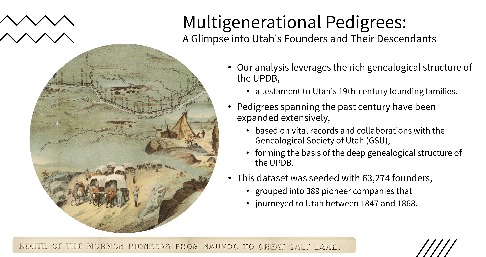
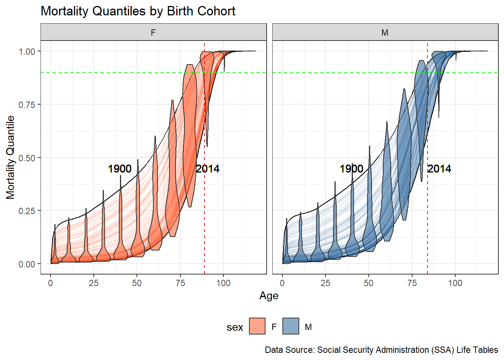
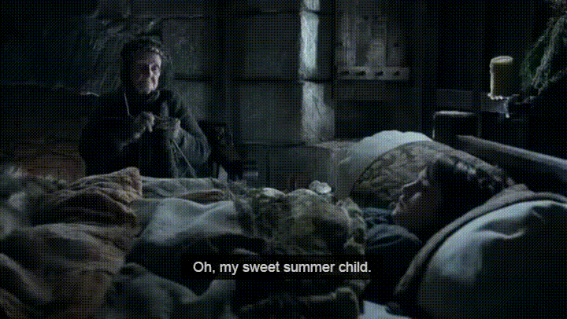
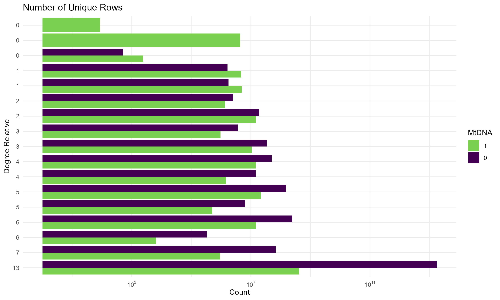
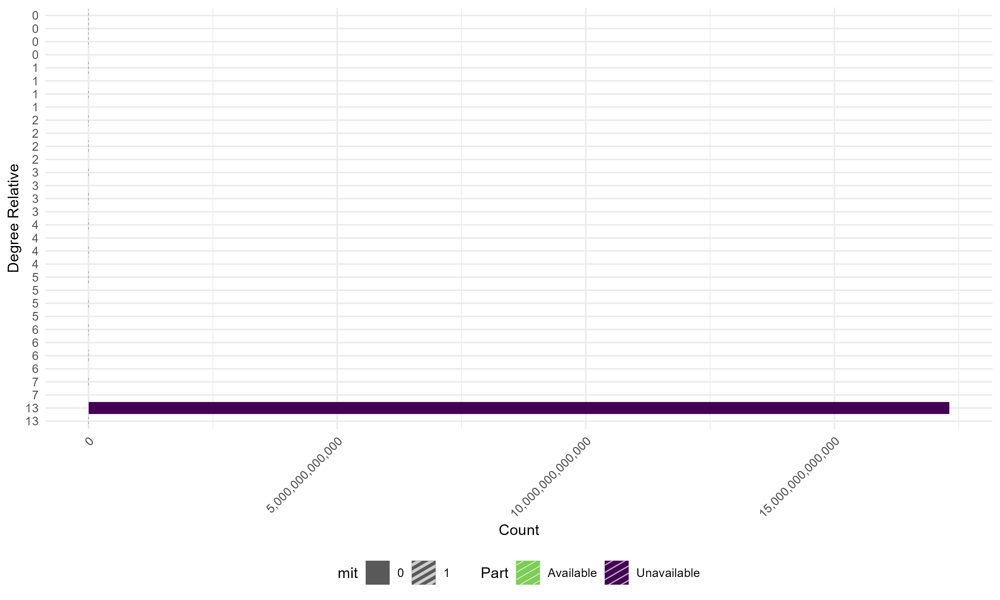
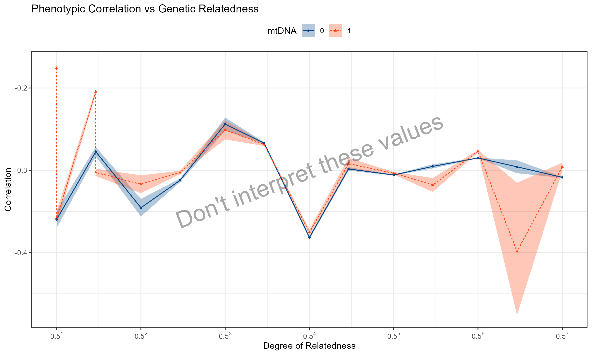
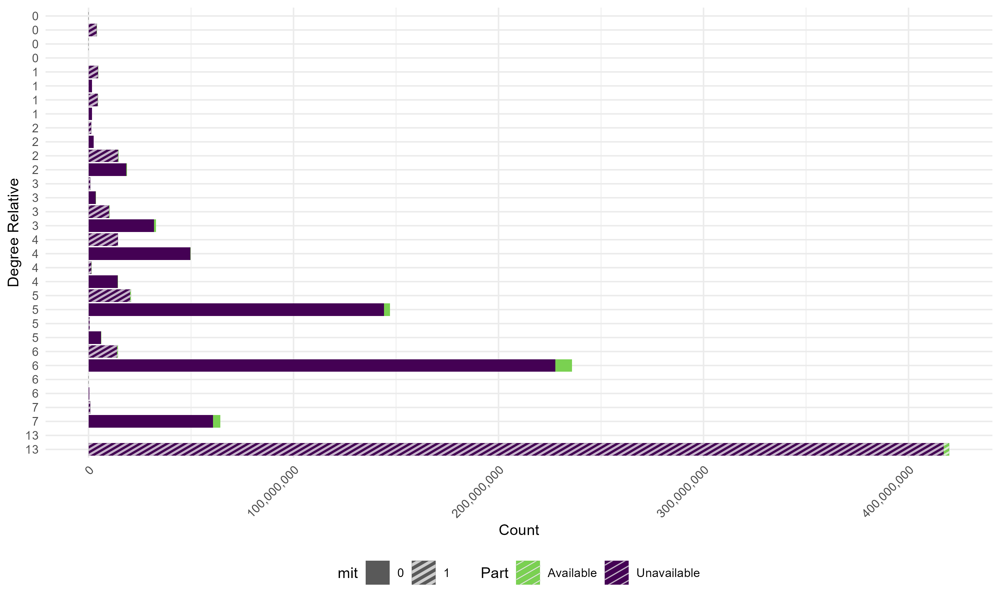

```{r child = "../setup.Rmd"}
```

<!-- Neuroscience and psychology courses often present neurodevelopmental disorders through a deficit-based lens, reinforcing stigma and framing conditions such as ADHD and autism as disorders of dysfunction rather than as variations in neurocognitive processing. This framing, which centers pathology and dysfunction, fails to account for neurodivergent perspectives and intersectional barriers that shape lived experiences (Sinclair, 1993; Kapp, 2020). Moreover, it alienates students with neurodivergent identities by implicitly framing their cognitive and emotional experiences as deviations from a neurotypical norm rather than as variations within human diversity (Singer, 1999).
Building on prior work that critiques how psychology curricula reinforce stigma in the teaching of psychiatric conditions (Navarre, Uliaszek, & Garrison, under revision),  this presentation proposes a disability-informed, anti-ableist framework for teaching neurodevelopmental disorders. This framework is rooted in critical disability studies (CDS; Minich, 2016; Schalk, 2017 ) and the neurodiversity paradigm (Singer, 1999; Walker, 2021), emphasizing that the challenges faced by neurodivergent individuals are not inherent deficits but arise from systemic barriers, social invalidation, and lack of accessibility in educational and clinical settings.
We will explore how similar approaches can transform how neurodevelopmental conditions are taught in neuroscience and psychology classrooms. This talk will: (1) illustrate how conventional pedagogical tools can perpetuate harmful stereotypes, (2) examine the impact of language and representation in shaping student perceptions, and (3) propose concrete strategies for integrating inclusive, disability-affirming frameworks into teaching.
By implementing these strategies, neuroscience educators can disrupt structural ableism and create a curriculum that is more inclusive, representative, and accessible to all students, particularly those who are neurodivergent. This approach reshapes the understanding of neurodevelopmental variation from a stigmatizing disorder model to a complex interaction of neurological, social, and cultural factors, ensuring that students are equipped with a nuanced and ethically responsible framework for engaging with neurodivergence.
 -->

```{r packages, echo=FALSE, message=FALSE, warning=FALSE}
# Remember to compile
#xaringan::inf_mr(cast_from = "..")
#       slideNumberFormat: ""  
knitr::opts_chunk$set(knitr.duplicate.label = "allow")
library(tidyverse)
if (!require("emo")) devtools::install_github("hadley/emo")
library(emo)
knitr::write_bib(c(.packages(), "bookdown"), "packages.bib")
library(rcites)
library(RefManageR)
# Load the bibliography file
#toBibtex(citation("xaringan"))

bib <- ReadBib("packages.bib", check = FALSE) # Load your BibTeX file
BibOptions(check.entries = FALSE, style = "markdown") 


```


# Hello world!

<!-- Slide 1: Introduction (1 minute) -->
<!-- Script: Good [morning/afternoon/evening], 
 everyone. My name is S. Mason Garrison, and I'm from Wake Forest University. I’m here today to talk about how we teach neurodevelopmental disabilities — and how we might do so in ways that are more inclusive, more accurate, and less pathologizing.  Like many of you, I’ve taught courses that include diagnostic categories like ADHD and autism. And I want to talk about how the way we frame those diagnoses — the language we use, the examples we give, the metaphors we reach for — profoundly shapes what our students take away. The core of this talk is about ADHD, autism, and related conditions. But I also want to suggest that these conversations don’t exist in isolation — and that the neurodiversity paradigm, when applied fully, invites us to think across diagnostic boundaries. That includes sensory and communication differences like blindness, Deafness, nonspeaking communication, and alternative perceptual modes. I’ll return to this expansion later in the talk. -->


```{r echo=FALSE,out.width="30%",fig.align='center',fig.cap="QR code for these slides",fig.height=3}
library(qrcode)
code <- qr_code("https://r-computing-lab.github.io/slides/02_neurodiversity/d00_slide.html#1")
plot(code)
```

.footnote[.center[
[r-computing-lab.github.io/slides/02_neurodiversity/d00_slide](https://r-computing-lab.github.io/slides/02_neurodiversity/d00_slide.html#1) 
]
]

---

# The Problem with Deficit Framing

<!-- Slide 2: Deficit framing -->
<!-- Script: In most neuroscience and psychology classrooms, neurodevelopmental conditions are taught using what’s often called a “deficit model.” That is: we treat ADHD and autism as disorders — breakdowns in executive function, or in social reciprocity, or in attention. That framing seems neutral. And we may think that these are just helpful illustrations of whatever phenonomon we're teaching about. But it encodes an implicit comparison — a norm — against which neurodivergent traits are cast as failures.  We rarely ask: what if these are differences, not deficits? And it doesn't just apply to those with cognitive differences. When blindness is framed as loss rather than variation, when deafness is treated as silence instead of culture, we reinforce a narrow model of ability. -->

.pull-left-wide[
- Psychology and neuroscience courses often present neurodevelopmental disorders as deficits.
- This framing implies dysfunction, brokenness, and deviation from a supposed norm.
- Conditions like ADHD and autism are portrayed as problems to be fixed.
- Sensory disabilities like blindness are portrayed as loss rather than variation.
- This reinforces stigma and ignores the lived experience of disabled people.
]


.pull-right-narrow[
```{r, echo=FALSE, out.width="85%", fig.align='center'}

if(file.exists("img/pathology_frame.png")) {
  knitr::include_graphics("img/pathology_frame.png")
} else {
  knitr::include_graphics("../img/logo.png")
}


```
]

---

# What Counts as Difference?

<!-- Slide 3: Starting with difference -->
<!-- Script: When we talk about diversity in cognition or behavior, we often start with diagnostic categories: ADHD, autism, dyslexia. But those aren’t the only kinds of differences that matter. Visual processing, sensory balance, tactile interpretation, alternative communication methods — these are all part of human variation. A neurodiversity lens asks us to treat all of these not as exceptions or impairments, but as ways of being. And it asks us to notice when curricula center just one way of perceiving, thinking, or moving through the world. -->

.pull-left-wide[
- Neurodiversity includes cognitive, sensory, and communicative variation.
- Not limited to psychiatric or learning diagnoses.
- Includes blindness, Deafness, alternative speech, sensory processing differences.
- The problem isn’t diversity — it’s curricular narrowness.
]

.pull-right-narrow[
```{r, echo=FALSE, out.width="85%", fig.align='center'}

if(file.exists("img/neurodiverse_modes.png")) {
  knitr::include_graphics("img/neurodiverse_modes.png")
} else {
  knitr::include_graphics("../img/logo.png")
}

```
]

---

# Who Is the Curriculum Built For?

<!-- Slide 3: Default assumptions in teaching -->
<!-- Script: Inaccessible teaching is often framed as an accident — an oversight. But it reflects deeper defaults. When every slide assumes visual access, when every example assumes verbal speech, when every assignment presumes a normative cognitive pace — that’s not neutrality. That’s a curriculum designed for only one kind of learner. A neurodiversity-informed approach asks: Who gets left out? And why? -->

- Most materials presume sighted, hearing, and neurotypical processing.
- These defaults are rarely acknowledged.
- Students who navigate the world differently are framed as edge cases — or not seen at all.
- Inaccessibility isn’t a flaw in the system — it is the system.

--
- Now before you think this is just a problem for neurodivergent students, consider this:  
  - If you’ve ever struggled to keep up with a fast-paced lecture, or felt lost in a sea of text-heavy slides, you’ve felt the impact of these defaults.
  

---

# What We're Proposing Instead

<!-- Slide 4: A unified neurodiversity paradigm -->

<!-- Script: So what’s the alternative? A framework that doesn’t start with pathology. A pedagogy that treats variation as expected. This doesn’t just mean rethinking how we teach ADHD or autism. It means applying that same lens across sensory, cognitive, and communicative dimensions. So that whether a student is blind, nonspeaking, or has an atypical learning profile — they’re not a problem to be accommodated. They’re already in the model. -->

.pull-left[
- Neurodiversity is not just about cognition — it's about interaction, access, and belonging.
- Recognizes variation in sensory input, speech, movement, learning.
- Includes students who use Braille, AAC, or alternative pacing.
- Moves from treating students as deviations to *redesigning* the system.
]
--
.pull-right[

- Now, *redesigning* is a big word. 
- It’s not just about 
  - adding captions or alt text, or 
  - adding more uncompensated labor to your to-do list.
- It’s about rethinking the assumptions we make about who our students are and how they learn.
- It's reconsidering our defaults, and asking who gets left out.
- And, if you do it right, these changes benefit **everyone**, not just those with disabilities.
- They also benefit *you* as an instructor!

```{r, echo=FALSE, out.width="100%", fig.align='center'}

if(file.exists("img/neurodiversity_roots.png")) {
  knitr::include_graphics("img/neurodiversity_roots.png")
} else {
  knitr::include_graphics("../img/logo.png")
}

```
]


---


# What This Talk Will Cover

<!-- Slide 5: Roadmap -->
<!-- Script: Here’s where we’re headed. First, I’ll show how conventional tools — even ones meant to be helpful — often reinforce narrow norms. Then I’ll turn to the role of language and representation. And finally, I’ll propose a framework for disability-affirming teaching that begins in neurodevelopmental difference but makes room for the broader ecology of human variation. -->

1. How conventional pedagogical tools reinforce narrow models of ability  
2. How language and representation shape perception  
3. Concrete strategies for inclusive, disability-affirming pedagogy

---

# The Trouble with Teaching Tools

<!-- Slide 6: Conventional tools -->
<!-- Script: Let’s start with something familiar: the tools we use to teach. Diagnostic criteria, checklists, trait maps, and imaging studies are common features in neuroscience and psychology classrooms. These are often presented as objective — as just-the-facts summaries of what ADHD or autism looks like. But these tools frame variation in constrained ways. What’s visible in a brain scan becomes “the disorder.” What’s absent from a diagnostic checklist becomes invisible. The very act of diagramming a “deficit” suggests that deviation from a statistical mean is failure — not just difference. -->

.pull-left[
- Diagnostic tools like the DSM shape how students conceptualize difference.
- Trait charts and brain imaging imply dysfunction without context.
- Case examples often highlight challenges but omit identity and agency.
- Checklists simplify complexity into pathology.
]

.pull-right[
```{r, echo=FALSE, out.width="85%", fig.align='center'}

if(file.exists("img/dsm_case_slide.png")) {
  knitr::include_graphics("img/dsm_case_slide.png")
} else {
  knitr::include_graphics("../img/logo.png")
}

```
]

---

# What Gets Centered?

<!-- Slide 7: Hidden curriculum -->
<!-- Script: The structure of our materials tells students what matters. If every example is a deficit, students learn that neurodivergence is a problem. If every brain image highlights a deviation, students learn to pathologize the visible. If every intervention is designed to normalize, students assume that normalization is the goal. This is what disability scholars call the “hidden curriculum”: the values we teach without saying them aloud. -->

- Emphasis on normalization trains students to expect convergence.
- Visuals like heatmaps or "reduced activation" imply that divergence = deficiency.
- “Support plans” focus on mitigation, not affirmation.
- These messages are rarely explicit — but they’re learned.

---

# The Power of Representation

<!-- Slide 8: Language and visuals -->
<!-- Script: Representation isn’t just about who’s in the slides — it’s also about how they’re framed. Saying “students with autism struggle with communication” is different from saying “students with autism may communicate in ways not recognized by neurotypical norms.” One locates difficulty in the person; the other, in the interaction. The same is true for visual representation. Images of isolated brains or redacted faces convey something about belonging — or its absence. -->

.pull-left[
- “Impairment” vs. “difference”
- “Deficit” vs. “divergent profile”
- “Normal” vs. “statistically common”
- Language encodes assumptions about causality and deviance.
]

.pull-right[
```{r, echo=FALSE, out.width="80%", fig.align='center'}

if(file.exists("img/language_frame_shift.png")) {
  knitr::include_graphics("img/language_frame_shift.png")
} else {
  knitr::include_graphics("../img/logo.png")
}
```
]

---

# A Note on Expansion

<!-- Slide 9: Broadening the frame -->
<!-- Script: So far we’ve focused on neurodevelopmental diagnoses like ADHD and autism — and that’s still the core of the talk. But I want to loop back to something I mentioned earlier: that the neurodiversity paradigm doesn’t need to stop there. The same framing strategies — pathologizing language, deficit-based visuals, hidden assumptions — also apply to how we talk about blindness, about echolalia, about alternative communication. A more expansive understanding of neurodiversity helps us see these parallels — and do better by all our students. -->

- Strategies that affirm neurodevelopmental variation also apply to:
  - Blind students using tactile navigation
  - Deaf students engaging in signed academic discourse
  - Nonspeaking students using AAC
- These aren’t separate cases — they reveal the same design failures
- Inclusion starts with what gets named, visualized, and expected

---

# What Inclusion Actually Looks Like

<!-- Slide 10: Universal design and planning -->
<!-- Script: So what does inclusive teaching look like — not in theory, but in practice? It starts before students enter the room. Inclusion isn’t just offering an accommodation letter and hoping for the best. It means designing courses from the outset to anticipate variation. That’s the principle behind Universal Design for Learning. But UDL isn’t just checklists or formatting tweaks — it’s a philosophical shift: assuming diversity is the default. Designing for variation. And doing so upfront. -->

.pull-left[
- Inclusion is a planning problem, not a reaction problem.
- UDL = anticipating variation, not retrofitting for exception.
- Ask: what kinds of learners are implicitly excluded?
- Build access into materials, structure, and expectations.
]

.pull-right[
```{r, echo=FALSE, out.width="80%", fig.align='center'}

if(file.exists("img/udl_intro.png")) {
  knitr::include_graphics("img/udl_intro.png")
} else {
  knitr::include_graphics("../img/logo.png")
}
```
]

---

# Examples of Inclusive Practice

<!-- Slide 11: What this can look like -->
<!-- Script: Here are some concrete examples. If you teach with dense visual slides, consider how blind students or screen reader users might access the material. If your quizzes rely on fast recall, think about how executive function diversity reshapes time. If your class rewards verbal spontaneity, what’s the role of alternative communication modes? Inclusive pedagogy means not assuming your own defaults are universal. -->

.pull-left[
- Visual: Alt text, audio descriptions, tactile models.
- Temporal: Flexible timing, asynchronous engagement.
- Communicative: Support AAC, typed response options, pause time.
- Structural: Consistent layout, upfront expectations.
]

.pull-right[
```{r, echo=FALSE, out.width="85%", fig.align='center'}

if(file.exists("img/inclusive_grid.png")) {
  knitr::include_graphics("img/inclusive_grid.png")
} else {
  knitr::include_graphics("../img/logo.png")
}
```
]

---

# What Students Learn Instead

<!-- Slide 12: Consequences of inclusion -->
<!-- Script: When you change what and how you teach, you change what students learn — not just about content, but about people. They learn that variation is real, expected, and respected. They learn that difference isn’t deficiency. They learn that their classroom — maybe for the first time — was built for them. And that changes what they believe is possible, for themselves and for others. -->

- Inclusive frameworks teach:
  - Difference ≠ deficit
  - Accessibility is foundational, not supplemental
  - Inclusion can be designed, not improvised
  - All students benefit when none are treated as exceptions

---

# But What About the Pushback?

<!-- Slide 13: Instructor resistance -->
<!-- Script: Any time you talk about redesigning curriculum, there’s pushback. People ask: How am I supposed to accommodate everyone? What if students game the system? What if I lose rigor? These questions reflect a deeper anxiety — not about access, but about authority. When we say “plan for variation,” we challenge the idea that there is one correct, measurable, teachable pace or format. That’s not a threat to learning — that’s a redefinition of who education is for. -->

- Common fears:
  - “What if it’s too much work?”
  - “What if they take advantage?”
  - “What if I can’t measure them fairly?”
- But these are design challenges — not reasons to exclude
- Rigor isn’t standardization — it’s clarity plus support

---

# What We Hoped Students Would Learn

<!-- Slide 14: Student outcomes (ideal) -->
<!-- Script: Let’s rewind. When we teach ADHD, autism, dyslexia, we often hope students will walk away with empathy, with understanding, with scientific nuance. We hope they’ll remember the complexity — that no two people present the same way. We hope they’ll learn that difference doesn’t mean broken. That disability isn’t inherently tragic. That neurodivergence can be identity. That access matters. That science can be humanizing. -->

- Variation is real and expected
- Labels don’t explain people
- Barriers are often environmental
- Neurodivergence includes strength, not just risk
- Accessibility is part of rigor

---

# What They Actually Learn (If We’re Not Careful)

<!-- Slide 15: Hidden learning -->
<!-- Script: But what do they learn instead? If we’re not careful — if we don’t name our assumptions, reframe our slides, audit our assignments — they learn something else. That disabled people are hard to deal with. That disability is always a problem. That the goal is to fix. That students who need different things don’t belong here. That access is optional. That disability is incompatible with excellence. That’s not in your lecture. But it’s in your design. -->

- Neurodivergent = broken
- Support = pity or burden
- “Real” students don’t need flexibility
- Disability = exception, not norm
- Teaching = standardization, not communication

---

# Reframing the Learning Environment

<!-- Slide 16: Model shifts -->
<!-- Script: What if we took those assumptions and flipped them? What if we said: disability isn’t the problem — inflexibility is. What if we made it impossible to build a class that didn’t work for blind students, or AAC users, or students with timeblindness? What if our learning targets included access and dignity? What if inclusion was the default design constraint — not the patch? -->

.pull-left[
- Redesign around outliers, not averages
- Start with disability, not after it
- Teach with difference in mind from day one
- Inclusion as infrastructure, not afterthought
]

.pull-right[
```{r, echo=FALSE, out.width="80%", fig.align='center'}

if(file.exists("img/redesign_startpoint.png")) {
  knitr::include_graphics("img/redesign_startpoint.png")
} else {
  knitr::include_graphics("../img/logo.png")
}
```
]

---

# Case Study: Rewriting a Lecture

<!-- Slide 17: Before and after -->
<!-- Script: Here’s an example. Left: an older version of a lecture slide on executive dysfunction. Right: a revised version using a neurodiversity-informed frame. Same science. But in the first version, the student is the problem. In the second, the system shares responsibility. In the first: deficit and disorder. In the second: variation and strategy. These shifts may seem small — but to students, they change everything. -->

```{r, echo=FALSE, out.width="90%", fig.align='center'}


if(file.exists("img/executive_dysfunction_reframe.png")) {
  knitr::include_graphics("img/executive_dysfunction_reframe.png")
} else {
  knitr::include_graphics("../img/logo.png")
}
```

---

# Student Responses

<!-- Slide 18: What students say -->
<!-- Script: And here’s what students say in response. When you teach access explicitly — when you name neurodivergence as part of the curriculum instead of an accommodation footnote — students notice. They feel seen. They participate more. They start using language that resists stigma. Some will tell you this is the first time their brain or body wasn’t treated as a problem. That’s not sentiment. That’s signal. -->

.pull-left[
- "I didn’t realize this was the first time I saw myself in the material."
- "I thought accommodations meant I didn’t belong. Now I think they’re a sign we all do."
- "I’ve never seen a slide designed for me."
]

.pull-right[
```{r, echo=FALSE, out.width="75%", fig.align='center'}


if(file.exists("img/student_quotes.png")) {
  knitr::include_graphics("img/student_quotes.png")
} else {
  knitr::include_graphics("../img/logo.png")
}
```
]

---

# Implications for Training

<!-- Slide 19: Beyond one course -->
<!-- Script: These choices ripple outward. When we train students in psychology or neuroscience, we’re shaping the frameworks they’ll bring into clinics, labs, and classrooms. If our teaching reinforces stigma, they’ll carry that forward. If it models respect and design equity, they’ll build on it. Neurodiversity-informed pedagogy doesn’t stop with one lecture — it rewrites what kinds of minds and bodies education is designed to support. -->

- Curriculum = cultural transmission
- Today’s undergrad = tomorrow’s provider, evaluator, policymaker
- Pedagogy shapes clinical language, research framing, hiring norms
- Inclusion in training leads to access in systems

---

# Where to Start

<!-- Slide 20: Practical entry points -->
<!-- Script: So where do you begin? You don’t need to rebuild your entire syllabus overnight. Start by auditing slides. Rewrite one case study. Add image descriptions. Use multimodal materials. Make your policies access-explicit. Ask students what they need — and believe them. Don’t wait for a letter. Build with them in mind. From the beginning. -->

- Audit: Who’s represented? Who’s missing?
- Language: Neutralize, humanize, decenter pathology
- Materials: Alt text, captions, structure, pacing
- Policies: Expect variation; build it in

---

# Summary

<!-- Slide 21: Recap -->
<!-- Script: So to summarize — we’ve talked about the deficit model and what it fails to capture. We’ve looked at how conventional tools frame difference. We’ve introduced the neurodiversity paradigm as both critique and design principle. And we’ve argued that these lessons extend beyond diagnosis — toward a broader ethic of variation. Not everyone learns the same way. Not everyone experiences the world the same way. And that’s not a challenge to teaching. That’s the reason we teach. -->

.pull-left[
- Deficit framing pathologizes variation
- Neurodiversity affirms complexity and legitimacy
- Inclusive pedagogy is design, not exception
- Students notice — and respond
]

.pull-right[
```{r, echo=FALSE, out.width="80%", fig.align='center'}

if(file.exists("img/summary_graphic.png")) {
  knitr::include_graphics("img/summary_graphic.png")
} else {
  knitr::include_graphics("../img/logo.png")
}
```
]

---

# Acknowledgments

<!-- Slide 22: Credits -->
<!-- Script: Thank you to my collaborators, especially Navarre, Uliaszek, & Garrison (under review); to the scholars whose work shaped this framing — including Sinclair, Singer, Walker, Schalk, and Minich — and to the students whose presence and feedback helped build this talk. -->

- CDS & neurodiversity scholarship: Sinclair (1993), Singer (1999), Minich (2016), Schalk (2017), Walker (2021)
- Curricular critique: Navarre, Uliaszek, & Garrison (under revision)
- Students in PSY/NSC classrooms, Wake Forest University

---

## Any Questions?

<!-- Slide 23: Close -->
<!-- Script: Thank you for your time. I’m happy to take questions now or connect later by email or GitHub. You can also scan this QR code to revisit the slides. -->

Feel free to reach out via email _garrissm@wfu.edu_ or on github _github.com/smasongarrison_

```{r qr, echo=FALSE, fig.align = "center", out.width = "30%"}
code <- qr_code("https://r-computing-lab.github.io/slides/02_neurodiversity/d00_slide.html")
plot(code)
```

.footnote[.center[
[r-computing-lab.github.io/slides/02_neurodiversity/d00_slide.html](https://r-computing-lab.github.io/slides/02_neurodiversity/d00_slide.html)
]]

---

class: middle

# Appended Talk for AV testing

---

# The Power of Mitochondria (mtDNA)

### "It's the powerhouse of the cell" ``r emo::ji("zap")``  .small[Every Middle School Biology Teacher]

<!-- Slide 2:  Why Look at Mitochondrial DNA in AD? -->
<!-- Script: Alzheimer’s disease is widely recognized as heritable, but nearly all existing models focus on nuclear DNA. And yet mitochondrial DNA—or mtDNA—has multiple biological pathways connecting it to neurodegeneration.

MtDNA is maternally inherited, non-recombining, and central to energy production and oxidative stress regulation. All of these are plausible mechanistic pathways for Alzheimer’s risk. Mutations in mtDNA accumulate with age, and dysfunctional mitochondria are repeatedly observed in AD-affected brain tissue.

But critically, even though these pathways are biologically plausible, they’ve been underexamined at the population level. So we asked: is there evidence of mtDNA-linked familial resemblance for AD in large-scale genealogical data? -->

.pull-left-wide[
- Alzheimer’s disease is widely recognized as heritable, but 
  - nearly all existing models focus on nuclear DNA.
- And yet, `r emo::ji("dna")` mtDNA has multiple biological pathways connecting it to neurodegeneration.
- MtDNA is 
  - maternally inherited, 
  - non-recombining, and 
  - central to energy production and 
  - oxidative stress regulation.
- All of these are plausible mechanistic pathways for Alzheimer’s risk. (Swerdlow, 2018; Coskun et al., 2012; Wallace, 2005)
]
--
.pull-right-narrow[
- Mutations in mtDNA accumulate with age, and 
  - dysfunctional mitochondria are repeatedly observed in AD-affected brain tissue (e.g., Coskun, et al 2004).
]

<!-- Swerdlow, R. H. (2018). Mitochondria and mitochondrial cascades in Alzheimer’s disease. Journal of Alzheimer’s Disease, 62(3), 1403-1416. -->
<!-- Wallace, D. C. (2005). A mitochondrial paradigm of metabolic and degenerative diseases, aging, and cancer: a dawn for evolutionary medicine. Annu. Rev. Genet., 39(1), 359-407. -->
<!-- Coskun, P. E., & Busciglio, J. (2012). Oxidative stress and mitochondrial dysfunction in Down’s syndrome: relevance to aging and dementia. Current gerontology and geriatrics research, 2012(1), 383170. -->
<!-- Coskun, P. E., Beal, M. F., & Wallace, D. C. (2004). Alzheimer's brains harbor somatic mtDNA control-region mutations that suppress mitochondrial transcription and replication. Proceedings of the National Academy of Sciences, 101(29), 10726-10731. -->

---
# The Power of Mitochondria (mtDNA)

### "It's the powerhouse of the cell" ``r emo::ji("zap")``  .small[Every Middle School Biology Teacher]

- And yet, despite this biological plausibility...
--

- .midi[they've been almost entirely ignored at the population level.]

--

### So we asked:

.center[Is there evidence of mtDNA-linked familial resemblance for AD in large-scale genealogical data?]


---

background-image: url(img/Slide9_cropped.PNG)
background-size: 98%
background-position: center
background-repeat: no-repeat
class: middle

# The 
  
```{r fig.align='center', include=FALSE, out.width="95%"}
#knitr::include_graphics("img/Slide9.PNG")
#knitr::include_graphics(image_write(crop_bottom_percent("img/Slide9.PNG", pct = 10), tempfile(fileext = ".png")))
crop_bottom_percent("img/Slide9.PNG", pct = 6, 
                    output_path = "img/Slide9_cropped.PNG")
#
```

---

background-image: url(img/Slide10_cropped.PNG)
background-size: 94%
background-position: center
background-repeat: no-repeat

# The Data: What We Have

```{r, echo=FALSE, out.width="95%", fig.align='center'}
crop_bottom_percent("img/Slide10.PNG", pct = 6)
#
```

---

background-image: url(img/Slide11_cropped.PNG)
background-size: 93%
background-position: center
background-repeat: no-repeat


# The Data: Who We Have
  
```{r fig.align='center', include=FALSE, out.width="93%"}
crop_bottom_percent("img/Slide11.PNG", pct = 6)
#
```

---


background-image: url(img/Slide12_cropped.PNG)
background-size: 93%
background-position: center
background-repeat: no-repeat


# The Data: Who We Have
  
```{r fig.align='center', include=FALSE, out.width="93%"}
crop_bottom_percent("img/Slide12.PNG", pct = 6)
```

---

# The Data: What We Used

<!-- Script: We used the Utah Population Database—one of the world’s largest and deepest genealogical datasets, with over 11 million individuals linked across multigenerational pedigrees. For this project, we extracted a subset of 4.8 million individuals embedded in multigenerational family trees, anchored around AD cases and matched controls. These pedigrees span up to 17 generations, seeded with founders from 19th-century Utah (Skolnick et al., 1979; O’Brien et al., 1994). -->
<!-- -->
<!-- Linked data included birth and death certificates, family history records, and ICD-coded diagnoses from EMRs and death records, covering ICD-6 through ICD-10. Critically, these AD indicators come from two sources: (1) death records and (2) electronic medical records from Intermountain Healthcare and University of Utah Health Sciences. Which brings us to the first constraint: diagnostic coverage. -->


.pull-left[
- For this project, we extracted a subset of 4.8 million individuals:
  - anchored around 100,000 AD cases and their matched controls,
  - organized into extended family trees,  
  - spanning up to 17 generations.
]

.pull-right[
- Linked records central to our phenotype:
  - ICD-coded diagnoses from EMRs and death records (ICD-6 to ICD-10).
- Critically, AD indicators came from two sources:
  - death certificates and  
  - electronic medical records from Intermountain Healthcare and the University of Utah Health Sciences Center.
]

---

# The Data: What We Made
 
.pull-left[
- We reconstructed extended pedigrees:
  - using **BGmisc**, our custom R package for extended behavior genetic analysis .small[(Garrison, Hunter, Lyu, Trattner, & Burt, 2024)],  
  - in combination with graph theory,  
  - and computed path-based relatedness estimates .small[(Hunter, Garrison et al., RnR)].
- For each dyad, we traced:
  - nuclear relatedness,
  - maternal vs. paternal lineage,
  - mtDNA, and potential shared environment.
]
--
.pull-right[
- To illustrate this on a human scale, we simulated a family:
  - spanning 6 generations,  
  - using `simulatePedigree()` and plotted with `ggpedigree` (Garrison, 2025),  
  - visualizing two relatedness types:
    - **additive** (left) and  
    - **mitochondrial** (right).
- The full dataset contains 4.8 million people—
  - but this mini-pedigree captures the logic of the design.
]

---

## Additive Relatedness

.center[
```{r echo=FALSE, out.width="800px", out.height = "500px", fig.align = "center"}
library(BGmisc)
library(ggpedigree)
set.seed(8)

# Simulate a family with 4 generations
df_ped_6 <- simulatePedigree(Ngen = 6)

df_ped_all <- recodeSex(df_ped_6,
  code_male = "M",
  recode_male = 1,
  recode_female = 0
) %>% rename(personID = ID, famID=fam)

ggpedigree::ggpedigree(df_ped_all,
  interactive = TRUE,
  personID = "personID",
  famID = "famID",
  config = list(
    label_method = "geom_text",
    label_text_size = 1,
    point_size = 1,
    sex_color_include = FALSE,
    focal_fill_personID = 10011,
    focal_fill_include = TRUE,
    focal_fill_force_zero = TRUE,
    focal_fill_component = "additive",
    focal_fill_mid_color = "orange",
    focal_fill_low_color = "#9F2A63FF",
   # focal_fill_high_color = "#2A9F63FF",
    focal_fill_method = "gradient",
    focal_fill_legend_title = "",
 sex_legend_title = "Relatedness to Founder\n\nSex",
    focal_fill_na_value = "black",
    value_rounding_digits = 4,
      code_male = "1",
    focal_fill_scale_midpoint = 0.5,
        tooltip_columns = c("personID","focal_fill")
  )

)
```
]

---

## Mitochondrial Relatedness

.center[

```{r echo=FALSE, out.width="800px",out.height = "500px", fig.align = "center"}
library(BGmisc)
library(ggpedigree)
set.seed(8)

# Simulate a family with 4 generations
df_ped_6 <- simulatePedigree(Ngen = 6)

df_ped_all <- recodeSex(df_ped_6,
  code_male = "M",
  recode_male = 1,
  recode_female = 0
) %>% rename(personID = ID, famID=fam)

ggpedigree::ggpedigree(df_ped_all,
  interactive = T,
  personID = "personID",
  famID = "famID",
  config = list(
    label_method = "geom_text",
    label_text_size = 1,
    point_size = 1,
    sex_color_include = FALSE,
    focal_fill_personID = 10011,
    focal_fill_include = TRUE,
    focal_fill_force_zero = TRUE,
    focal_fill_component = "mitochondrial",
    focal_fill_high_color = "#d55e00",
    focal_fill_mid_color = "#d55e00",
    focal_fill_low_color = "grey10",
    focal_fill_scale_midpoint = 0.85,
    focal_fill_legend_title = "",
     sex_legend_title = "MTDNA Relatedness to Founder\n\nSex",
    focal_fill_na_value = "black",
    value_rounding_digits = 4,
   code_male = "1",
   tooltip_columns = c("personID","focal_fill")
  )) 

```
]


<!-- Script: Our approach was to algorithmically reconstruct extended pedigrees and extract cousin dyads at various degrees of relatedness. We used BGmisc, our custom R package for extended behavior genetic analysis (Garrison, Hunter, Lyu, Trattner, & Burt, 2024), in combination with graph theory algorithms to identify cousin pairs and compute path-based relatedness estimates.  -->

<!-- For each dyad, we traced whether the relation passed through the maternal or paternal line, whether they shared mtDNA, and whether they had any shared environment. We then calculated polychoric correlations for AD outcomes across these bins, stratified by degree of relatedness and lineage. -->


---

# If plotly doesn't behave...

```{r echo=FALSE, out.width="500px", out.height = "600px", fig.align = "center"}
library(BGmisc)
library(ggpedigree)
library(tidyverse)
library(patchwork) # for combining plots
set.seed(8)

# Simulate a family with 4 generations
df_ped_6 <- simulatePedigree(Ngen = 6)

df_ped_all <- recodeSex(df_ped_6,
  code_male = "M",
  recode_male = 1,
  recode_female = 0
) %>% rename(personID = ID, famID=fam)

m1 <- ggpedigree::ggpedigree(df_ped_all,
  interactive = FALSE,
  personID = "personID",
  famID = "famID",
  config = list(
    label_method = "geom_text",
    label_text_size = 1,
    label_include=FALSE,
    point_size = 3,
    sex_color_include = FALSE,
    focal_fill_personID = 10011,
    focal_fill_include = TRUE,
    focal_fill_force_zero = TRUE,
    focal_fill_component = "additive",
    focal_fill_mid_color = "orange",
    focal_fill_low_color = "#9F2A63FF",
   # focal_fill_high_color = "#2A9F63FF",
    focal_fill_method = "gradient",
    focal_fill_legend_title = "",
 sex_legend_title = "Relatedness to Founder\n\nSex",
    focal_fill_na_value = "black",
    value_rounding_digits = 4,
      code_male = "1",
    focal_fill_scale_midpoint = 0.5,
        tooltip_columns = c("personID","focal_fill")
  )

)


m2 <- ggpedigree::ggpedigree(df_ped_all,
  interactive = F,
  personID = "personID",
  famID = "famID",
  config = list(
    label_method = "geom_text",
    label_include=FALSE,
    label_text_size = 1,
    point_size = 3,
    sex_color_include = FALSE,
    focal_fill_personID = 10011,
    focal_fill_include = TRUE,
    focal_fill_force_zero = TRUE,
    focal_fill_component = "mitochondrial",
    focal_fill_high_color = "#d55e00",
    focal_fill_mid_color = "#d55e00",
    focal_fill_low_color = "grey10",
    focal_fill_scale_midpoint = 0.85,
    focal_fill_legend_title = "",
     sex_legend_title = "MTDNA Relatedness to Founder\n\nSex",
    focal_fill_na_value = "black",
    value_rounding_digits = 4,
   code_male = "1",
   tooltip_columns = c("personID","focal_fill")
  )) 
```

```{r echo=FALSE, message=FALSE, warning=FALSE, dimensions=c(8, 16)}
m1 + m2 +
  plot_layout(
    ncol = 2, #heights = c(1.1, 2.5),
    guides = "collect", tag_level = "new"
  ) +
  plot_annotation(
    tag_levels = list(c("Additive", "Mitochrondrial")),
    theme = theme(plot.margin = margin(0, 0, 0, 0))
  ) +
  guides(shape = "none") &
  theme(
    legend.position = "none",
    plot.margin = unit(c(0, 0, 0.0, 0), "lines")
  )
```


---

class: middle

# Foreshadowing...

In theory, this is where that talk would shift to showing the results of our analysis, but...  

--

## But in practice?

- We hit constraints. And not subtle ones...
- But twos
    - family size and
    - diagnostic coverage

---

# Constraint 1: Family Size

- In a previous iteration of this project, we examined 'longevists'
  - individuals who lived to be in the top 10% of the population for age at death.
  - If you attended that talk, you may remember that we found strong cousin resemblance for longevity, but that the heart of that talk was centered around how to handle our big family...
  
--
.pull-left.center[
```{r, echo=FALSE, out.width="99%", fig.align='center', fig.cap="A pedigree plot of the SSA mortality from 1900 to the present."}

```
]
.pull-right[
```{r, echo=FALSE, out.width="55%", fig.align='center', fig.cap=""}
knitr::include_graphics("img/mtdna.png")
```
]
---

background-image: url(img/Slide15.PNG)
background-size: 94%
background-position: 50% 105%
background-repeat: no-repeat

# Constraint 1: Family Size 

<!-- Script: In this project, we’re not looking at longevists, but at Alzheimer’s cases. And while the Utah Population Database is large, it’s not infinite. So we had to make some hard choices about how to define our cases and controls. -->


--

```{r echo=FALSE, fig.align='center', out.width="80%"}

```

---

background-image: url(img/Slide15.PNG)
background-size: 94%
background-position: 50% 105%
background-repeat: no-repeat

# Constraint 1: Family Size 


---

# Constraint 1: Family Size 

- I wish our family was that ... .tiny[small.]

--
- I wish it was that ... .tiny[manageable.]
- But it’s not.

--
- To give you a sense of the scale of what we’re working with... 

---

# Constraint 1: Family Size

.pull-left[
```{r, echo=FALSE, out.width="99%", fig.align='center'}

```
]

.pull-right[
- Yes, that scale is logarithmic.  
  - And yes, that really is a lot of cousins.
- For context:
  - the human body contains approximately `2 × 10^13` blood cells,
  - and our dataset has a comparable order of magnitude in cousin pairs.
- In theory, we have:  
  - `4,160,931^2` possible cousin pairs in our big family.
- That’s approximately:  
  - 17 trillion 313 billion 346 million 786 thousand 761.
]

---

# Without log scaling...

.pull-left-wide[
```{r, echo=FALSE, out.width="85%", fig.align='center'}

```

]
--
.pull-right-narrow[
- Same plot.  
- Just without the log scale.
- This is what happens when you try to visualize 4,160,931 cousins
  - on a linear scale.  
- The y-axis is so large that it’s hard to see the smaller relationships.
]

---

# Constraint 2: Diagnostic Coverage

## Who the Data Don’t Show
  
<!-- Script: Even with a population this large, the usable signal is fragile. Many individuals have no diagnostic data at all. Others have only a single diagnostic entry, or an AD-related cause of death recorded via ICD-9. There’s also no uniform ascertainment: some participants have decades of EMR data, others none.

 -->

.pull-left[
- Even with a population this large, the usable signal is fragile. 
- Diagnostic coverage is incomplete:
  - some individuals have clear AD diagnoses,
  - some have indicators of **no** AD, and
  - many have no diagnostic data at all.

]
--
.pull-right[
- Our classification is necessarily binary:  
  - AD case vs. non-case.
- But this dichotomy obscures a third group:  
  - those with unknown diagnostic status.
- And even for known cases, we lose nuance in:  
  - severity,  
  - age of onset, and  
  - diagnostic certainty.
]

---

class: middle

# What We Hoped to Find

---

# What We Hoped to Find
  
<!-- Script: If mtDNA contributes to AD, we would expect cousin pairs who share maternal lineage—thus mtDNA—to resemble each other more than those of equal nuclear relatedness but through a paternal line. So, for example, maternal 3rd cousins might show higher concordance for AD than paternal 3rd cousins, despite both having 1.5625% expected nuclear overlap. -->

.pull-left[
- If mtDNA contributes to AD,  
  - then cousin pairs who share **maternal lineage**—thus mtDNA—  
  - should resemble each other more than cousin pairs with equal nuclear relatedness through the **paternal line**.
]

.pull-right[
- For example:  
  - Maternal 3rd cousins (1.5625% nuclear relatedness)  
  - should show **higher concordance** for AD  
  - than paternal 3rd cousins,  
  - if mtDNA contributes to risk.
]


---

# What We Found
  
<!-- Script: We observed impressively negatively phi coefficients for AD status across all degrees of relatedness, indicating that cousins were less likely to share AD diagnoses than expected by chance. This is inconsistent with the known heritability of AD; it also suggests that our diagnostic coverage is incomplete.

It did not matter whether the dyad was maternal or paternal, or how closely related they were. It didn't matter how nicely we modeled the quality of our diagnostic data, or how we controlled for nuclear relatedness. The cousin similarity design did not detect any signal of mtDNA-linked familial resemblance for AD. And frankly, in hindsight, this is not surprising. 

We received 100,000 people with clear AD diagnoses, and 100,000 matched controls. We also received all the demographic data for their relatives. 

What we didn't receive was clear diagnoses for those relatives. For many of them, that's not reasonable to get. 

We have 4.8 million people, but we only have 100,000 AD cases, and 100,000 non-AD controls. That doesn't mean that we have 4.6 million people who don't have AD. It means that we have 4.6 million people who we don't know whether they have AD or not.

-->
 
.pull-left[
- We observed **strongly negative phi coefficients**  
  - for AD status across all degrees of relatedness.
- Cousins were **less likely** to share an AD diagnosis than expected by chance.
- This contradicts the **known heritability of AD** 
  - and immediately suggests problems with the data.
]

--

.pull-right[
- The pattern held regardless of:
  - whether the dyad was maternal or paternal,
  - how close they were,
  - how well we modeled diagnostic quality.
- The cousin similarity design detects a signal
  - but it's in the wrong direction.
]

---

# Results: What We Found

```{r, echo=FALSE, out.width="75%", fig.align='center'}

``` 

---

# hindsight

- In hindsight, this is not surprising:
  - We had 100,000 well-classified AD cases and 100,000 matched controls—
  - but the remaining 4.6 million people?

---
# They're missing...
  
```{r, echo=FALSE, out.width="75%", fig.align='center'}

``` 

---

# They're missing... by design
  
```{r, echo=FALSE, out.width="75%", fig.align='center'}

``` 

---

# What We Learned Instead
  
<!-- Script: So what did we learn? We learned that the cousin similarity design is a powerful tool for evaluating mtDNA using pedigree structure—not through genotyping, but through patterns of resemblance. But we also learned that the data we have are not sufficient to answer our original question. -->
<!-- Script: What actually failed here? Because it’s not the sample size. It’s not the analysis. It’s the design. -->
.pull-left[
- Constraint 1: Family size
  - Turns out, this design is plenty powerful.
  - Even a small slice of the family was enough to detect effects.
  - Just not the effects we were hoping for.
]
--
.pull-right[
- Constraint 2: Diagnostic coverage
  - The data we have are not sufficient to answer our original question.
  - We need more complete diagnostic coverage for relatives.
  - We need to be able to distinguish between AD and non-AD relatives.
  - We need to be able to distinguish between AD and unknown relatives.
]
---

# What We Learned Instead

- If anything, the case-control design induced selection bias.
- Which means:
  - We didn’t test resemblance across families—
  - we tested it within a preselected outcome set.
  - We can’t yet resolve whether mtDNA meaningfully contributes to AD via familial resemblance.
  - But we’ve constructed the architecture to test that question—one that can be deployed as richer phenotype linkages emerge.


---

# Implications and Next Steps
  
<!-- Script: So what are the implications?
  
Substantively, we can’t yet resolve whether mtDNA meaningfully contributes to AD via familial resemblance. But we’ve constructed the architecture to test that question—one that can be deployed as richer phenotype linkages emerge.

Methodologically, this demonstrates a scalable framework for evaluating mtDNA using pedigree structure—not through genotyping, but through patterns of resemblance.
 -->
  
- Substantively, we can’t yet resolve whether mtDNA meaningfully contributes to AD via familial resemblance. 
- But we’ve constructed the architecture to test that question—one that can be re-deployed with more complete phenotype linkages.
- Methodologically, this demonstrates a scalable framework for evaluating mtDNA using pedigree structure—not through genotyping, but through patterns of resemblance.
- The most fruitful next step is reducing missingness in our phenotype data 


---

# Acknowledgements
  
<!-- Script: This work was funded by the National Institute on Aging [RF1-AG073189] and supported by the Utah Population Database. The analytic infrastructure was developed in the open-source R package BGmisc (Garrison et al., 2024). Thanks to my co-authors and to the data stewards at UPDB. -->
  
- This work was funded by the National Institute on Aging [RF1-AG073189] and supported by the Utah Population Database.

---

## Any Questions?

Feel free to ask any questions now, or reach out to me after the talk via email _garrissm@wfu.edu_ or on github _github.com/smasongarrison_.

```{r qr_ds4p, echo=FALSE, fig.align = "center", out.width = "30%", caption="Scan the QR code to visit the Data Atlas"}
library(qrcode)
code <- qr_code("https://r-computing-lab.github.io/slides/00_bga_2025/d00_slide.html")
plot(code)
```

.footnote[.center[
[r-computing-lab.github.io/slides/00_bga_2025/d00_slide.html](https://r-computing-lab.github.io/slides/00_bga_2025/d00_slide.html) 
]
]


