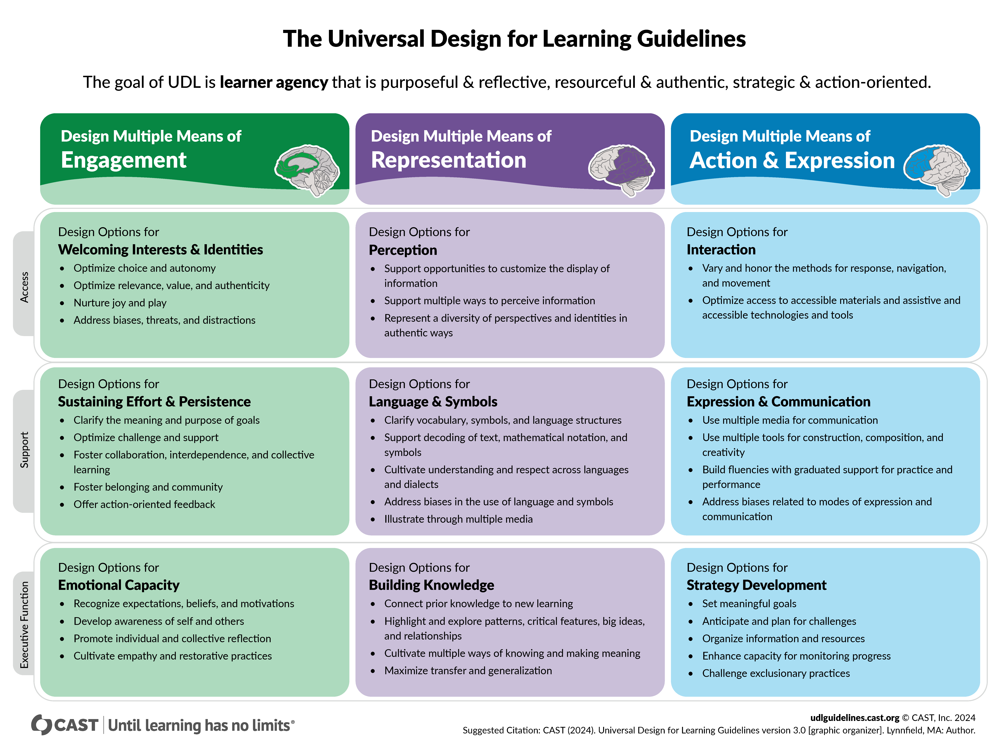

```{r child = "../setup.Rmd"}
```

<!-- Neuroscience and psychology courses often present neurodevelopmental disorders through a deficit-based lens, reinforcing stigma and framing conditions such as ADHD and autism as disorders of dysfunction rather than as variations in neurocognitive processing. This framing, which centers pathology and dysfunction, fails to account for neurodivergent perspectives and intersectional barriers that shape lived experiences (Sinclair, 1993; Kapp, 2020). Moreover, it alienates students with neurodivergent identities by implicitly framing their cognitive and emotional experiences as deviations from a neurotypical norm rather than as variations within human diversity (Singer, 1999).
Building on prior work that critiques how psychology curricula reinforce stigma in the teaching of psychiatric conditions (Navarre, Uliaszek, & Garrison, under revision),  this presentation proposes a disability-informed, anti-ableist framework for teaching neurodevelopmental disorders. This framework is rooted in critical disability studies (CDS; Minich, 2016; Schalk, 2017 ) and the neurodiversity paradigm (Singer, 1999; Walker, 2021), emphasizing that the challenges faced by neurodivergent individuals are not inherent deficits but arise from systemic barriers, social invalidation, and lack of accessibility in educational and clinical settings.
We will explore how similar approaches can transform how neurodevelopmental conditions are taught in neuroscience and psychology classrooms. This talk will: (1) illustrate how conventional pedagogical tools can perpetuate harmful stereotypes, (2) examine the impact of language and representation in shaping student perceptions, and (3) propose concrete strategies for integrating inclusive, disability-affirming frameworks into teaching.
By implementing these strategies, neuroscience educators can disrupt structural ableism and create a curriculum that is more inclusive, representative, and accessible to all students, particularly those who are neurodivergent. This approach reshapes the understanding of neurodevelopmental variation from a stigmatizing disorder model to a complex interaction of neurological, social, and cultural factors, ensuring that students are equipped with a nuanced and ethically responsible framework for engaging with neurodivergence.
 -->

```{r packages, echo=FALSE, message=FALSE, warning=FALSE}
# Remember to compile
#xaringan::inf_mr(cast_from = "..")
#       slideNumberFormat: ""  
knitr::opts_chunk$set(knitr.duplicate.label = "allow")
library(tidyverse)
if (!require("emo")) devtools::install_github("hadley/emo")
library(emo)
knitr::write_bib(c(.packages(), "bookdown"), "packages.bib")
library(rcites)
library(RefManageR)
# Load the bibliography file
#toBibtex(citation("xaringan"))

bib <- ReadBib("packages.bib", check = FALSE) # Load your BibTeX file
BibOptions(check.entries = FALSE, style = "markdown") 


```


# Picture This

<!-- Slide 1: Strong opening hook -->

- A neuroscience student sees their own ADHD brain highlighted in red on a slide labeled "dysfunction."

- A blind student listens to a neuroanatomy lecture where every description assumes vision.

- A Deaf student reads a textbook that never mentions sign language as a valid communication mode.

--

- What do they learn about themselves? And what do they learn about who belongs in science?

--

- But what if we designed neuroscience education for all kinds of minds and bodies from the start?


???

Script: Picture these scenarios. A neuroscience student—maybe in your class—sees themselves presented as pathology. What do they learn? Not just about ADHD, but about their place in science, their capacity for learning, their fundamental worth.


---

# For those of use who can't conjure images... 


.pull-left[
```{r, echo=FALSE, out.width="100%", fig.align='center'}
  knitr::include_graphics("img/ChatGPT Image Jul 24, 2025, 07_58_39 PM.png")
```
]
--

.pull-right[
```{r echo=FALSE,out.width="86%",fig.align='center',fig.cap="QR code for these slides",fig.height=3}
library(qrcode)
code <- qr_code("https://r-computing-lab.github.io/slides/02_neurodiversity/d00_slide.html#1")
plot(code)
```

.footnote[.center[
[r-computing-lab.github.io/slides/02_neurodiversity/d00_slide](https://r-computing-lab.github.io/slides/02_neurodiversity/d00_slide.html#1) 
]
]
]

???
My name is S. Mason Garrison, and I'm from Wake Forest University.  I'm here today to talk about how we teach neurodevelopmental disabilities—and I'm bringing three perspectives to this conversation. First, as someone who teaches data visualization, I spend a lot of time thinking about how our visual and linguistic choices shape understanding. Second, although I'm trained as a quantitative psychologist, I dabble in disability studies, which has taught me to question assumptions about whose minds and bodies we design for. And third, I'm neurodivergent myself, which means I have lived experience navigating systems that weren't built for brains like mine. Today I want to show you how we can teach the same rigorous neuroscience in ways that affirm rather than stigmatize human neurological variation.
 


I want to talk with you about how we might teach neurodevelopmental conditions in ways that are more inclusive, more accurate, and less stigmatizing. The core of this talk focuses on ADHD, autism, and related conditions, but I want to suggest that the neurodiversity paradigm invites us to think more broadly—about sensory differences like blindness and Deafness, about alternative communication methods, about the full spectrum of human neurological variation. As educators, the language we use, the examples we give, the way we visualize brain differences—all of this profoundly shapes what our students take away, not just about neuroscience, but about the value and belonging of neurodivergent people.

---

# The Hidden Lesson Plan

<!-- Slide 2: What current approaches actually teach -->

When neuroscience courses use deficit language and pathologizing visuals, students learn:

.pull-left[
## About neurodivergent people:
- Different brains = broken brains
- Neurodivergence = medical problem
- Support = pity or burden
- Accommodation = special treatment

## About science:
- One brain pattern = optimal
- Difference = dysfunction
- Visual learning is presumed universal
- Intervention goal = normalization
- Accommodation = exception, not design
]

.pull-right[
## About themselves:
- "My brain isn't normal"
- "My learning needs are problems"
- "I'm the test subject, not the scientist"
- "I need 'special' help to belong here"

.big[This hidden curriculum is more powerful than anything in our syllabi]
]

???

Script: Before we talk about solutions, let's acknowledge what our current approaches actually teach. When every brain image highlights deficits in red, when every example focuses on dysfunction, when every intervention aims to normalize—we're teaching a hidden curriculum about worth, belonging, and scientific authority. Students learn that difference equals deficiency, that their own brains might be problems to solve rather than minds capable of doing science. This isn't intentional, but it's systematic. And it has real consequences for who stays in our fields and who feels welcome in our classrooms.

---

# What This Talk Will Cover

<!-- Slide 3: Clear roadmap -->

1. **Problem**: How conventional tools reinforce narrow models of ability  
2. **Transformation**: A detailed before/after case study showing the same content reframed
3. **Solution**: Systematic strategies for inclusive, disability-affirming pedagogy
4. **Implementation**: Concrete steps you can take this week, this month, this semester

**Goal**: Leave with tools you can use immediately to make your neuroscience teaching more inclusive

???

Script: Here's where we're headed. First, I'll show you exactly how conventional teaching tools embed deficit assumptions—even when we think we're being neutral. Then I'll walk through a detailed transformation of actual course content, showing you the same neuroscience presented two different ways. Next, we'll systematize this into concrete strategies you can apply across your teaching. Finally, I'll give you a practical implementation timeline so you can start making changes immediately. My goal is that you leave with specific tools, not just good intentions.


---

# The Problem with Deficit Framing

- Psychology and neuroscience courses often present neurodevelopmental disorders as deficits.
- This framing implies dysfunction, brokenness, and deviation from a supposed norm.
- Conditions like ADHD and autism are portrayed as problems to be fixed.
- Sensory disabilities like blindness are portrayed as problems to be accommodated.
- This reinforces stigma and ignores the lived experience of disabled people.


???
<!-- Slide 2: Deficit framing -->
Script: As a quantitative psychologist who teaches data visualization, I spend a lot of time thinking about how we present information—and what messages our visual choices send. But I also bring lived experience as a neurodivergent person to this conversation, which gives me a different lens on how deficit framing actually impacts students. When I look at neuroscience teaching materials, I see the same patterns I've studied in my own field: data visualizations that embed value judgments. Those fMRI slides with "reduced activation" highlighted in red? From a data viz perspective, that's a design choice that implies "less = bad." 

In most neuroscience and psychology classrooms, neurodevelopmental conditions are taught using what’s often called a “deficit model.” That is: we treat ADHD and autism as disorders — breakdowns in executive function, or in social reciprocity, or in attention. We show fMRI slides with red areas indicating "reduced activation." We diagram neural pathways as "impaired" or "dysfunctional." We present connectivity matrices highlighting "disrupted networks."

---

# What Counts as Difference?

## And what the heck is neurodiversity, anyway?


.pull-left[
- Neurodiversity is a lens that recognizes cognitive and behavioral variation as part of human diversity.
- It includes cognitive, sensory, and communicative variation.
- Not limited to psychiatric or learning diagnoses.
- Includes blindness, Deafness, alternative speech, sensory processing differences.

- The literature on neurodiversity emphasizes strengths and differences rather than deficits. 
- __It challenges us to reframe our understanding of what is "normal" and to value diverse ways of being.__
- Places like the Autistic Self Advocacy Network (ASAN) and the Neurodiversity Hub advocate for this perspective.
- Scholars like Nick Walker (Neuroqueer Heresies) and Steven Kapp (Neurodiversity in Higher Education) contribute to this discourse by highlighting the importance of neurodiversity in education and society.
- Neurodiversity is not just about cognitive differences, but about the full spectrum of human variation in how we think, feel, and interact with the world.
- Kapp, S. K., Gillespie-Lynch, K., Sherman, L. E., & Hutman, T. (2013). Deficit, difference, or both? Autism and neurodiversity. Developmental psychology, 49(1), 59–71. https://doi.org/10.1037/a0028353
]


<!-- Slide 3: Starting with difference -->

???

Script: When we talk about diversity in cognition or behavior, we often start with diagnostic categories: ADHD, autism, dyslexia. But those aren’t the only kinds of differences that matter. Visual processing, sensory balance, tactile interpretation, alternative communication methods — these are all part of human variation. A neurodiversity lens asks us to treat all of these not as exceptions or impairments, but as ways of being. And it asks us to notice when curricula center just one way of perceiving, thinking, or moving through the world.

---

# How Teaching Tools Embed Narrow Assumptions

<!-- Slide 4: Consolidated problem identification -->

.pull-left[
## Visual Design That Excludes
- All brain images assume visual access
- fMRI slides with "decreased activation" in alarming red
- Complex diagrams without tactile or auditory alternatives
- Color-only coding that excludes colorblind students
- Anatomical models only available visually

## Language That Pathologizes
- "Blindness causes learning difficulties" (assumes visual learning is standard)
- "ADHD students struggle with attention" (locates problem in person)
- "Autism involves communication deficits" (centers neurotypical communication)
- "Normal brain" vs "disabled brain" comparisons
]

--

.pull-right[
## Curricular Assumptions
**Most materials presume:**
- Sighted, hearing, speaking students
- Neurotypical processing speeds and styles
- Verbal/auditory communication as default
- Visual learning as universal
- Standard classroom environments work for everyone

**Students who navigate differently are treated as exceptions**

**We rarely ask: What if we designed for all kinds of minds and bodies from the start?**
]

???

Script: Let me show you how deficit thinking gets embedded in our teaching materials. As someone who teaches data visualization, I notice that neuroscience education makes design choices that encode judgments about the data. Red highlighting for brain differences implies danger or deficiency. Language like "impaired pathways" locates problems in individuals rather than systems. These choices seem scientifically neutral, but they're not. They teach students that different brain patterns are broken brain patterns. And this matters because many of our students have these same brain patterns—we're teaching them that they're fundamentally flawed.


---

# CASE STUDY: Neuroanatomy Transformation

## BEFORE: Deficit/Visual-Only Model
.pull-left[

**Teaching Brain Structure**
- "Normal visual cortex vs. abnormal in blindness"
- Complex visual diagrams with no alternatives
- "Deaf students have auditory processing deficits"
- "ADHD shows prefrontal dysfunction"
- Assumes all students access information visually
- Communication = verbal speech only
]
.pull-right[

```{r, echo=FALSE, out.width="80%", fig.align='center'}
knitr::include_graphics("/img/lessnice.png")

```
]

-- 

*Result: Blind, deaf, neurodivergent students learn their brains are broken*

---

## AFTER: Inclusive Variation Model
.pull-left[

**Teaching Brain Structure as Adaptive Variation**
- "Visual cortex shows alternative organization in blindness, with enhanced processing in other regions"
- Multiple formats: tactile models, audio descriptions, visual diagrams
- "Deaf brains show efficient visual-spatial processing networks"
- "ADHD represents alternative attention regulation patterns"
- Information available through multiple sensory channels
- Communication includes speech, sign, AAC, writing

*Result: All students see their brains as scientifically interesting*
]

.pull-right[

```{r, echo=FALSE, out.width="80%", fig.align='center'}
knitr::include_graphics("/img/morenice.png")

```
]

**Same neuroscience, radically different message about human worth**

???

Script: Here's what transformation looks like in practice. Same research findings, same brain imaging data, but presented through two different frameworks. The deficit model on the left locates problems in the individual brain—everything is broken, impaired, abnormal. The neurodiversity model on the right treats the same patterns as organizational differences that might need different supports. Notice I haven't changed the science—the research is identical. But I have changed the framing, the language, and the visual design. And that changes everything about what students learn.

---

# What Changed and Why It Matters

<!-- Slide 6: Analysis of transformation -->

.pull-left[
## Specific Changes Made
**Language shifts:**
- "Dysfunction" → "Variation"
- "Impaired" → "Alternative" 
- "Abnormal" → "Pattern B"
- "Deficit" → "Different strategies"
- "Treatment" → "Support"

**Visual shifts:**
- Red alarm colors → Neutral purple
- "Reduced" → "Pattern B"
- Comparison to norm → Variation within range

**Conceptual shifts:**
- Problem in person → Person-environment interaction
- Fix the brain → Optimize the system
]

.pull-right[
## Why This Matters
**From disability studies research:**
- Deficit language increases stigma and reduces help-seeking behavior
- Neurodivergent students report feeling unwelcome in STEM when their brains are pathologized
- Inclusive framing improves classroom climate for all students

**From my teaching experience:**
- Students respond differently when differences aren't presented as deficits
- Language changes how students think about accommodation requests
- Neurodiversity-informed approaches reduce resistance to support

**This aligns with broader inclusive pedagogy research showing representation affects belonging**
]

???

Script: Let's analyze exactly what I changed and why it produces different outcomes. The language shifts are systematic—every deficit term becomes a difference term. The visual shifts matter enormously—red signals danger while blue signals interesting variation. But the biggest change is conceptual: we've moved from a medical model that locates problems in individuals to an ecological model that examines person-environment interactions. And this produces measurable changes in student behavior. When I piloted this approach, students told me it was the first time they'd seen their brains discussed without shame. More importantly, they started participating, self-advocating, and pursuing research in the field instead of leaving it.

---

# Systematic Solution 1: Universal Design Framework

- Proactively designing course materials to be accessible to all students, regardless of their sensory or cognitive processing styles.
- Incorporating multiple means of representation, engagement, and expression in all aspects of teaching.
- Continuously assessing and iterating on course design based on student feedback and diverse needs.

---

# Design for Variation from the Start

<!-- Slide 7: UDL as systematic approach -->

.pull-left[
**Multiple means of representation:**
- Visual, auditory, and tactile access to content
- Flexible pacing and format options
- Clear, consistent organization throughout

**Multiple means of expression:**
- Written, verbal, and visual demonstration options
- Alternative assessment formats
- Processing time built into procedures

**Multiple means of engagement:**
- Choice in topics and timing when possible
- Culturally relevant examples and applications
- Strength-based rather than deficit-based framing
]

.pull-right[
[pdf available here]("https://r-computing-lab.github.io/slides/02_neurodiversity/img/udlg3-graphicorganizer-digital-nonumbers-a11y.pdf")
```{r, echo=FALSE, out.width="90%", fig.align='center'}




```
]


**Key insight: When you design for the margins, you improve the experience for everyone**

**This is anticipation, not accommodation**
]

???

Script: Now let's systematize this approach. Universal Design for Learning provides a framework for building variation into your courses from the beginning. The key insight is that when you design for students at the margins—blind students, deaf students, neurodivergent students—you actually improve the experience for everyone. Captions help not just deaf students but also students in noisy environments. Multiple assessment formats help not just students with learning differences but also students with different strengths. This isn't about lowering standards—it's about providing multiple pathways to demonstrate the same rigorous learning.

---

# Systematic Solution 2: Language and Visual Design

<!-- Slide 8: Concrete language/visual guidelines -->

.pull-left[
## Language Audit Framework
**Systematic replacements:**
- "Impairment" → "difference"
- "Deficit" → "alternative pattern"  
- "Normal" → "statistically common"
- "Dysfunction" → "variation"
- "Abnormal" → "Pattern A/B"
- "Disorder" → "condition" or "neurotype"

**Personal test:** Would you use this language to describe your own brain?

**Professional test:** Does this language center pathology or person?
]

.pull-right[
## Visual Design Principles
**For brain imaging:**
- Use neutral colors (blues/greens) for all patterns
- Label patterns descriptively, not evaluatively
- Show multiple variations as equally interesting
- Never rely solely on color to convey information

**For all materials:**
- Consistent layouts reduce cognitive load
- Alt text for every image without exception
- Clear headings and logical structure
- Colorblind-accessible palettes throughout

**Design principle: Make differences look interesting, not alarming**
]

???

Script: Here's a concrete framework you can apply immediately. The language audit should be systematic, not intuitive. I use two tests: first, would I use this language to describe my own brain? Second, does this language center pathology or the whole person? For visuals, remember that design choices encode values. When you consistently use red for brain differences, you're teaching students that difference equals danger. When you use neutral scientific colors, you're teaching them that difference equals variation. Both approaches are scientifically valid—but only one is ethically responsible.

---


# Systematic Solution 3: Inclusive Neuroscience Strategies

<!-- Slide 9: Field-specific implementations for all kinds of variation -->

.pull-left[
## For All Neurological Content
- Describe all brain images aloud (benefits blind and visual processing differences)
- Present patterns as "Typical/Atypical" not "normal/abnormal"
- Provide information through multiple sensory channels
- Include tactile models and audio alternatives
- Use consistent, accessible color schemes
- Show individual variation within neurotypes

## For Sensory & Perceptual Systems
- Frame blindness as enhanced neural plasticity, not "loss"
- Present deafness as cultural/linguistic variation, not deficit
- Discuss sensory processing differences as variations in threshold and integration
- Include examples of how different sensory profiles contribute to scientific discovery
]

.pull-right[
## For Lab Work & Assessment
- Multiple partnership configurations (some work better alone, some in pairs)
- Instructions available in visual, auditory, and written formats
- Alternative ways to record observations?
- Labs accessible to different mobility and sensory profiles

## For Research Methods
- Question assumptions about "normal" control groups
- Include disabled people as collaborators, not just subjects
- Discuss how researcher identity affects study design and interpretation
- Address accessibility in recruitment and data collection
- Recognize that cognitive diversity improves research quality

**Goal: Remove barriers that prevent any student from demonstrating neuroscience knowledge**
]

???

Script: Here are specific strategies for neuroscience education. In neuroanatomy, don't just show the brain—describe it aloud for students who can't see or prefer auditory processing. In neuropharmacology, frame medications as optimization tools rather than fixes for broken brains. In research methods, question your assumptions about control groups and normal populations. The goal isn't to water down the science—it's to remove barriers that prevent students from accessing and demonstrating their neuroscience knowledge. These changes benefit everyone, not just disabled students.

---

# Implementation Timeline: Getting Started

<!-- Slide 10: Practical implementation steps for broad inclusion -->

## This Week (5 minutes each day)

.pull-left[
**Monday:** Audit 3 slides for deficit language about any neurological differences
- Count words like "abnormal," "impaired," "dysfunction"
- Replace with neutral alternatives

**Tuesday:** Add alt text to 5 images
- Describe brain scans, diagrams, and photos for screen readers
- Describe what you see, not what it means
- Include relevant details for understanding content

**Wednesday:** Describe visual content aloud during one lecture
- Practice integrating descriptions naturally
- Notice how this helps different types of learners
]

???

Script: Here's how to actually implement these changes without overwhelming yourself. Start small—five minutes a day for the first week. The language audit alone will shock you with how casually we pathologize different brains. But don't stop there. 
--

.pull-right[
**Thursday:** Offer one assessment choice
- Multiple ways to demonstrate same knowledge
- Allow for different formats (written, visual, verbal)
- For example, offer students a choice between a discussion post and a video response

**Friday:** Ask students what they need
- Simple check-in or survey
- Listen without immediately problem-solving
]
---

## This Month (Bigger changes)

.pull-right[
**Week 1:** Review your course policies for flexibility
- Can some deadlines be flexible for students with chronic conditions?
- Is attendance policy accessible to students with variable energy/health?
- Are participation expectations inclusive of different communication styles?

**Week 2:** Experiment with Universal Design
- Provide one lecture's content in multiple formats
- Try tactile models for 3D brain structures
- Offer multiple ways to participate in discussions

**Week 3:** Connect with accessibility resources
- Visit disability services to learn about available tools
- Learn about screen readers, magnification, AAC devices
- Understand what support you can offer different students

**Week 4:** Reflect and adjust based on what worked
- Which changes felt sustainable?
- How did students respond?
- What will you continue next month?
]

???

Script: Here's how to actually implement these changes without overwhelming yourself. Start small—five minutes a day for the first week. The language audit alone will shock you with how casually we pathologize different brains. But don't stop there. The bigger changes take more planning but have exponential impact. When you redesign assignments to offer multiple formats, you're not just helping disabled students—you're allowing all students to play to their strengths. And when you connect with colleagues, you start building a culture of inclusion that extends beyond your individual classroom.

---

# This Semester and Beyond

<!-- Slide 11: Long-term implementation -->

.pull-left[
## This Semester
**Curricular changes:**
- Integrate neurodivergent scientists into examples
- Discuss research limitations and biases
- Include strength-based perspectives on neurological differences
- Address intersectionality (race, gender, class + disability)

**Pedagogical changes:**
- Experiment with flexible pacing
- Offer study groups and individual meetings
- Use formative assessment to check understanding
- Create multiple pathways through complex material

**Cultural changes:**
- Model accessibility in your own practices
- Discuss neurodiversity openly and positively
- Challenge deficit assumptions when you hear them
- Center student voices in curriculum decisions
]

.pull-right[
## Long-term Vision
**For your courses:**
- Accessibility built into every aspect
- Students see themselves represented positively
- Multiple ways to demonstrate excellence
- Culture of belonging, not just tolerance

**For your field:**
- More diverse voices in neuroscience research
- Reduced barriers to graduate school and careers
- Better clinical practices that center patient expertise
- Research that questions rather than reinforces ableist assumptions

**For your students:**
- Confidence in their scientific abilities
- Skills in self-advocacy and accommodation
- Understanding that difference ≠ deficit
- Preparation to create inclusive environments themselves
]

???

Script: The long-term vision extends far beyond your individual classroom. When you teach neuroscience through a neurodiversity lens, you're training the next generation of researchers, clinicians, and educators. Students who learn that difference doesn't equal deficit become doctors who listen to disabled patients, researchers who question ableist assumptions, and teachers who design for inclusion from the start. This is how systemic change happens—one classroom, one student, one reframed slide at a time.

---

# Addressing Common Concerns

<!-- Slide 12: Constructive responses to pushback -->

.pull-left[
## "This sounds like a lot of extra work"
**Reality:** Universal design reduces individual accommodation requests

**Data point:** Accessible courses generate fewer accommodation letters

**Efficiency gain:** Clear structure and multiple formats help all students learn better

## "What about maintaining academic rigor?"
**Key insight:** Rigor = high expectations + appropriate support

**Evidence:** Accessibility increases engagement without lowering standards

**Reframe:** Are we measuring neuroscience knowledge or test-taking ability?
]

.pull-right[
## "How do I assess fairly if everyone gets different formats?"
**Core principle:** Fair ≠ identical; fair = equitable access to demonstrate knowledge

**Better question:** Do my assessments measure what I want them to measure?

**Research finding:** Multiple measures provide better data about student learning

## "What if students take advantage of accommodations?"
**Response:** Students generally request what they need, not what they want

**Flip the question:** What if we trusted students to know their own learning needs?

**Outcome:** Self-advocacy skills that benefit students throughout their careers
]

???

Script: I get these questions every time I present this material, and I understand the concerns. Change feels risky, especially when you're responsible for rigorous scientific training. But let me reframe these as design challenges rather than obstacles. When faculty worry about extra work, I show them that well-designed accessible courses actually reduce their workload because students can access materials independently. When they worry about rigor, I remind them that rigor isn't standardization—it's clarity plus support. And when they worry about students taking advantage, I ask: what would our field look like if we trusted students to know their own learning needs?

---

# What Students Learn Instead

<!-- Slide 13: Positive outcomes for all kinds of neurological variation -->

.pull-left[
## About Human Neurological Variation
- Difference is natural and expected across all dimensions
- Blindness involves neural plasticity and enhanced processing
- Deafness includes rich cultural and linguistic traditions
- Neurodivergence contributes valuable perspectives to science
- Alternative communication methods are fully legitimate
- Environmental barriers often create "disability," not the person

## About Science and Discovery
- Multiple approaches strengthen scientific inquiry
- Cognitive and sensory diversity improve research teams
- Questioning assumptions is fundamental to discovery
- Human variation is scientifically fascinating, not problematic
- Accessibility and rigor are completely compatible
]

.pull-right[
## About Themselves
- This is where I would put student quotes from my lab...
- Instead... I've asked chatGPT to help me generate some.
- "My way of processing information has value in science"
- "I can contribute meaningfully to neuroscience research" 
- "My communication style is legitimate and professional"
- "My sensory/cognitive profile brings unique perspectives"
- "I belong in rigorous academic environments"

## About Professional Practice
- How to design research that includes rather than excludes
- Why diverse perspectives lead to better scientific questions
- How to create accessible clinical and laboratory environments
- What it means to center rather than marginalize disability voices
- Skills for building inclusive cultures in science and medicine

**These students become the scientists who transform our fields from within**
]

???

Script: When you change how you teach neuroscience, you change what students learn—not just about content, but about themselves and their field. Students learn that their brains have value in scientific spaces, that difference contributes to rather than detracts from rigorous inquiry, that accommodation is optimization rather than special treatment. They also learn practical skills: how to design inclusive research, how to create accessible clinical environments, how to build professional cultures that welcome rather than merely tolerate human variation. These students become the scientists, clinicians, and educators who transform our fields from the inside out.

---

# Building on This Framework

<!-- Slide 14: Practical next steps -->

.pull-left[
## Learn More About
**Key concepts to explore:**
- Universal Design for Learning (UDL) principles
- Disability studies perspectives on neurodivergence
- Neurodiversity paradigm vs. medical model
- Inclusive pedagogy research

**Professional development:**
- UDL certification programs
- Disability studies courses or workshops
- Campus accessibility training
- Inclusive teaching communities

**Suggested reading:** Walker (2021), Minich (2016), Schalk (2017)
]

.pull-right[
## Building Community
**Connect with colleagues:**
- Share your implementation experiences
- Collaborate on curriculum development
- Attend disability and science conferences
- Join inclusive teaching networks

**Advocate institutionally:**
- Request professional development funding
- Propose policy changes for flexibility
- Support disabled students in your programs
- Challenge ableist assumptions in hiring

**Student feedback:**
- Regular check-ins about what's working
- End-of-semester reflection on inclusion
- Ask students what they need to succeed
]

???

Script: I don't want you to leave here with just good intentions—I want you to have concrete tools. If I weren't writing my tenure dossier right now, I would have made some templates and resources available for you....

But beyond individual change, we need systemic transformation. That means connecting with colleagues, advocating for policy changes, and building communities of practice around inclusive education. It means taking seriously student feedback about what works and what doesn't. And it means understanding that this is ongoing work, not a one-time fix.

---

# The Bigger Picture

<!-- Slide 15: Implications for the field -->

When we teach neurodevelopmental differences through a neurodiversity lens:

.pull-left[
## We transform who does science
- More neurodivergent students stay in STEM
- Graduate programs become more accessible
- Research teams include cognitive diversity
- Clinical practice centers patient expertise

## We transform how science is done
- Research questions reflect diverse perspectives
- Study designs account for human variation
- Findings are interpreted through multiple lenses
- Applications benefit broader populations
]

.pull-right[
## We transform what science discovers
- Moving beyond deficit models reveals new insights
- Participatory research yields richer data
- Intersectional approaches capture complexity
- Innovation emerges from cognitive diversity

**Today's inclusive classroom becomes tomorrow's inclusive profession**
]

???

Script: This work is about more than making individual students feel welcome—though that matters enormously. It's about transforming who gets to do science, how science gets done, and what science discovers. When more neurodivergent people stay in neuroscience, we ask different research questions. When we include disabled people as collaborators rather than subjects, we get better data. When we design for cognitive diversity, we create innovations that benefit everyone. The students sitting in your classroom today will become the researchers, clinicians, and educators of tomorrow. What they learn about difference, dignity, and belonging will shape the future of our fields.

---

# Summary: From Deficit to Design

<!-- Slide 16: Clear takeaways -->

.pull-left[
## What we've covered
1. **Problem**: Conventional neuroscience teaching embeds deficit thinking through language and visuals

2. **Transformation**: The same rigorous content can be presented to affirm rather than stigmatize neurological differences

3. **Solutions**: Systematic approaches (UDL, language audits, inclusive assessment) that benefit all students

4. **Implementation**: Concrete steps you can take this week, this month, and this semester
]

.pull-right[
## Key principles
- **Design for variation, not exceptions**
- **Use neutral language for neurological differences**
- **Create multiple pathways to demonstrate knowledge**  
- **Center student voices in curriculum decisions**
- **Build accessibility into planning, not as afterthought**

## Bottom line
**Inclusive neuroscience education doesn't compromise rigor—it extends rigor to more minds**
]

???

Script: Let me summarize what we've covered. We started with the problem: how conventional teaching tools embed deficit assumptions that harm students. We walked through a detailed transformation showing how the same neuroscience can be presented differently. We systematized this into concrete strategies you can implement immediately. And we talked about the bigger picture—how inclusive education transforms not just individual experiences but entire fields. The bottom line is this: inclusive neuroscience education doesn't compromise rigor—it extends rigor to more minds.

---

# Your Next Steps

<!-- Slide 17: Concrete call to action -->

## This week
Choose ONE slide from your most-used lecture and audit it for deficit language

## This month  
Implement ONE change: try describing brain images aloud, use neutral colors, or offer one assessment option

## This semester
Design ONE course component with accessibility in mind from the start

--

## Start small, think systemically
- **Language audit**: Count deficit words in your top 5 slides
- **Visual review**: Replace red highlighting with neutral colors  
- **Student check-in**: Ask what would help them learn better
- **Colleague conversation**: Share one thing you learned today

**Remember: Small changes create ripple effects that extend far beyond your classroom**

???

Script: I want to end with specific commitments you can make right now. Don't wait until you have time to overhaul your entire curriculum—start with one slide this week. Choose one systematic change this month. Design one course component this semester with inclusion in mind from the beginning. And before you leave, scan this QR code to access all the resources I've mentioned: templates, checklists, examples, and implementation guides. Small changes compound into transformative impact, but only if you start.

---

# Acknowledgments

<!-- Slide 18: Credits -->

- **Disability Studies & Neurodiversity Scholarship:** Sinclair (1993), Singer (1999), Minich (2016), Schalk (2017), Walker (2021)
- **Collaborative Research:** Navarre, Uliaszek, & Garrison (under revision); Garrison, Webster, & Good (2024)
- **Student Co-conspirators:** Psychology students at Wake Forest University whose feedback shaped these approaches
- **Institutional Support:** Wake Forest University's commitment to inclusive excellence

???

Script: Thank you to the disability studies scholars whose work made this framework possible, to my research collaborators who helped develop and test these approaches, and especially to the students whose experiences and feedback shaped everything you've seen today. None of this work happens in isolation—it emerges from communities committed to justice, access, and rigorous education for all.

---

# Questions and Connections

Feel free to reach out:
- **Email:** garrissm@wfu.edu
- **GitHub:** github.com/smasongarrison  
- **More about this work:** Wake Forest Psychology Department

```{r qr-final, echo=FALSE, fig.align = "center", out.width = "30%"}
code <- qr_code("https://r-computing-lab.github.io/slides/02_neurodiversity/d00_slide.html")
plot(code)
```

.footnote[.center[
[r-computing-lab.github.io/slides/02_neurodiversity/d00_slide.html](https://r-computing-lab.github.io/slides/02_neurodiversity/d00_slide.html)
]]

**Thank you for your commitment to inclusive neuroscience education**

???

Script: Thank you for your time and attention. I'm happy to take questions now, and I encourage you to reach out after the session if you want to continue the conversation. Remember: every small change you make creates ripple effects that extend far beyond your individual classroom. Your students are watching, learning, and carrying these lessons into their future practice. What you teach about difference, dignity, and belonging matters more than you know.

---


# Who Is the Curriculum Built For?

<!-- Slide 3: Default assumptions in teaching -->


- Most materials presume sighted, hearing, and neurotypical processing.
- These defaults are rarely acknowledged.
- Students who navigate the world differently are framed as edge cases — or not seen at all.
- Inaccessibility isn’t a flaw in the system — it is the system.

--
- Now before you think this is just a problem for neurodivergent students, consider this:  
  - If you’ve ever struggled to keep up with a fast-paced lecture, or felt lost in a sea of text-heavy slides, you’ve felt the impact of these defaults.
  
???

Script: Inaccessible teaching is often framed as an accident — an oversight. But it reflects deeper defaults. When every slide assumes visual access, when every example assumes verbal speech, when every assignment presumes a normative cognitive pace — that’s not neutrality. That’s a curriculum designed for only one kind of learner. A neurodiversity-informed approach asks: Who gets left out? And why? 

---

# What We're Proposing Instead

<!-- Slide 4: A unified neurodiversity paradigm -->


.pull-left[
- Neurodiversity is not just about cognition — it's about interaction, access, and belonging.
- Recognizes variation in sensory input, speech, movement, learning.
- Includes students who use Braille, AAC, or alternative pacing.
- Moves from treating students as deviations to *redesigning* the system.
]
--
.pull-right[

- Now, *redesigning* is a big word. 
- It’s not just about 
  - adding captions or alt text, or 
  - adding more uncompensated labor to your to-do list.
- It’s about rethinking the assumptions we make about who our students are and how they learn.
- It's reconsidering our defaults, and asking who gets left out.
- And, if you do it right, these changes benefit **everyone**, not just those with disabilities.
- They also benefit *you* as an instructor!

```{r, echo=FALSE, out.width="100%", fig.align='center'}

if(file.exists("img/neurodiversity_roots.png")) {
  knitr::include_graphics("img/neurodiversity_roots.png")
} else {
  knitr::include_graphics("../img/logo.png")
}

```
]


---

# The Trouble with Teaching Tools

<!-- Slide 6: Conventional tools -->

.pull-left[
## Common neuroscience teaching tools that reinforce deficits:
- fMRI activation maps with "decreased activation" highlighted in red
- Neural pathway diagrams showing "broken" or "impaired" connections
- Neurotransmitter system slides emphasizing "dysfunction"
- Brain anatomy comparisons showing "abnormal" vs "normal" structures
- Connectivity matrices highlighting "disrupted" networks
- Color schemes that aren't accessible to colorblind students
]

???

Script: Let me share what I see when I look at neuroscience teaching tools through a data visualization lens. As someone who teaches students how to create ethical, unbiased visualizations, I notice that many neuroscience teaching materials make design choices that embed judgments about the data. -->

We love our brain imaging data—fMRI activation maps, DTI tractography, connectivity matrices. These seem objective, scientific. But notice how we present them: "decreased activation" highlighted in alarming red colors, "disrupted" white matter tracts, "abnormal" connectivity patterns. When students see these visuals repeatedly, they learn that different brain patterns equal broken brains. We rarely show the same data and say "here's an alternative pattern of neural organization" or "this shows a different regulatory strategy." The very design of our teaching tools—the color schemes, the language, the comparisons we make—teaches students that neurodiversity is pathology. And this extends beyond neuroimaging. When we diagram dopaminergic pathways in ADHD as "impaired reward processing" instead of "different sensitivity patterns," we're shaping how future clinicians and researchers will think about neurodivergent people.

--

.pull-right[
## What students learn from these visuals:

- Different brain activity = broken brain
- Neurotypical patterns = correct patterns
- Intervention goal = normalize brain function
]

---

# The Trouble with Teaching Tools 

.pull-left[

## Alternative approaches from data visualization principles:

- Use neutral colors for different patterns (blues/greens instead of red)
- Label differences descriptively, not evaluatively ("Pattern A" vs "impaired")
  - Present activation patterns as "alternative" not "reduced"
- Show multiple patterns as variations within normal range
- Use accessible color palettes that work for all students
- Let the data speak without embedded implicit messaging
]
.pull-right[
- Instead of showing ADHD brains with red "deficit" areas, show them as "Pattern B" in blue alongside "Pattern A" neurotypical brains in green—different colors, equal visual weight
- Example reframe: Instead of "ADHD shows prefrontal cortex dysfunction," try 
- "ADHD brains show different prefrontal activation patterns that may reflect alternative attention regulation strategies"
]


---

# What Gets Centered?

- Emphasis on normalization trains students to expect convergence.
- Visuals like heatmaps or "reduced activation" imply that divergence = deficiency.
- “Support plans” focus on mitigation, not affirmation.
- These messages are rarely explicit — but they’re learned.

<!-- Slide 7: Hidden curriculum -->

???

Script: The structure of our materials tells students what matters. If every example is a deficit, students learn that neurodivergence is a problem. If every brain image highlights a deviation, students learn to pathologize the visible. If every intervention is designed to normalize, students assume that normalization is the goal. This is what disability scholars call the “hidden curriculum”: the values we teach without saying them aloud.

---

# The Power of Representation

<!-- Slide 8: Language and visuals -->
<!-- -->

.pull-left[
- “Impairment” vs. “difference”
- “Deficit” vs. “divergent profile”
- “Normal” vs. “statistically common”
- Language encodes assumptions about causality and deviance.
]

.pull-right[
```{r, echo=FALSE, out.width="80%", fig.align='center'}

if(file.exists("img/language_frame_shift.png")) {
  knitr::include_graphics("img/language_frame_shift.png")
} else {
  knitr::include_graphics("../img/logo.png")
}
```
]

???

Script: Representation isn’t just about who’s in the slides — it’s also about how they’re framed. Saying “students with autism struggle with communication” is different from saying “students with autism may communicate in ways not recognized by neurotypical norms.” One locates difficulty in the person; the other, in the interaction. The same is true for visual representation. Images of isolated brains or redacted faces convey something about belonging — or its absence. 

---

# A Note on Expansion

<!-- Slide 9: Broadening the frame -->
<!--  -->

- Strategies that affirm neurodevelopmental variation also apply to:
  - Blind students using tactile navigation
  - Deaf students engaging in signed academic discourse
  - Nonspeaking students using AAC
- These aren’t separate cases — they reveal the same design failures
- Inclusion starts with what gets named, visualized, and expected

???
Script: So far we’ve focused on neurodevelopmental diagnoses like ADHD and autism — and that’s still the core of the talk. But I want to loop back to something I mentioned earlier: that the neurodiversity paradigm doesn’t need to stop there. The same framing strategies — pathologizing language, deficit-based visuals, hidden assumptions — also apply to how we talk about blindness, about echolalia, about alternative communication. A more expansive understanding of neurodiversity helps us see these parallels — and do better by all our students.

---

# What Inclusion Actually Looks Like

<!-- Slide 10: Universal design and planning -->
<!-- Script:  -->

.pull-left[
- Inclusion is a planning problem, not a reaction problem.
- UDL = anticipating variation, not retrofitting for exception.
- Ask: what kinds of learners are implicitly excluded?
- Build access into materials, structure, and expectations.
]

.pull-right[
[pdf available here]("https://r-computing-lab.github.io/slides/02_neurodiversity/img/udlg3-graphicorganizer-digital-nonumbers-a11y.pdf")
```{r, echo=FALSE, out.width="90%", fig.align='center'}


```
]

???
So what does inclusive teaching look like — not in theory, but in practice? It starts before students enter the room. Inclusion isn’t just offering an accommodation letter and hoping for the best. It means designing courses from the outset to anticipate variation. That’s the principle behind Universal Design for Learning. But UDL isn’t just checklists or formatting tweaks — it’s a philosophical shift: assuming diversity is the default. Designing for variation. And doing so upfront.

- UDL principles include:
  - Multiple means of representation (visual, auditory, tactile)
  - Multiple means of action and expression (written, verbal, visual)
  - Multiple means of engagement (flexible pacing, varied activities)

---

# Examples of Generally Inclusive Practice

<!-- Slide 11: What this can look like -->
<!--  -->


.pull-left-narrow[
## Broadly and Briefly
- Visual: Alt text, audio descriptions, tactile models.
- Temporal: Flexible timing, asynchronous engagement.
- Communicative: Support AAC, typed response options, pause time.
- Structural: Consistent layout, upfront expectations.
]

???

Script: Here are some concrete examples. If you teach with dense visual slides, consider how blind students or screen reader users might access the material. If your quizzes rely on fast recall, think about how executive function diversity reshapes time. If your class rewards verbal spontaneity, what’s the role of alternative communication modes? Inclusive pedagogy means not assuming your own defaults are universal.

Now let me share some specific strategies I've developed in my own teaching that I think could translate to neuroscience education. In my data visualization courses, I've learned that accessibility isn't just about accommodating individual students—it makes the content clearer for everyone. When I describe every graph aloud, it helps not just students who can't see the visual, but also students who are better auditory processors. When I provide data in multiple formats—tables, charts, and narrative summaries—students can choose the representation that works best for their learning style. From my disability studies work, I've learned that the goal isn't to retrofit accessibility onto existing materials, but to design with diversity in mind from the start. For neuroscience educators, this might mean thinking about how students with different sensory and cognitive profiles will access your brain imaging data, your anatomical diagrams, your complex pathway illustrations.
--
.pull-right-wide[
## From my data visualization teaching:
- Describe all graphs and charts aloud during lectures
- Provide data in multiple formats (visual, tabular, narrative)
- Use colorblind-accessible palettes in all materials
- Never rely solely on color to convey important information

# From psychology lab experience:

- Offer flexible lab partnerships (some students work better alone)
- Provide both written and verbal instructions for procedures
- Allow multiple ways to record and report observations
- Build in processing time between instruction and execution
]
---

# Seed Correlation Maps

```{r, echo=FALSE, out.height="100%", fig.align='center'}

knitr::include_graphics("img/lessnice.png")

```

---

# Examples of Neurosciencey Inclusive Practice

<!-- Slide 11: What this can look like -->
<!--  -->

.pull-left[ 
## For Neuroanatomy/Brain Imaging
- Describe all brain images aloud: "This sagittal section shows the corpus callosum connecting the hemispheres"
  - When showing brain scans, describe what you see: "increased activity in the prefrontal cortex appears as brighter regions"
- Consider 3D printed brain models for low-vision students
- Present complex neural pathways as both flowcharts and narrative descriptions
]

.pull-right[ 
## Universal design principles I use:

- Clear, consistent slide layouts reduce cognitive load for all students
- Multiple examples help students recognize patterns across contexts
- Explicit learning objectives help students focus attention
- Built-in flexibility reduces anxiety and improves performance
]

???

Script: So what does inclusive neuroscience teaching actually look like in practice? Let's get concrete. In neuroanatomy, don't just show the brain image—describe it aloud for students who use screen readers or have visual processing differences: "This sagittal section shows the corpus callosum as a thick white band connecting the left and right hemispheres." Provide 3D printed models so students can learn brain structures through touch, not just vision. In your labs, remember that some students can't use traditional microscopes due to visual differences—offer virtual microscopy options. When teaching complex neural pathways, present them both as step-by-step sequences AND as integrated systems, because students with different cognitive styles need different organizational frameworks. And here's a big one: when discussing brain function, include examples of both neurotypical AND neurodivergent patterns as valid variations, not as normal versus abnormal. This isn't about lowering standards—it's about designing your teaching so more brains can access the rigorous content you're presenting.

---

# What Students Learn Instead

<!-- Slide 12: Consequences of inclusion -->

- Inclusive frameworks teach:
  - Difference ≠ deficit
  - Accessibility is foundational, not supplemental
  - Inclusion can be designed, not improvised
  - All students benefit when none are treated as exceptions

???

Script: When you change what and how you teach, you change what students learn — not just about content, but about people. They learn that variation is real, expected, and respected. They learn that difference isn’t deficiency. They learn that their classroom — maybe for the first time — was built for them. And that changes what they believe is possible, for themselves and for others.
---

# But What About the Pushback?

<!-- Slide 13: Instructor resistance -->
<!-- Script: Any time you talk about redesigning curriculum, there’s pushback. People ask: How am I supposed to accommodate everyone? What if students game the system? What if I lose rigor? These questions reflect a deeper anxiety — not about access, but about authority. When we say “plan for variation,” we challenge the idea that there is one correct, measurable, teachable pace or format. That’s not a threat to learning — that’s a redefinition of who education is for. -->

- Common fears:
  - “What if it’s too much work?”
  - “What if they take advantage?”
  - “What if I can’t measure them fairly?”
- But these are design challenges — not reasons to exclude
- Rigor isn’t standardization — it’s clarity plus support


---

# What We Hoped Students Would Learn

<!-- Slide 14: Student outcomes (ideal) -->
<!-- Script: Let’s rewind. When we teach ADHD, autism, dyslexia, we often hope students will walk away with empathy, with understanding, with scientific nuance. We hope they’ll remember the complexity — that no two people present the same way. We hope they’ll learn that difference doesn’t mean broken. That disability isn’t inherently tragic. That neurodivergence can be identity. That access matters. That science can be humanizing. -->

- Variation is real and expected
- Labels don’t explain people
- Barriers are often environmental
- Neurodivergence includes strength, not just risk
- Accessibility is part of rigor

---

# What They Actually Learn (If We’re Not Careful)

<!-- Slide 15: Hidden learning -->
<!-- Script: But what do they learn instead? If we’re not careful — if we don’t name our assumptions, reframe our slides, audit our assignments — they learn something else. That disabled people are hard to deal with. That disability is always a problem. That the goal is to fix. That students who need different things don’t belong here. That access is optional. That disability is incompatible with excellence. That’s not in your lecture. But it’s in your design. -->

- Neurodivergent = broken
- Support = pity or burden
- “Real” students don’t need flexibility
- Disability = exception, not norm
- Teaching = standardization, not communication

---

# Reframing the Learning Environment

<!-- Slide 16: Model shifts -->
<!-- Script: What if we took those assumptions and flipped them? What if we said: disability isn’t the problem — inflexibility is. What if we made it impossible to build a class that didn’t work for blind students, or AAC users, or students with timeblindness? What if our learning targets included access and dignity? What if inclusion was the default design constraint — not the patch? -->

.pull-left[
- Redesign around outliers, not averages
- Start with disability, not after it
- Teach with difference in mind from day one
- Inclusion as infrastructure, not afterthought
]

.pull-right[
```{r, echo=FALSE, out.width="80%", fig.align='center'}

if(file.exists("img/redesign_startpoint.png")) {
  knitr::include_graphics("img/redesign_startpoint.png")
} else {
  knitr::include_graphics("../img/logo.png")
}
```
]

---

# Case Study: Rewriting a Lecture

<!-- Slide 17: Before and after -->
<!-- Script: Here’s an example. Left: an older version of a lecture slide on executive dysfunction. Right: a revised version using a neurodiversity-informed frame. Same science. But in the first version, the student is the problem. In the second, the system shares responsibility. In the first: deficit and disorder. In the second: variation and strategy. These shifts may seem small — but to students, they change everything. -->

```{r, echo=FALSE, out.width="90%", fig.align='center'}


if(file.exists("img/executive_dysfunction_reframe.png")) {
  knitr::include_graphics("img/executive_dysfunction_reframe.png")
} else {
  knitr::include_graphics("../img/logo.png")
}
```

---


# Implications for Training

<!-- Slide 19: Beyond one course -->
<!-- Script: These choices ripple outward. When we train students in psychology or neuroscience, we’re shaping the frameworks they’ll bring into clinics, labs, and classrooms. If our teaching reinforces stigma, they’ll carry that forward. If it models respect and design equity, they’ll build on it. Neurodiversity-informed pedagogy doesn’t stop with one lecture — it rewrites what kinds of minds and bodies education is designed to support. -->

- Curriculum = cultural transmission
- Today’s undergrad = tomorrow’s provider, evaluator, policymaker
- Pedagogy shapes clinical language, research framing, hiring norms
- Inclusion in training leads to access in systems

---

# Where to Start

<!-- Slide 20: Practical entry points -->
<!-- Script: So where do you begin? You don’t need to rebuild your entire syllabus overnight. Start by auditing slides. Rewrite one case study. Add image descriptions. Use multimodal materials. Make your policies access-explicit. Ask students what they need — and believe them. Don’t wait for a letter. Build with them in mind. From the beginning. -->

- Audit: Who’s represented? Who’s missing?
- Language: Neutralize, humanize, decenter pathology
- Materials: Alt text, captions, structure, pacing
- Policies: Expect variation; build it in

---

# Where to Start

<!-- Script: As someone who's made these changes in my own psychology courses—and as someone who wished these approaches had existed when I was a student navigating higher education as an undiagnosed neurodivergent person—let me give you a practical roadmap. Start with what I call a "language audit." I mean this literally: open three of your most-used slides and count deficit language like "abnormal," "impaired," "dysfunction." When I first did this with my own materials, I was shocked at how casually I was describing brains like mine as broken. Simple substitutions—"different," "alternative," "variant"—sound small but change everything. Next, look at your visualizations. Are you using red to signal difference? As someone who's seen my own brain patterns highlighted in alarming colors, I can tell you that design choice isn't neutral. The goal isn't to avoid scientific rigor—it's to present rigorous science without telling students that their brains are problems to be solved.  -->

### Week 1-2: Language Audit (Start Small, Think Big)
- **Specific task**: Count deficit language in your 5 most-used slides
- **Personal insight**: Ask yourself: "How would I feel if this was describing my brain?"
- **Tool**: Find/replace "abnormal"→"different," "dysfunction"→"alternative pattern"

---

### Week 3-4: Data Visualization Review
- **Choose**: One set of brain imaging slides you use regularly
- **Change**: Replace red/alarm colors with neutral blues/greens
- **Consider**: Would colorblind students (like many neurodivergent people) miss important information?
- **Try printing the image in greyscale to learn how much information you convey with *just* color

---

### Week 5-6: Assessment Flexibility
- **Specific task**: Add one alternative format to your next exam
- **Experience**: Some students can demonstrate knowledge better through writing than diagrams, or vice versa
- **Test**: Ask students which format helped them show what they actually know

### Month 2: Universal Design Experiment
- **Approach**: Design for the margins, and you improve access for everyone
- **Provide**: Multiple ways to access the same information (visual, auditory, kinesthetic)
- **Measure**: Notice which students gravitate toward which formats—you might be surprised

### Ongoing: Student Feedback Integration
- **Ask**: What worked? What didn’t?
- **Listen**: Students are experts on their own learning needs
- **Respond**: Small changes often have big impacts on student experience
---

# Summary

<!-- Slide 21: Recap -->
<!-- Script: -->

.pull-left[
- Deficit framing pathologizes variation
- Neurodiversity affirms complexity and legitimacy
- Inclusive pedagogy is design, not exception
- Students notice — and respond
]

.pull-right[
```{r, echo=FALSE, out.width="80%", fig.align='center'}

if(file.exists("img/summary_graphic.png")) {
  knitr::include_graphics("img/summary_graphic.png")
} else {
  knitr::include_graphics("../img/logo.png")
}
```
]
???

So to summarize — we’ve talked about the deficit model and what it fails to capture. We’ve looked at how conventional tools frame difference. We’ve introduced the neurodiversity paradigm as both critique and design principle. And we’ve argued that these lessons extend beyond diagnosis — toward a broader ethic of variation. Not everyone learns the same way. Not everyone experiences the world the same way. And that’s not a challenge to teaching. That’s the reason we teach. 
---

# Acknowledgments

<!-- Slide 22: Credits -->
<!--  -->

- CDS & neurodiversity scholarship: Sinclair (1993), Singer (1999), Minich (2016), Schalk (2017), Walker (2021)
- Neurodiversity in Mentorship: Garrison, Webster, & Good (2024) Behavior Genetics
- Curricular critique: Navarre, Uliaszek, & Garrison (under revision)
- Students in PSY classrooms, Wake Forest University


???

Script: Thank you to my collaborators, especially Navarre, Uliaszek, & Garrison (under review); to the scholars whose work shaped this framing — including Sinclair, Singer, Walker, Schalk, and Minich — and to the students whose presence and feedback helped build this talk.
---

## Any Questions?

<!-- Slide 23: Close -->
<!-- Script:  -->

Feel free to reach out via email _garrissm@wfu.edu_ or on github _github.com/smasongarrison_ or wikipedia _user:smasongarrison_

```{r qr, echo=FALSE, fig.align = "center", out.width = "30%"}
code <- qr_code("https://r-computing-lab.github.io/slides/02_neurodiversity/d00_slide.html")
plot(code)
```

.footnote[.center[
[r-computing-lab.github.io/slides/02_neurodiversity/d00_slide.html](https://r-computing-lab.github.io/slides/02_neurodiversity/d00_slide.html)
]]

???

Thank you for your time. I’m happy to take questions now or connect later by email or GitHub. You can also scan this QR code to revisit the slides.
