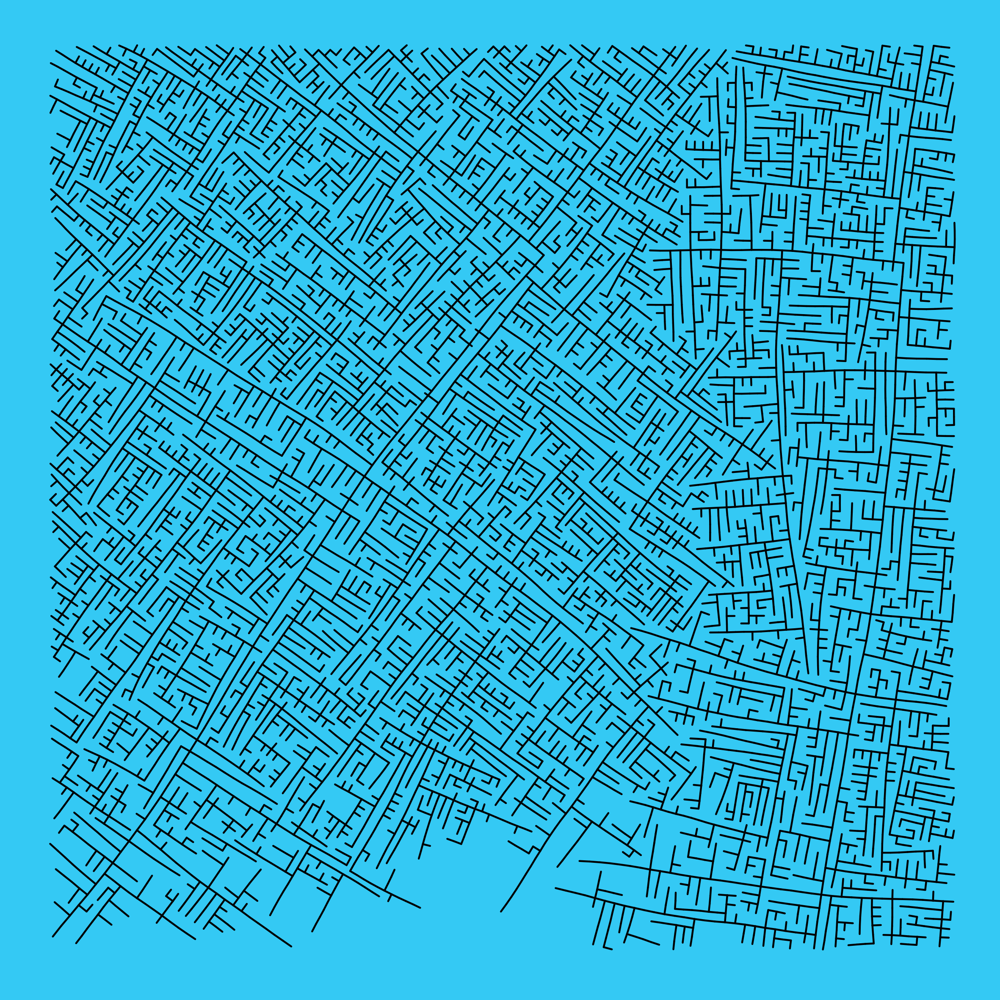
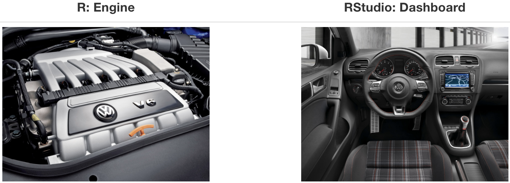

---

```{r child = "../setup.Rmd",echo = F}
```

```{r packages, echo=FALSE, message=FALSE, warning=FALSE,include=FALSE}
# Remember to compile
#xaringan::inf_mr(cast_from = "..")
#       slideNumberFormat: ""  
library(tidyverse)
if (!require("emo")) devtools::install_github("hadley/emo")
library(emo)
if (!require("jasmines")) devtools::install_github("djnavarro/jasmines")
if (!require("mathart")) devtools::install_github("marcusvolz/mathart")
```

class: center, middle 

# Data Science for Psychologists Workshop
## APS Annual Convention
### Mason Garrison
#### Assistant Professor of Quantitative Psychology
#### Wake Forest University

---
class: middle

# Workshop Overview!

---

# Workshop Overview

- .large[<i class="fa fa-database fa"></i> = Introduction to R and the tidyverse]
--

- .large[<i class="fa fa-flask fa"></i> = Data Wrangling]
--

- .large[<i class="fa fa-code fa"></i> = Data Visualization]
--


<br><br><br><br><br><br><br>

.small[
.center[
[DataScience4Psych.github.io/DataScience4Psych/](https://DataScience4Psych.github.io/DataScience4Psych/)
]
]

---

# Introduction to R and the tidyverse
.dark-blue.pull-left[
- .large[Getting started with R and RStudio]
- .large[Understanding the structure and philosophy of the tidyverse]
- .large[Learning basic R syntax and operations]
]
---

# Data Wrangling
.pull-left[
- .large[Importing and exporting data in various formats]
- .large[Cleaning, transforming, and reshaping data]
]
---

# Data Visualization

.pull-left[
- .large[Creating static and interactive visualizations using ggplot2]
- .large[Customizing visual elements to enhance your plots]
- .large[Interpreting and describing visualizations]
]
.center.pull-right[

```{r echo=FALSE, out.width="95%",fig.align = 'left'}
# r code to generate this figure is plot_metro.R

```
]

---
class: middle

# Hello world!

---

## What is data science?

- <i class="fa fa-database fa"></i> + <i class="fa fa-flask fa"></i> = data science?
--

- <i class="fa fa-database fa"></i> + <i class="fa fa-code fa"></i> = data science?
--

- <i class="fa fa-database fa"></i> + <i class="fa fa-user fa"></i> + <i class="fa fa-code fa"></i> = data science?
--

- <i class="fa fa-database fa"></i> + <i class="fa fa-users fa"></i> + <i class="fa fa-code fa"></i> = data science?
--

<br>
<br>
.large[
Data science is an exciting discipline that allows you to turn raw data into understanding, insight, and knowledge. We're going to learn to do this in a `tidy` way -- more on that later!
]
---

# What is this course?

This course is an introduction to data science that is designed for psychologists. It emphasizes statistical thinking and best practices.
<br><br>
--

**Q - What data science background does this course assume?**  
A - None.
<br>
--

**Q - Is this an intro CS course?**  
A - Although statistics and computer science $\ne$ data science, they are very closely related and have tremendous of overlap. Hence, this course is a great way to get comfortable with those topics. However this course is **not** your typical course.
<br>
--

**Q - Will we be doing computing?**   
A - Yes.
<br>
--


**Q - What computing language will we learn?**  
A - R.
<br>
--

**Q: Why not language X?**  
A: We can discuss that *remotely* over `r emo::ji("coffee")`.


---

## Where is this course?

<br><br><br><br><br><br><br>

.large[
.center[
[DataScience4Psych.github.io/DataScience4Psych/](https://DataScience4Psych.github.io/DataScience4Psych/)
]
]

---
class: middle

# Introduction to R and the tidyverse

- Getting started with R and RStudio
- Understanding the structure and philosophy of the tidyverse
- Learning basic R syntax and operations


---

class: middle

# R and RStudio

---

## What is R/RStudio?

- R is a statistical programming language
- RStudio is a convenient interface for R (an integrated development environment, IDE)
- At its simplest:
    - R is like a car’s engine
    - RStudio is like a car’s dashboard

```{r fig.align="center", echo=FALSE, out.width="66%"}

```


---

## Let's take a tour - R / RStudio

.center[

]

- Console
- Using R as a calculator
- Environment
- Loading and viewing a data frame
- Accessing a variable in a data frame
- R functions


---

## Working with R at the command line 

- Launch RStudio/R.
- Notice the default panes:
    - Console (entire left)
    - Environment/History (tabbed in upper right)
    - Files/Plots/Packages/Help (tabbed in lower right)


--

- FYI: You can change the default location of the panes, among many other things
  - [Customizing RStudio](https://support.rstudio.com/hc/en-us/articles/200549016-Customizing-RStudio)

---

## Working with R at the command line (pt 2)

- Go into the Console, where we interact with the live R process.
- Make an assignment and then inspect the object you just created:

```{r start_rbasics}
x <- 3 * 4
x
```

- All R statements where you create objects -- "assignments" -- have this form:

```{r eval = FALSE}
objectName <- value
```

- Read this as 'x gets 12'

<!---
and in my head I hear, e.g., "x gets 12".

You will make lots of assignments and the operator `<-` is a pain to type. Don't be lazy and use `=`, although it would work, because it will just sow confusion later. Instead, utilize RStudio's keyboard shortcut: Alt + - (the minus sign).
-->


---

## R essentials

A short list (for now):

- Functions are (most often) verbs, followed by what they will be applied to in parentheses:

```{r eval=FALSE}
do_this(to_this)
do_that(to_this, to_that, with_those)
```

--

- Columns (variables) in data frames are accessed with `$`:

```{r eval=FALSE}
dataframe$var_name
```

--

- Packages are installed with the `install.packages` function and loaded with the `library` function, once per session:

```{r eval=FALSE}
install.packages("package_name")
library(package_name)
```

---

## tidyverse

.pull-left[

]

.pull-right[
.center[
[tidyverse.org](https://www.tidyverse.org/)
]

- The tidyverse is an opinionated collection of R packages designed for data science. 
- All packages share an underlying philosophy and a common grammar. 
]

---

class: middle

# R Markdown

---


## R Markdown

- Fully reproducible reports -- each time you knit the analysis is ran from the beginning
- Simple markdown syntax for text
- Code goes in chunks, defined by three backticks, narrative goes outside of chunks

---

## Let's take a tour - R Markdown


.center[

]

Concepts introduced:

- Copying a project of mine
- Knitting documents
- R Markdown and (some) R syntax

---

.your-turn[

- The Bechdel test asks whether a work of fiction features at least two women who talk to each other about something other than a man, and there must be two women named characters.
- Go to github page and fork the assignment `Bechdel + R Markdown`. 
- Open and knit the R Markdown document `bechdel.Rmd` and follow along with the instructions.
]

---

class: middle

# Wrapping Up...

---