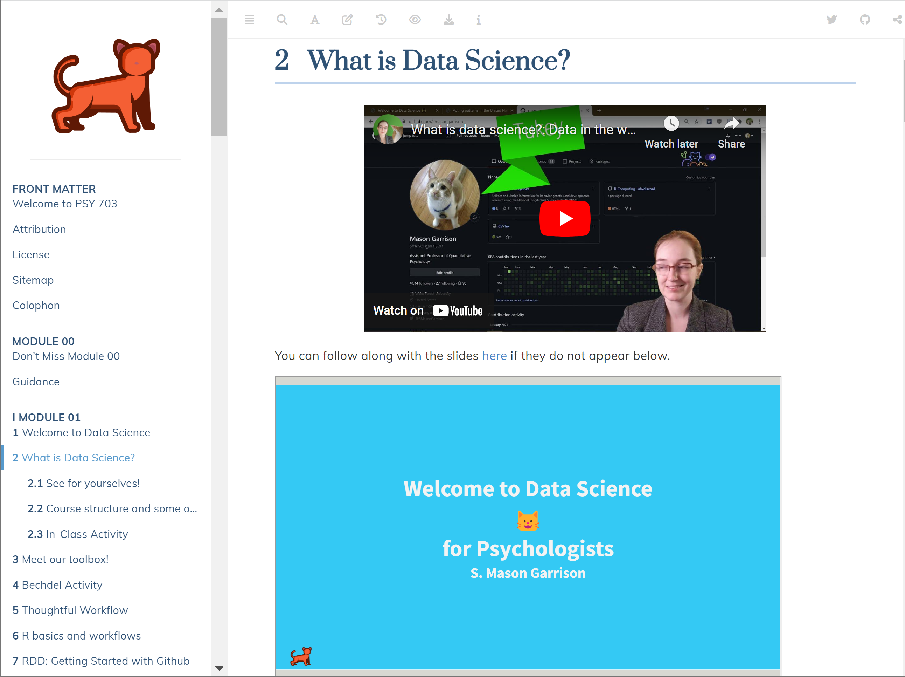
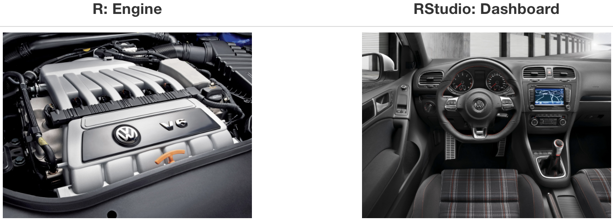

```{r child = "../setup.Rmd",echo = F}
```

```{r packages, echo=FALSE, message=FALSE, warning=FALSE,include=FALSE}
# Remember to compile
#xaringan::inf_mr(cast_from = "..")
#       slideNumberFormat: ""  
library(tidyverse)
if (!require("emo")) devtools::install_github("hadley/emo")
library(emo)
if (!require("jasmines")) devtools::install_github("djnavarro/jasmines")
if (!require("mathart")) devtools::install_github("marcusvolz/mathart")
if (!require("fontawesome")) devtools::install_github("rstudio/fontawesome")
library(fontawesome)
```

class: center, middle 

# Data Science for Psychologists Workshop
## APS Annual Convention
### Mason Garrison
#### Assistant Professor of Quantitative Psychology
#### Wake Forest University
#### wifi: psychscience23

---

class: middle

# A Little About Me

---

# Who Am I?

.pull-left[
- My name is S. Mason Garrison
- I'm an Assistant Professor of Quantitative Psychology at
  - Wake Forest University
- I'm a Quantitative Psychologist and 
  - Behavior Geneticist by training.
]

.center.pull-right[
```{r echo=FALSE, out.width="90%"}

```
]

---

## My Work

<!-- rewrite -->

- My substantive work focuses on examining the relationships between socioeconomic status, individual differences, and health.
- I use genetically-informed designs to approach these questions, leveraging cousins, siblings, and other kin.
- I rely heavily on pre-existing data sets, working with tons data, quite literally in some cases.
- My current work is heavily centered around data modeling for all people of Utah and their ancestors. 
  - We've (Mike Hunter & Alex Burt) developed some novel pedigree models to comparing cousins up to the 11th degree. 
  - At the moment, we're looking at outcomes that the National Institute on Aging (NIA) is interested in....


---

## Why I'm Here Today

<!-- rewrite -->.large[
- I'm passionate about sharing my love for R and data science with others, especially those within the field of psychology.
- I believe that the tools and methodologies of data science can 
  - meaningfully enhance our ability to conduct efficient and impactful research in psychology
- I'm excited to be here and share this course with you!
]
---

## Fun Facts About Me
.pull-left.large[
- I'm a cat lover! (as you might have guessed from my use of `r emo::ji('cat')`)
- I enjoy automating things and *pretty active* on wikipedia. 
- I'm a chai tea enthusiast!
]
--
.pull-right[
```{r echo=FALSE, out.width="100%",fig.align = 'center'}

```
]

---

class: middle

# Workshop Overview!

---

# Workshop Disclaimer
.pull-left[
- This workshop is adapted from my semester-long Data Science for Psychologists class. 
- That class is fully-flipped, so you're going to experience the live version. 
- However, I definitely encourage you to check out the full thing.
]
.pull-right[
```{r echo=FALSE, out.width="95%",fig.align = 'center'}

```
]

```{r ref.label="qr",echo=FALSE,out.width="10%"}
```

.center[
[DataScience4Psych.github.io/DataScience4Psych/](https://DataScience4Psych.github.io/DataScience4Psych/) 
]
---

```{r qr}
library(qrcode)
code <- qr_code("https://DataScience4Psych.github.io/DataScience4Psych/")
plot(code)
```

---

# Workshop Overview


- .large[<i class="fa fa-database fa"></i> Welcome to R and the tidyverse]
--

- .large[<i class="fa fa-code fa"></i> Data and Visualization]
--

- .large[<i class="fa fa-flask fa"></i> Data Wrangling]

--

<br><br><br><br><br><br><br>

.small[
.center[
[DataScience4Psych.github.io/DataScience4Psych/](https://DataScience4Psych.github.io/DataScience4Psych/)
]
]

---

# Introduction to R and the tidyverse
.pull-left[
- .large[Getting started with R and RStudio]
- .large[Understanding the structure and philosophy of the tidyverse]
- .large[Learning basic R syntax and operations]
]
---

# Data Visualization

.pull-left[
- .large[Creating static and interactive visualizations using ggplot2]
- .large[Customizing visual elements to enhance your plots]
- .large[Interpreting and describing visualizations]
]
.center.pull-right[

```{r echo=FALSE, out.width="95%",fig.align = 'left'}
# r code to generate this figure is plot_metro.R
knitr::include_graphics("img/plot007w.png")
```
]

---

# Data Wrangling
.pull-left[
- .large[Importing and exporting data in various formats]
- .large[Cleaning, transforming, and reshaping data]
]
---


---
class: middle

# Hello world!

---

## What is data science?

- <i class="fa fa-database fa"></i> + <i class="fa fa-flask fa"></i> = data science?
--

- <i class="fa fa-database fa"></i> + <i class="fa fa-code fa"></i> = data science?
--

- <i class="fa fa-database fa"></i> + <i class="fa fa-user fa"></i> + <i class="fa fa-code fa"></i> = data science?
--

- <i class="fa fa-database fa"></i> + <i class="fa fa-users fa"></i> + <i class="fa fa-code fa"></i> = data science?
--

<br>
<br>
.large[
Data science is an exciting discipline that allows you to turn raw data into understanding, insight, and knowledge. We're going to learn to do this in a `tidy` way -- more on that later!
]
---


## Where is this course?

<br>
.center[
```{r ref.label="qr",echo=FALSE,out.width="20%"}
```

<br>
Notes: [DataScience4Psych.github.io/DataScience4Psych/](https://DataScience4Psych.github.io/DataScience4Psych/)
]

<br>
.center[
```{r slides,echo=FALSE,out.width="20%"}
library(qrcode)
code <- qr_code("https://datascience4psych.github.io/slides/")
plot(code)
```
<br>
Slides: [datascience4psych.github.io/slides/](https://datascience4psych.github.io/slides/)
]

---

class: center, middle 

# Meet the toolkit
## `r emo::ji('hammer_and_pick')`
<br>
.center[
```{r,echo=FALSE,out.width="20%"}
library(qrcode)
code <- qr_code("https://datascience4psych.github.io/slides/workshop/d01_02_welcome_toolkit.html")
plot(code)
```
<br>
Slide: [datascience4psych.github.io/slides/workshop/d01_02_welcome_toolkit.html](https://datascience4psych.github.io/slides/workshop/d01_02_welcome_toolkit.html)
]

---

class: middle

# Reproducible data analysis

---

## Reproducibility checklist

.question[
What does it mean for a data analysis to be "reproducible"?
]

--

Near-term goals:

- Are the tables and figures reproducible from the code and data?
- Does the code actually do what you think it does?
- In addition to what was done, is it clear **why** it was done? 
(e.g., how were parameter settings chosen?)

--

Long-term goals:

- Can the code be used for other data?
- Can you extend the code to do other things?

---

## Toolkit


- Scriptability $\rightarrow$ R
- Literate programming (code, narrative, output in one place) $\rightarrow$ R Markdown
- Version control $\rightarrow$ Git / GitHub


---

class: middle

# Toolkit overview

---

```{r echo=FALSE, out.width="100%"}
knitr::include_graphics("img/whole-game-01.png")
```

---

```{r echo=FALSE, out.width="100%"}
knitr::include_graphics("img/whole-game-02.png")
```

---

```{r echo=FALSE, out.width="100%"}
knitr::include_graphics("img/whole-game-03.png")
```

---

```{r echo=FALSE, out.width="100%"}
knitr::include_graphics("img/whole-game-04.png")
```

---

class: middle

# R and RStudio

---

## What is R/RStudio?

- R is a statistical programming language
- RStudio is a convenient interface for R (an integrated development environment, IDE)
- At its simplest:
    - R is like a car's engine
    - RStudio is like a car’s dashboard

```{r fig.align="center", echo=FALSE, out.width="66%"}

```


---

## Let's take a tour - R / RStudio

.center[

]

- Console
- Using R as a calculator
- Environment
- Loading and viewing a data frame
- Accessing a variable in a data frame
- R functions


---

## Tour: Working with R at the command line 

- Launch RStudio/R.
- Notice the default panes:
    - Console (entire left)
    - Environment/History (tabbed in upper right)
    - Files/Plots/Packages/Help (tabbed in lower right)


--

- FYI: You can change the default location of the panes, among many other things
  - [Customizing RStudio](https://support.rstudio.com/hc/en-us/articles/200549016-Customizing-RStudio)

---

## Tour: Working with R at the command line (pt 2)

- Go into the Console, where we interact with the live R process.
- Make an assignment and then inspect the object you just created:

```{r start_rbasics}
x <- 3 * 4
x
```

- All R statements where you create objects -- "assignments" -- have this form:

```{r eval = FALSE}
objectName <- value
```

- Read this as 'x gets 12'


.footnote[and in my head I hear, e.g., "x gets 12".

You will make lots of assignments and the operator `<-` is a pain to type. Don't be lazy and use `=`, although it would work, because it will just sow confusion later. Instead, utilize RStudio's keyboard shortcut: Alt + - (the minus sign).]


---

## R essentials

A short list (for now):

- Functions are (most often) verbs, followed by what they will be applied to in parentheses:

```{r eval=FALSE}
do_this(to_this)
do_that(to_this, to_that, with_those)
```

--

- Columns (variables) in data frames are accessed with `$`:

```{r eval=FALSE}
dataframe$var_name
```

--

- Packages are installed with the `install.packages` function and loaded with the `library` function, once per session:

```{r eval=FALSE}
install.packages("package_name")
library(package_name)
```

---

## tidyverse

.pull-left[
.center[
```{r echo=FALSE,fig.align='center', out.width="50%"}
knitr::include_graphics("img/hexs.png")
```
]
]
.pull-right[
.center[
[tidyverse.org](https://www.tidyverse.org/)]
- The tidyverse is an opinionated collection of R packages designed for data science.
- All packages share an underlying philosophy and common grammar: the "tidy data" principles.
- "Tidy data" has a specific structure: each variable is a column, each observation is a row, and each type of observational unit is a table.
]


---

## tidyverse

.pull-left[
.center[
```{r echo=FALSE,fig.align='center', out.width="50%"}
knitr::include_graphics("img/hexs.png")
```
]
]
.pull-right[
.center[
[tidyverse.org](https://www.tidyverse.org/)]
- Key packages include: 
  - **ggplot2** for data visualization.
  - **dplyr** for data manipulation.
  - **tidyr** for data tidying.
  - **readr** for data import.
  - **purrr** for functional programming.
  - **tibble** for tibble, a modern reimagining of data frames.
  - **stringr** for string manipulation.
  - **forcats** for handling categorical variables.
- These packages are designed to work together seamlessly.
]

---

class: middle

# R Markdown

---


## R Markdown

- .large[Fully reproducible reports -- each time you knit the analysis is run from the beginning]
- .large[Simple markdown syntax for text]
- .large[Code goes in chunks, defined by three backticks, while narrative goes outside of chunks]
---

## Let's take a tour - R Markdown


.center[

]

Concepts introduced:

- Copying a project
- Knitting documents
- R Markdown and (some) R syntax

---

.your-turn[

- The Bechdel test asks whether a work of fiction features at least two women who talk to each other about something other than a man, and there must be two women named characters.
- Go to github page and download the assignment `Bechdel + R Markdown`. 
- Open and knit the R Markdown document `bechdel.Rmd` and follow along with the instructions.
- https://github.com/DataScience4Psych/ae-02-bechdel-rmarkdown
]

.center[
```{r,echo=FALSE,out.width="20%"}
library(qrcode)
code <- qr_code("https://github.com/DataScience4Psych/ae-02-bechdel-rmarkdown")
plot(code)
```
]
---

class: middle

# Wrapping Up...

---

## R Markdown help

.pull-left[
.center[
[R Markdown cheat sheet](https://github.com/rstudio/cheatsheets/raw/master/rmarkdown-2.0.pdf)
]

.center[
```{r echo=FALSE,fig.align='center', out.width="70%"}
knitr::include_graphics("img/rmd-cheatsheet.png")
```
]
]
.pull-right[
.center[
Markdown Quick Reference  
`Help -> Markdown Quick Reference`
]
.center[
```{r echo=FALSE,fig.align='center', out.width="90%"}
knitr::include_graphics("img/md-cheatsheet.png")
```
]
]
---

## Workspaces

Remember this, and expect it to bite you a few times as you're learning to work with R Markdown: The workspace of your R Markdown document is separate from the Console!

- Run the following in the console
```{r eval = FALSE}
x <- 2
x * 3
```
.question[
All looks good, eh?
]

- Then, add the following chunk in your R Markdown document
```{r eval = FALSE}
x * 3
```
--
.question[
What happens? Why the error?
]

---


class: middle

# Wrapping Up... R and R Markdown


---

class: middle

# Getting help in R

---

## Reading help files

```{r echo=FALSE, out.width="50%"}
knitr::include_graphics("img/r-help.png")
```


---

## Asking good questions

.pull-left[
- **Good:** Describe your intention and include your code and the error
- **Better:** Describe your intention and create a minimum working example
- **Best:** Write a **rep**roducible **ex**ample (reprex) -- we'll introduce this concept more formally and teach you the tools for it a little later in the semester
]
--
.pull-right[

- Use code formatting
- For issues with R code: copy / paste your code and resulting error, don't use screenshots!
]

---

# Sources

- Mine Çetinkaya-Rundel's Data Science in a Box ([link](https://datasciencebox.org/))
- Kieran Healy's [Data Visualization: A practical introduction](http://socviz.co/appendix.html#a-little-more-about-r)
- [Jenny Bryan's Stat545](https://stat545.com)
- [Modern Dive](https://moderndive.com/)

---
class: middle

# Wrapping Up...


