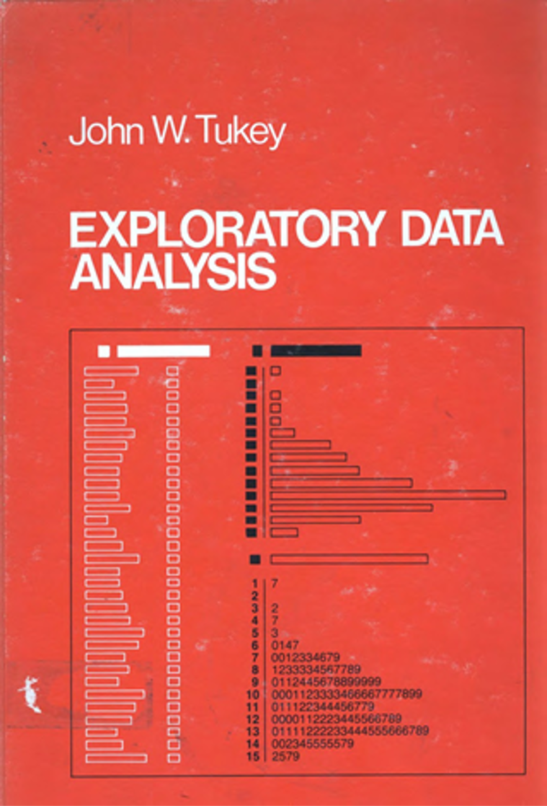
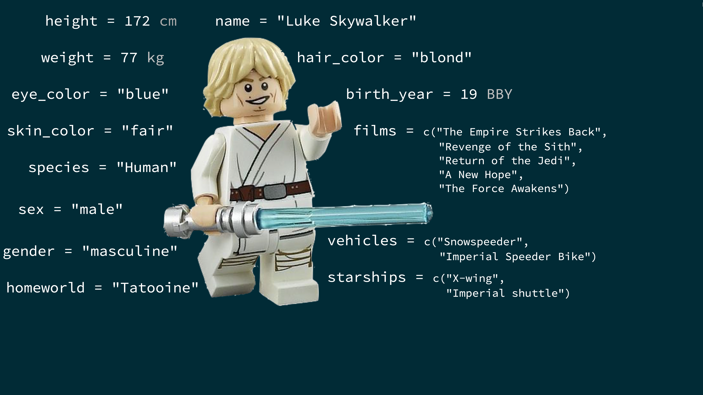
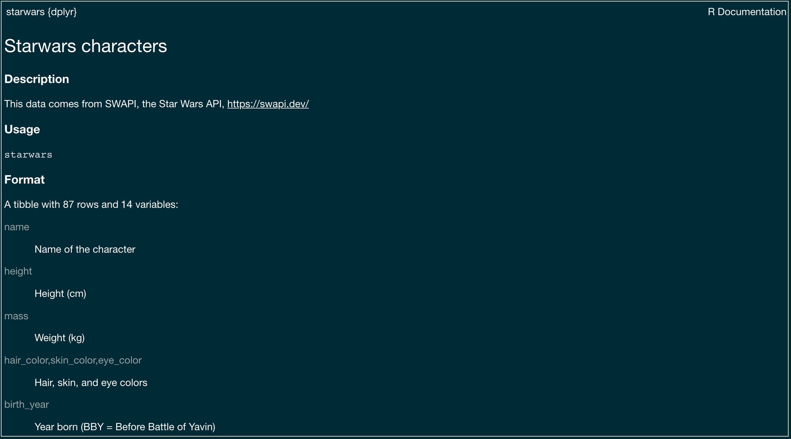
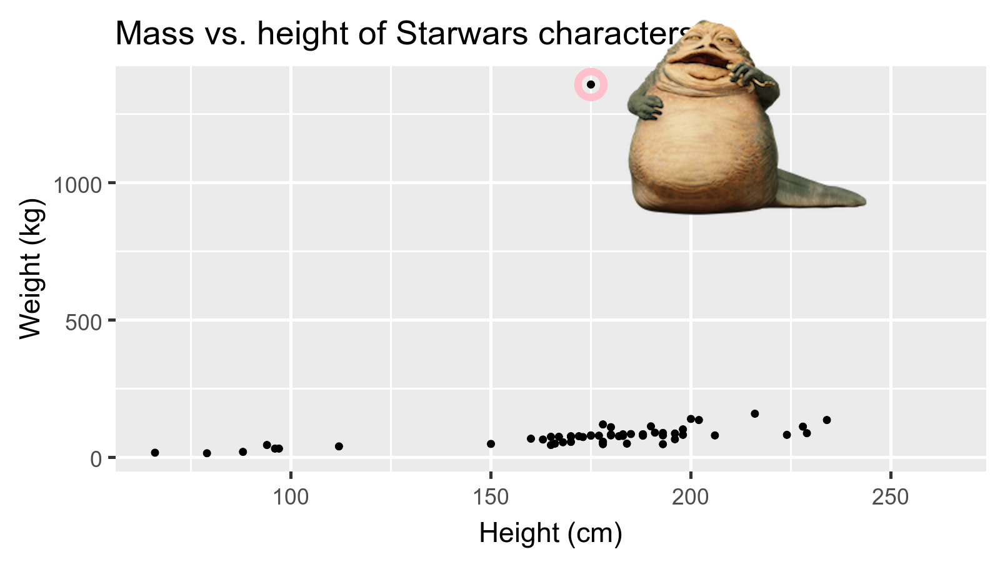
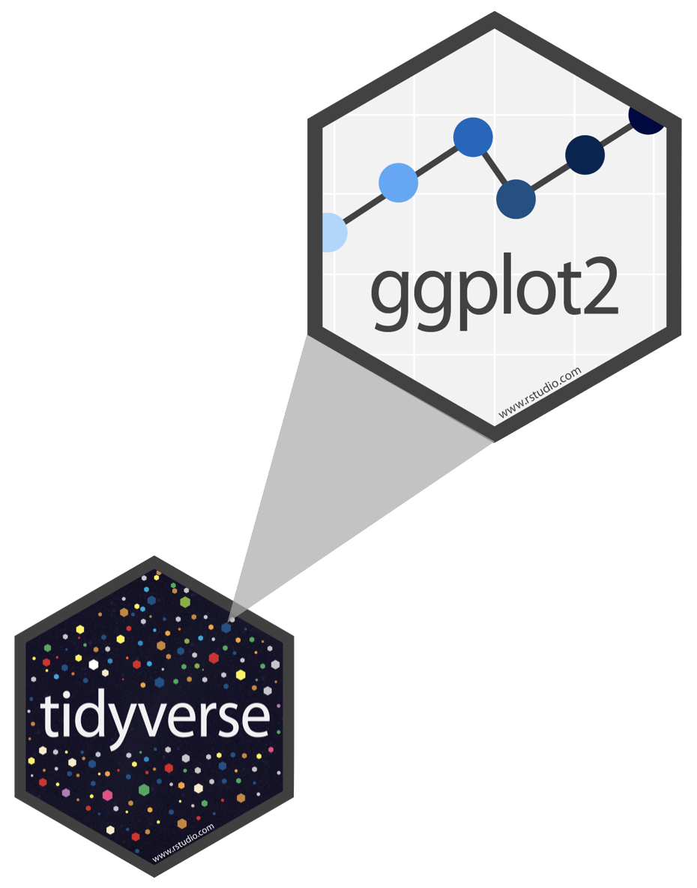
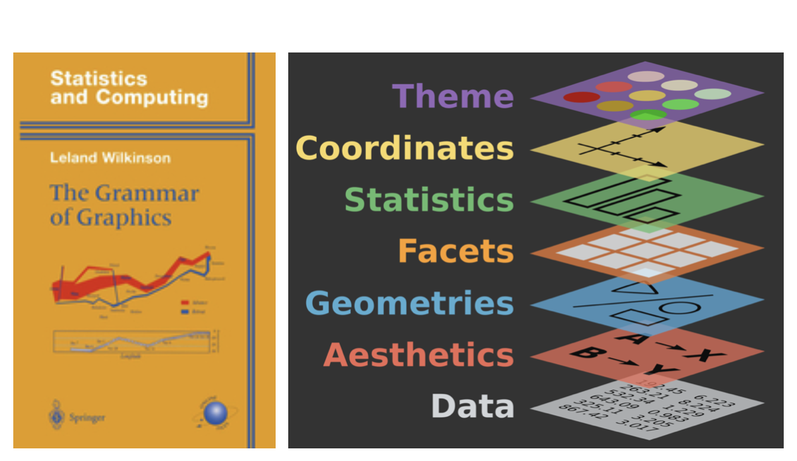

```{r child = "../setup.Rmd"}
```

```{r packages, echo=FALSE, message=FALSE, warning=FALSE}
library(emo)
library(tidyverse)
library(fontawesome)
library(magick)
library(Tmisc)
if (!require("dsbox")) devtools::install_github("rstudio-education/dsbox")
if (!require("gradethis")) devtools::install_github("rstudio-education/gradethis")
library(dsbox)

# Remember to compile
#xaringan::inf_mr(cast_from = "..")
```

class: middle

#  Exploring Our Data: What is in a dataset?

---


.pull-left[ 
> "We will be exploring numbers. We need to handle them easily and look at them effectively. Techniques for handling and looking — whether graphical, arithmetic, or intermediate — will be important."

> John Tukey
]

.pull-right[
```{r echo=FALSE, out.width="77%"}

```
] 


---

## Dataset terminology

- Each row is an **observation**
- Each column is a **variable**

.center[.midi[
```{r message=FALSE}
starwars
```

]
]
---

## Luke Skywalker



---

## What's in the Star Wars data?

Take a `glimpse` at the data:
.medi[
```{r}
glimpse(starwars)
```
]
---

.question[
How many rows and columns does this dataset have?
What does each row represent?
What does each column represent?
]

```{r eval = FALSE}
?starwars
```

```{r echo=FALSE}

```

---

.question[
How many rows and columns does this dataset have?
]

.pull-left[
```{r}
nrow(starwars) # number of rows
ncol(starwars) # number of columns
dim(starwars)  # dimensions (row column)
```
]

---

## Mass vs. height

.question[ 
How would you describe the relationship between mass and height of Starwars characters?
What other variables would help us understand data points that don't follow the overall trend?
Who is the not so tall but really chubby character?
]

```{r fig.width = 8, warning = FALSE, echo=FALSE, out.width = "50%"}
ggplot(data = starwars, mapping = aes(x = height, y = mass)) +
  geom_point() +
  labs(title = "Mass vs. height of Starwars characters",
       x = "Height (cm)", y = "Weight (kg)") +
  geom_point(data = starwars %>% filter(name == "Jabba Desilijic Tiure"), size = 5, pch = 1, color = "pink", stroke = 3)
```

---

## Jabba!

```{r echo = FALSE, warning = FALSE, cache = FALSE, out.width = "80%"}
jabba <- image_read("img/jabba.png")

fig <- image_graph(width = 1600, height = 900, res = 200)
ggplot(data = starwars, mapping = aes(x = height, y = mass)) +
  geom_point() +
  labs(title = "Mass vs. height of Starwars characters",
       x = "Height (cm)", y = "Weight (kg)") +
  geom_point(data = starwars %>% filter(name == "Jabba Desilijic Tiure"), size = 5, pch = 1, color = "pink", stroke = 3)
dev.off()

out <- fig %>% image_composite(jabba, offset = "+1000+30")

image_write(out, "img/jabbaplot.png", format = "png")

```

---


## Mass vs. height

```{r mass-height, fig.width = 8, out.width = "50%"}
ggplot(data = starwars, mapping = aes(x = height, y = mass)) +
  geom_point() +
  labs(title = "Mass vs. height of Starwars characters",
       x = "Height (cm)", y = "Weight (kg)")
```

---

.question[ 
- What are the functions doing the plotting?
- What is the dataset being plotted?
- Which variables map to which features (aesthetics) of the plot?
- What does the warning mean?<sup>+</sup>
]

```{r ref.label="mass-height", fig.show = "hide"}
```

.footnote[
<sup>+</sup>Suppressing warning to subsequent slides to save space
]

---

## Hello ggplot2!

.pull-left-narrow[
```{r echo=FALSE, out.width="80%"}

```
] 
.pull-right[
- **ggplot2** is tidyverse's data visualization package 
- `gg` in "ggplot2" stands for Grammar of Graphics 
- Inspired by the book **Grammar of Graphics** by Leland Wilkinson
- `ggplot()` is the main function in ggplot2
- Plots are constructed in layers
- Structure of the code for plots can be summarized as
]
--
```{r eval = FALSE}
ggplot(data = [dataset], 
       mapping = aes(x = [x-variable], y = [y-variable])) +
   geom_xxx() +
   other options
```


---

## ggplot2 $\in$ tidyverse a.k.a. Grammar of Graphics

.pull-left-narrow[
- **ggplot2** is tidyverse's data visualization package 
- `gg` in "ggplot2" stands for Grammar of Graphics 
- Inspired by the book **Grammar of Graphics** by Leland Wilkinson
- Grammar of graphics is a tool to concisely describe the components of a graphic
- The ggplot2 package comes with the tidyverse

```{r}
library(tidyverse)
```

- For help with ggplot2, see [ggplot2.tidyverse.org](http://ggplot2.tidyverse.org/)

]
.pull-right-wide[
```{r echo=FALSE, out.width="90%"}

```
]

.footnote[ Source: [BloggoType](http://bloggotype.blogspot.com/2016/08/holiday-notes2-grammar-of-graphics.html)]

---
class: middle

# Wrapping Up... 


---

class: middle

# Why do we visualize?

---

## Anscombe's quartet

```{r quartet-for-show, eval = FALSE, echo = FALSE}
library(Tmisc)
quartet
```

.midi.pull-left[
```{r quartet-view1, echo = FALSE}
quartet[1:22,]
```
] 
.midi.pull-right[
```{r quartet-view2, echo = FALSE}
quartet[23:44,]
```
]

---

## Summarizing Anscombe's quartet
<br>
.medi.pull-left-narrow[
```{r quartet-summary,eval=FALSE}
quartet %>%
  group_by(set) %>%
  summarize(
    mean_x = mean(x), 
    mean_y = mean(y),
    sd_x = sd(x),
    sd_y = sd(y),
    r = cor(x, y)
  )
```
]
.pull-right-wide[
```{r ref.label="quartet-summary",echo=FALSE}
```
]
---

## Visualizing Anscombe's quartet
<br>
.middle[
```{r quartet-plot, echo = FALSE, out.width = "80%", fig.asp = 0.5}
ggplot(quartet, aes(x = x, y = y)) +
  geom_point() +
  facet_wrap(~ set, ncol = 4)
```
]
---
class: middle

# Wrapping Up...


