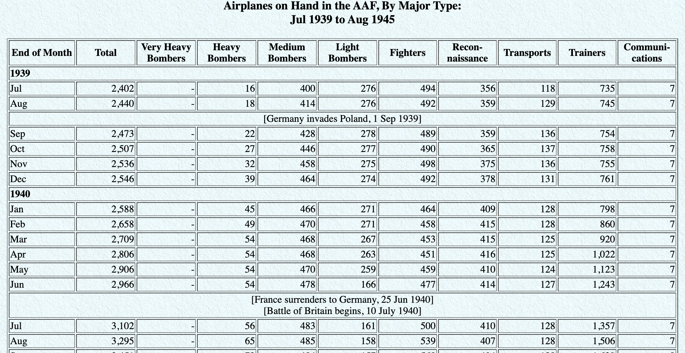
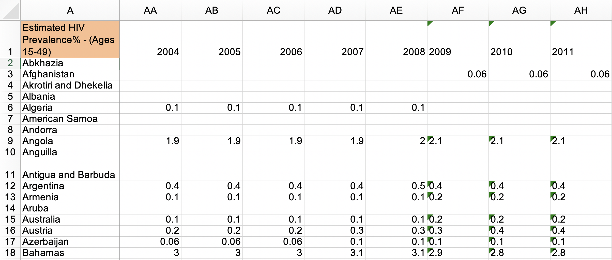
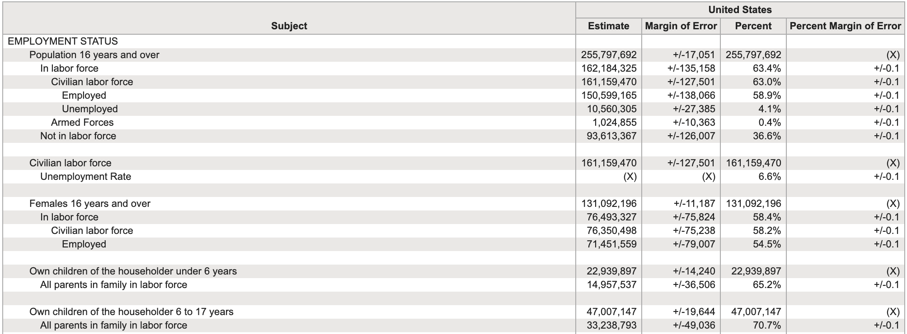

```{r child = "../setup.Rmd"}
```

```{r packages, echo=FALSE, message=FALSE, warning=FALSE}
library(tidyverse)
library(emo)
# Remember to compile
#xaringan::inf_mr(cast_from = "..")
```

## Tidy data

>Happy families are all alike; every unhappy family is unhappy in its own way. 
>
>Leo Tolstoy

--

.pull-left[

**Characteristics of tidy data:**

- Each variable forms a column.
- Each observation forms a row.
- Each type of observational unit forms a table.
]

--
.pull-right[
**Characteristics of untidy data:**

!@#$%^&*()
]

---

## 

.question[
What makes this data not tidy?
]

```{r hyperwar-airplanes-on-hand, echo=FALSE, out.width="90%", fig.align = "center", caption = "WW2 Army Air Force combat aircraft", out.width = "70%"}

```

.footnote[
Source: [Army Air Forces Statistical Digest, WW II](https://www.ibiblio.org/hyperwar/AAF/StatDigest/aafsd-3.html)
]

---

.question[
What makes this data not tidy?
]

<br>

```{r hiv-est-prevalence-15-49, echo=FALSE, out.width="95%", fig.align = "center", caption = "Estimated HIV prevalence among 15-49 year olds", out.width = "70%"}

```

.footnote[
Source: [Gapminder, Estimated HIV prevalence among 15-49 year olds](https://www.gapminder.org/data)
]

---

.question[
What makes this data not tidy?
]

<br>

```{r us-general-economic-characteristic-acs-2017, echo=FALSE, out.width="95%", fig.align = "center", caption = "US General Economic Characteristics, ACS 2017", out.width = "85%"}

```

.footnote[
Source: [US Census Fact Finder, General Economic Characteristics, ACS 2017](https://factfinder.census.gov/faces/tableservices/jsf/pages/productview.xhtml?pid=ACS_17_5YR_DP03)
]

---

## Displaying vs. summarizing data


.pull-left[
```{r echo=FALSE}
starwars %>%
  select(name, height, mass)
```
]
.pull-right[
```{r echo=FALSE}
starwars %>%
  group_by(gender) %>%
  summarize(avg_ht = mean(height, na.rm = TRUE))
```
]

---


.pull-left[
```{r eval=FALSE}
starwars %>%
  select(name, height, mass)
```
]
.pull-right[
```{r eval=FALSE}
starwars %>%
  group_by(gender) %>%
  summarize(
    avg_ht = mean(height, na.rm = TRUE)
    )
```
]
---

class: middle

# Wrapping Up...
---

class: middle

# Data structures in R

---
## Data structures in R
Three main ways to store data:

- Matrix: 
  - Requires all the elements to be of the same type (e.g. numeric or character)
- Data frame: 
  - Allows for mixed types of variables
- Tibble: 
  - Like a data frame, but works more consistently

---
## Tibbles

Tibbles are a better version of data frames.

- The [documentation](https://tibble.tidyverse.org/) describes them as 

--
>"data.frames for the lazy and surly: 
>
>they do less 
>
>(i.e. they don’t change variable names or types,
>
>and don’t do partial matching)
>
>and complain more
>s
>(e.g. when a variable does not exist)."

---

## Two other advantages:

1. They subset more consistently: 
  - when you use square brackets to subset a tibble, 
      - you always get another tibble. 
  - With data frames, you sometimes get a vector and sometimes get a data frame.
2. They print more elegantly.

--

#### Compared to base R
+ Base R functions, (including those for data frames), 
  + try to guess what you want to do.
+ Sometimes, this "helpful" guessing  leads to unexpected outcomes, 
  + so tibbles have done away with most of that.

---

## Tibbles don't change names

. . .
.midi[
```{r}
library(tidyverse)
(df = data.frame("a" = 1:5, "b 2" = 5:1))
(ti = tibble("a" = 1:5, "b 2" = 5:1))
```
]
---

## Tibbles complain about bad column names

. . .

```{r}
df$c
ti$c
```

---

## Tibbles subset consistently

. . .

```{r}
df[,1]
ti[,1]
```

---

## Tibbles don't *do* partial matching

. . .

```{r}
df$b
ti$b
```
---

## Tibbles don't coerce strings to factors

Previously...
```{r}
df = data.frame(l1 = letters[1:5])
```
```{r,include=FALSE}
df = data.frame(l1 = letters[1:5],stringsAsFactors = TRUE)
```
The most annoying thing about data frames:
```{r}
df$l2 = letters[1:5]
class(df$l1)
class(df$l2)
```

---

# Tibbles don't have this problem
```{r}
## but with tibbles it's all the same
ti = tibble(l1 = letters[1:5])
ti$l2 = letters[1:5]
class(ti$l1)
class(ti$l2)
```

---


class: middle

# Wrapping Up...

---

## Ok...So... technically... 

Base R has fixed this issue...

```{r}
df = data.frame(l1 = letters[1:5])
df$l2 = letters[1:5]
class(df$l1)
class(df$l2)
```


